# 基础信息

|      |      |
|------|------|
| 名称 | sorts |
| 编码语言 | .java |
| 代码路径 | Java/src/main/java/com/thealgorithms/sorts |
| 包名 | Java.src.main.java.com.thealgorithms.sorts |
| 概述说明 | 多种排序算法实现，包括基数、堆、选择、递归、Pancake、Circle、Comb、内省、二分插入、插入、Gnome、Stalin、自适应归并、Wiggle、Bead、快速、Patience、Spread、Dark、原地归并、Shell、桶、交换、Tree、拓扑、荷兰国旗、归并、Simple、Cycle、Flash、Pigeonhole、Wave、链表、冒泡、Slow、鸡尾酒、奇偶、计数、Swap、Bitonic、Bogo、Stooge、Tim、双轴快速排序等。 |

# 说明

## 概述
该代码模块是一个包含多种排序算法的实现集合，涵盖了从经典算法（如快速排序、归并排序、堆排序）到较为特殊的算法（如StalinSort、BogoSort）的广泛范围。这些算法通过不同的策略（如分治、递归、交换、比较等）对数组或链表进行排序，适用于各种数据规模和场景。模块中的每个算法都经过独立实现，且大部分代码都包含输入验证、性能优化和特定场景下的处理逻辑，确保算法的正确性和效率。

## 主要业务场景
1. **大规模数据排序**：如快速排序、归并排序、TimSort、SpreadSort等算法，适用于处理大规模数据集，能够在保证排序效率的同时，优化内存和计算资源的使用。
2. **小规模数据排序**：如插入排序、选择排序、GnomeSort等算法，适合处理小规模数据集，虽然时间复杂度较高，但在数据量较小时表现良好。
3. **特定数据结构排序**：如TreeSort（二叉搜索树排序）、LinkListSort（链表排序）等，专为特定数据结构设计，能够高效处理树或链表的排序需求。
4. **特殊场景排序**：如StalinSort（移除无序元素）、BogoSort（随机排序）、PancakeSort（翻转排序）等，适用于特定场景或教学演示，展示了排序算法的多样性和灵活性。
5. **并行计算环境**：如BitonicSort、OddEvenSort等算法，适合在并行计算环境中使用，能够充分利用多处理器资源，提高排序效率。
6. **内存优化排序**：如MergeSortNoExtraSpace（原地归并排序）、CycleSort（最小化写入操作）等，适用于内存资源有限的场景，通过优化空间复杂度实现高效排序。
7. **教学与研究**：如SlowSort、StoogeSort等算法，主要用于展示递归分治等基本算法思想，适合教学或理论研究场景。

该模块的算法实现兼顾了功能性、效率和可读性，能够满足从实际应用到教学研究的多方面需求。

### 包内部结构视图

```mermaid
graph TD
    sorts --> RadixSort.java
    sorts --> StrandSort.java
    sorts --> HeapSort.java
    sorts --> SelectionSort.java
    sorts --> SelectionSortRecursive.java
    sorts --> PancakeSort.java
    sorts --> CircleSort.java
    sorts --> CombSort.java
    sorts --> IntrospectiveSort.java
    sorts --> BinaryInsertionSort.java
    sorts --> InsertionSort.java
    sorts --> GnomeSort.java
    sorts --> StalinSort.java
    sorts --> SortUtilsRandomGenerator.java
    sorts --> AdaptiveMergeSort.java
    sorts --> WiggleSort.java
    sorts --> BeadSort.java
    sorts --> QuickSort.java
    sorts --> PatienceSort.java
    sorts --> SpreadSort.java
    sorts --> DarkSort.java
    sorts --> MergeSortNoExtraSpace.java
    sorts --> ShellSort.java
    sorts --> BucketSort.java
    sorts --> SortAlgorithm.java
    sorts --> ExchangeSort.java
    sorts --> TreeSort.java
    sorts --> TopologicalSort.java
    sorts --> DutchNationalFlagSort.java
    sorts --> MergeSortRecursive.java
    sorts --> SortUtils.java
    sorts --> SimpleSort.java
    sorts --> CycleSort.java
    sorts --> FlashSort.java
    sorts --> PigeonholeSort.java
    sorts --> WaveSort.java
    sorts --> LinkListSort.java
    sorts --> BubbleSortRecursive.java
    sorts --> SlowSort.java
    sorts --> CocktailShakerSort.java
    sorts --> OddEvenSort.java
    sorts --> CountingSort.java
    sorts --> SwapSort.java
    sorts --> BubbleSort.java
    sorts --> BitonicSort.java
    sorts --> BogoSort.java
    sorts --> StoogeSort.java
    sorts --> MergeSort.java
    sorts --> TimSort.java
    sorts --> DualPivotQuickSort.java
```

该流程图展示了一个包含多种排序算法的目录结构，所有排序算法文件都位于“sorts”目录下。每个节点代表一个具体的排序算法文件，显示了该目录下丰富的排序算法实现。

# 文件列表 File List

| 名称   | 类型  | 说明 |
|-------|------|-------------|
| [DualPivotQuickSort.java](DualPivotQuickSort.md) | file | 双轴快速排序递归分区并排序数组。 |
| [StoogeSort.java](StoogeSort.md) | file | StoogeSort通过递归分三段排序数组。 |
| [BubbleSort.java](BubbleSort.md) | file | BubbleSort类实现通用冒泡排序，返回排序数组。 |
| [OddEvenSort.java](OddEvenSort.md) | file | OddEvenSort类实现奇偶排序，交替奇偶索引排序数组。 |
| [WaveSort.java](WaveSort.md) | file | WaveSort类实现波浪排序算法，确保交替元素大于相邻元素，并检查数组是否波浪排序。 |
| [SimpleSort.java](SimpleSort.md) | file | SimpleSort类实现SortAlgorithm接口，通过双重循环比较交换数组元素完成排序。 |
| [TreeSort.java](TreeSort.md) | file | TreeSort类利用二叉搜索树对数组和列表进行排序。 |
| [SortAlgorithm.java](SortAlgorithm.md) | file | 信息为空，无法生成概要描述。 |
| [SpreadSort.java](SpreadSort.md) | file | SpreadSort算法支持自定义参数，适用于大规模数据排序。 |
| [WiggleSort.java](WiggleSort.md) | file | WiggleSort利用中值三色排序实现数组摆动有序。 |
| [GnomeSort.java](GnomeSort.md) | file | GnomeSort通过交换和比较数组元素实现排序。 |
| [CircleSort.java](CircleSort.md) | file | CircleSort算法递归比较数组两端元素，交换后循环直至排序完成。 |
| [SelectionSort.java](SelectionSort.md) | file | 实现选择排序算法，按升序排列数组元素。 |
| [TimSort.java](TimSort.md) | file | TimSort算法先分段插入排序，再合并排序。 |
| [MergeSort.java](MergeSort.md) | file | 归并排序算法实现，含排序与合并功能。 |
| [BogoSort.java](BogoSort.md) | file | BogoSort通过随机排列数组直至有序实现排序。 |
| [BitonicSort.java](BitonicSort.md) | file | BitonicSort类实现升序降序排序，通过填充最大值和递归合并完成。 |
| [SwapSort.java](SwapSort.md) | file | SwapSort通过交换较小元素实现数组排序。 |
| [CountingSort.java](CountingSort.md) | file | 计数排序通过直方图、累加和重构数组实现排序。 |
| [CocktailShakerSort.java](CocktailShakerSort.md) | file | 鸡尾酒排序算法实现双向交替冒泡排序。 |
| [SlowSort.java](SlowSort.md) | file | SlowSort通过递归分治和元素交换实现数组排序。 |
| [BubbleSortRecursive.java](BubbleSortRecursive.md) | file | 递归冒泡排序通过比较交换元素并递归调用实现排序。 |
| [LinkListSort.java](LinkListSort.md) | file | LinkListSort类用归并、插入和堆排序算法对链表排序，Node类创建链表节点。 |
| [PigeonholeSort.java](PigeonholeSort.md) | file | PigeonholeSort类实现鸽巢排序，处理负数，创建鸽巢并排序。 |
| [FlashSort.java](FlashSort.md) | file | FlashSort类实现排序算法，涵盖分类、转换、排列和插入排序步骤。 |
| [CycleSort.java](CycleSort.md) | file | CycleSort类通过循环定位和替换元素实现数组排序。 |
| [SortUtils.java](SortUtils.md) | file | SortUtils类提供数组和列表的排序辅助功能，涵盖交换、比较、翻转、打印及排序检查。 |
| [MergeSortRecursive.java](MergeSortRecursive.md) | file | 递归归并排序，包含合并与排序方法。 |
| [DutchNationalFlagSort.java](DutchNationalFlagSort.md) | file | 荷兰国旗算法通过交换元素将数组分为三部分。 |
| [TopologicalSort.java](TopologicalSort.md) | file | 实现拓扑排序的类，利用DFS检测环并生成线性顺序。 |
| [ExchangeSort.java](ExchangeSort.md) | file | 交换排序算法通过双重循环比较并交换数组元素实现排序。 |
| [BucketSort.java](BucketSort.md) | file | 桶排序实现步骤：初始化桶、分配元素、排序桶、合并结果。 |
| [ShellSort.java](ShellSort.md) | file | ShellSort使用Knuth序列计算间隔，执行插入排序实现通用排序。 |
| [MergeSortNoExtraSpace.java](MergeSortNoExtraSpace.md) | file | 无额外空间原地归并排序，适用于非负整数数组。 |
| [DarkSort.java](DarkSort.md) | file | DarkSort类利用计数和数组重构实现高效排序。 |
| [PatienceSort.java](PatienceSort.md) | file | PatienceSort算法通过分堆、合并堆和提取堆元素排序数组。 |
| [QuickSort.java](QuickSort.md) | file | 快速排序利用递归分治和随机分区对数组进行排序。 |
| [BeadSort.java](BeadSort.md) | file | BeadSort算法实现非负整数数组排序，含输入验证和网格填充。 |
| [AdaptiveMergeSort.java](AdaptiveMergeSort.md) | file | 自适应归并排序通过递归分治合并数组元素。 |
| [SortUtilsRandomGenerator.java](SortUtilsRandomGenerator.md) | file | SortUtilsRandomGenerator类生成随机数组和数值，支持双精度和整数类型。 |
| [StalinSort.java](StalinSort.md) | file | StalinSort通过移除无序元素实现数组排序。 |
| [InsertionSort.java](InsertionSort.md) | file | 插入排序类实现全数组和子数组排序，优化哨兵排序。 |
| [BinaryInsertionSort.java](BinaryInsertionSort.md) | file | 二分插入排序利用二分查找优化插入位置，提高排序效率。 |
| [IntrospectiveSort.java](IntrospectiveSort.md) | file | 内省排序融合快排、堆排和插排，通过递归深度优化排序策略。 |
| [CombSort.java](CombSort.md) | file | CombSort算法通过动态调整间隔和交换元素来排序数组。 |
| [PancakeSort.java](PancakeSort.md) | file | 煎饼排序通过翻转操作将最大元素移至正确位置。 |
| [SelectionSortRecursive.java](SelectionSortRecursive.md) | file | 递归选择排序实现排序、交换和查找最小元素功能。 |
| [HeapSort.java](HeapSort.md) | file | 堆排序算法实现，根索引从1开始，简化计算。 |
| [StrandSort.java](StrandSort.md) | file | StrandSort类实现Strand Sort算法，包含排序和合并方法。 |
| [RadixSort.java](RadixSort.md) | file | 基数排序支持非负整数排序，包含输入检查和计数排序辅助方法。 |

