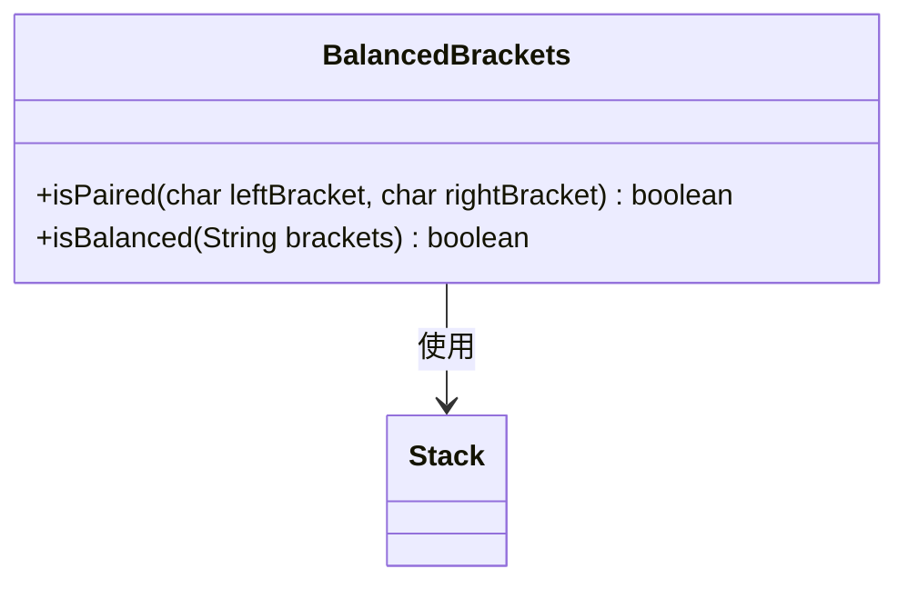
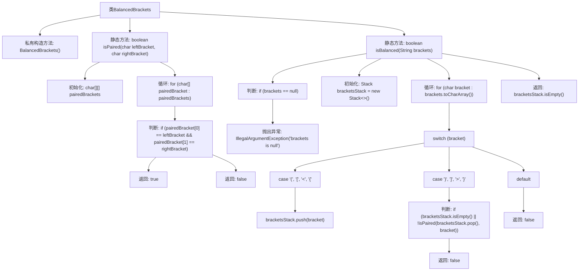

# 基础信息

|      |      |
|------|------|
| 名称 | BalancedBrackets |
| 编码语言 | .java |
| 代码路径 | Java/src/main/java/com/thealgorithms/stacks/BalancedBrackets.java |
| 包名 | com.thealgorithms.stacks |
| 依赖项 | ['java.util.Stack'] |
| 概述说明 | BalancedBrackets类用于检测括号是否配对和平衡。 |

# 说明

BalancedBrackets类的主要功能是检查括号是否配对和平衡。它通过分析输入字符串中的括号，确保每种类型的括号都有对应的闭合括号，并且括号的嵌套顺序正确。该类能够处理多种括号类型，如圆括号、方括号和花括号。通过遍历字符串并使用栈数据结构，BalancedBrackets类能够高效地检测括号的平衡性，并在发现不匹配或未闭合的括号时返回相应的错误信息。

# 类列表 Class Summary

| 名称   | 类型  | 说明 |
|-------|------|-------------|
| BalancedBrackets | class | BalancedBrackets类检查括号是否配对和平衡。 |

## 类 BalancedBrackets

|      |      |
|------|------|
| 访问范围 | final |
| 类型 | class |
| 名称 | BalancedBrackets |
| 说明 | BalancedBrackets类检查括号是否配对和平衡。 |

### UML类图

**描述：**  
`BalancedBrackets` 类提供了两个静态方法：`isPaired` 和 `isBalanced`。`isPaired` 方法用于检查两个括号是否匹配，而 `isBalanced` 方法则用于检查一个字符串中的括号是否平衡。`isBalanced` 方法使用 `Stack` 数据结构来跟踪括号的匹配情况，确保每个打开的括号都有对应的关闭括号，并且顺序正确。如果括号字符串为空或包含不匹配的括号，`isBalanced` 方法将返回 `false`。

### 内部方法调用关系图

这段代码定义了一个`BalancedBrackets`类，包含两个静态方法：`isPaired`和`isBalanced`。`isPaired`方法用于检查两个字符是否为配对的括号，`isBalanced`方法用于检查一个字符串中的括号是否平衡。代码通过使用栈数据结构来确保括号的正确配对和平衡，并在输入为空时抛出异常。

### 字段列表 Field List

| 名称  | 类型  | 说明 |
|-------|-------|------|

### 方法列表 Method List

| 名称  | 类型  | 说明 |
|-------|-------|------|
| isPaired | boolean | 判断两个字符是否为配对的括号。 |
| isBalanced | boolean | 检查字符串括号是否平衡，使用栈匹配成对括号。 |

