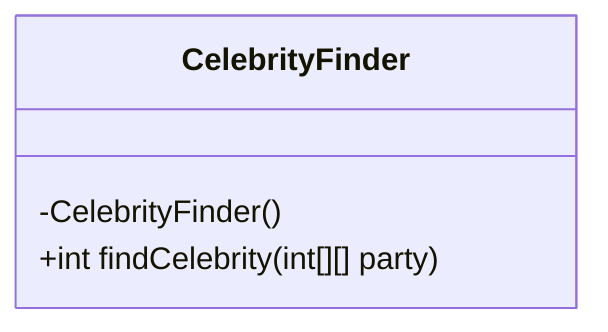
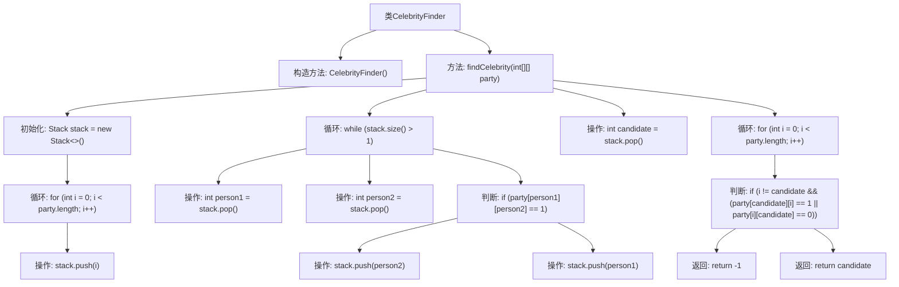

# 基础信息

|      |      |
|------|------|
| 名称 | CelebrityFinder |
| 编码语言 | .java |
| 代码路径 | Java/src/main/java/com/thealgorithms/stacks/CelebrityFinder.java |
| 包名 | com.thealgorithms.stacks |
| 依赖项 | ['java.util.Stack'] |
| 概述说明 | CelebrityFinder类使用栈算法在二维矩阵中查找名人索引，若无名人则返回-1。 |

# 说明

CelebrityFinder类采用栈算法在二维矩阵中查找名人的索引。名人是指在矩阵中所有其他人都认识他，但他不认识任何其他人的人。算法通过栈数据结构逐步排除不可能成为名人的候选者，最终确定名人索引。如果矩阵中不存在名人，则返回-1。该算法高效且准确，适用于大规模矩阵的名人查找场景。

# 类列表 Class Summary

| 名称   | 类型  | 说明 |
|-------|------|-------------|
| CelebrityFinder | class | CelebrityFinder类通过栈算法在二维矩阵中查找名人索引，无名人则返回-1。 |

## 类 CelebrityFinder

|      |      |
|------|------|
| 访问范围 | public final |
| 类型 | class |
| 名称 | CelebrityFinder |
| 说明 | CelebrityFinder类通过栈算法在二维矩阵中查找名人索引，无名人则返回-1。 |

### UML类图

**描述：**  
`CelebrityFinder` 是一个工具类，用于在给定的聚会矩阵中查找名人。该类的唯一方法是 `findCelebrity`，它接受一个二维矩阵作为输入，矩阵中的元素 `party[i][j]` 表示第 `i` 个人是否认识第 `j` 个人。方法通过栈结构逐步排除不可能的名人，最终验证剩余候选人是否为真正的名人。如果找到名人，则返回其索引；否则返回 `-1`。该类设计为不可实例化，所有方法均为静态。

### 内部方法调用关系图

这段代码实现了一个用于在派对矩阵中查找名人的算法。首先，将所有人员推入栈中，然后通过比较栈顶的两个人来确定潜在的名人。最后，验证这个候选人是否满足名人的条件。如果满足，则返回该候选人的索引；否则返回-1。该算法通过栈和循环结构高效地处理了名人查找问题。

### 字段列表 Field List

| 名称  | 类型  | 说明 |
|-------|-------|------|

### 方法列表 Method List

| 名称  | 类型  | 说明 |
|-------|-------|------|
| findCelebrity | int | 使用栈找出聚会中的名人并验证其身份。 |

