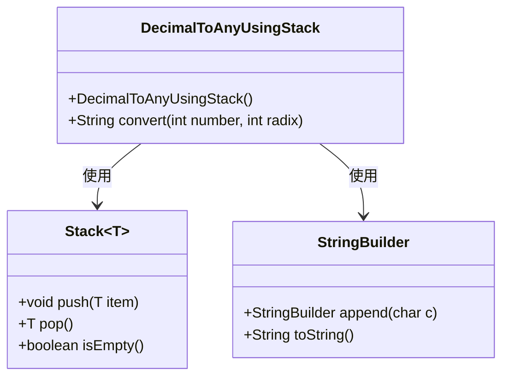
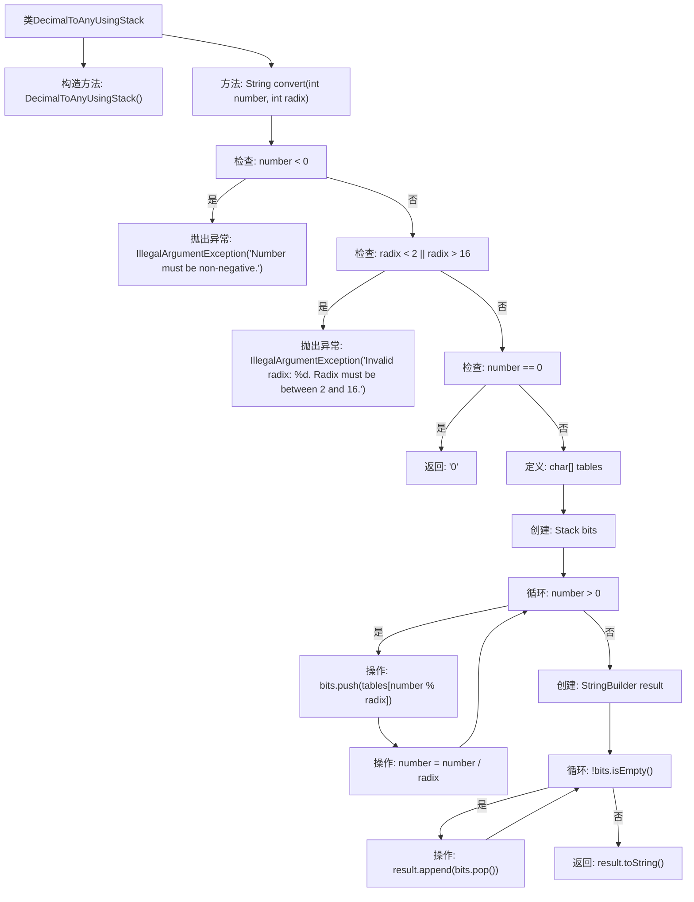

# 基础信息

|      |      |
|------|------|
| 名称 | DecimalToAnyUsingStack |
| 编码语言 | .java |
| 代码路径 | Java/src/main/java/com/thealgorithms/stacks/DecimalToAnyUsingStack.java |
| 包名 | com.thealgorithms.stacks |
| 依赖项 | ['java.util.Stack'] |
| 概述说明 | 十进制转2到16进制，利用栈实现转换。 |

# 说明

该功能旨在将十进制数转换为指定进制，支持2到16进制之间的转换。转换过程中使用栈数据结构来实现，确保转换的准确性和效率。通过栈的先进后出特性，能够有效地处理数位的存储和输出，最终得到目标进制的数值表示。

# 类列表 Class Summary

| 名称   | 类型  | 说明 |
|-------|------|-------------|
| DecimalToAnyUsingStack | class | 将十进制数转换为指定进制，支持2到16进制，使用栈实现。 |

## 类 DecimalToAnyUsingStack

|      |      |
|------|------|
| 访问范围 | public final |
| 类型 | class |
| 名称 | DecimalToAnyUsingStack |
| 说明 | 将十进制数转换为指定进制，支持2到16进制，使用栈实现。 |

### UML类图

这段代码定义了一个 `DecimalToAnyUsingStack` 类，用于将十进制数转换为任意进制（2到16进制）的字符串表示。该类包含一个静态方法 `convert`，该方法接收两个参数：待转换的十进制数和目标进制。方法首先检查输入的有效性，然后使用栈来存储转换过程中的每一位字符，最后通过 `StringBuilder` 构建并返回结果字符串。代码中使用了 `Stack` 和 `StringBuilder` 类来辅助完成转换过程。

### 内部方法调用关系图

这段代码实现了一个将十进制数转换为任意进制（2到16进制）的功能。首先，代码会检查输入的数字是否为负数或进制是否在有效范围内，若不符合条件则抛出异常。如果输入数字为0，则直接返回"0"。接着，代码通过栈结构将数字逐位转换为目标进制的字符，最后将这些字符从栈中弹出并拼接成最终结果字符串返回。

### 字段列表 Field List

| 名称  | 类型  | 说明 |
|-------|-------|------|

### 方法列表 Method List

| 名称  | 类型  | 说明 |
|-------|-------|------|
| convert | String | 将非负整数转换为指定进制字符串，支持2到16进制。 |

