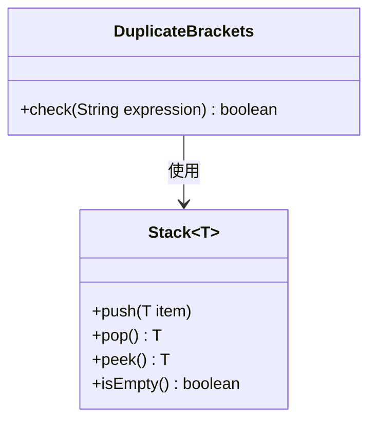
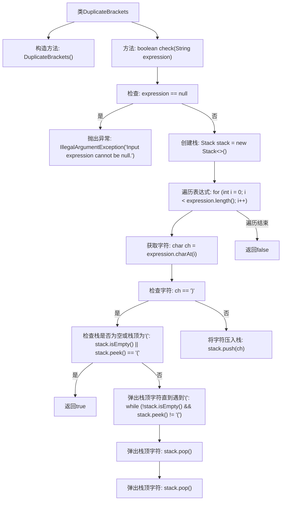

# 基础信息

|      |      |
|------|------|
| 名称 | DuplicateBrackets |
| 编码语言 | .java |
| 代码路径 | Java/src/main/java/com/thealgorithms/stacks/DuplicateBrackets.java |
| 包名 | com.thealgorithms.stacks |
| 依赖项 | ['java.util.Stack'] |
| 概述说明 | 检查表达式括号是否冗余，返回布尔值。 |

# 说明

该功能用于检查表达式中是否存在多余或冗余的括号，并返回一个布尔值作为结果。如果表达式中存在不必要的括号，函数将返回真；反之，则返回假。该功能旨在优化表达式的结构，确保括号的使用是必要且合理的。

# 类列表 Class Summary

| 名称   | 类型  | 说明 |
|-------|------|-------------|
| DuplicateBrackets | class | 检查表达式中是否存在多余或冗余括号，返回布尔值。 |

## 类 DuplicateBrackets

|      |      |
|------|------|
| 访问范围 | public final |
| 类型 | class |
| 名称 | DuplicateBrackets |
| 说明 | 检查表达式中是否存在多余或冗余括号，返回布尔值。 |

### UML类图

这段代码定义了一个名为 `DuplicateBrackets` 的类，该类包含一个静态方法 `check`，用于检查给定表达式中是否存在多余或冗余的括号。方法通过使用 `Stack` 数据结构来跟踪括号的匹配情况。如果检测到多余的括号，方法返回 `true`，否则返回 `false`。`Stack` 是一个泛型类，用于存储字符类型的元素。`DuplicateBrackets` 类依赖于 `Stack` 类来实现其功能。

### 内部方法调用关系图

这段代码定义了一个名为`DuplicateBrackets`的类，其中包含一个静态方法`check`，用于检查给定表达式中是否存在多余或冗余的括号。方法首先检查输入表达式是否为`null`，如果是则抛出`IllegalArgumentException`异常。然后，方法使用栈数据结构遍历表达式中的每个字符，当遇到右括号时，检查栈顶是否为左括号，如果是则返回`true`，否则弹出栈顶字符直到遇到左括号。最后，如果遍历结束后栈为空，则返回`false`，表示没有多余或冗余的括号。

### 字段列表 Field List

| 名称  | 类型  | 说明 |
|-------|-------|------|

### 方法列表 Method List

| 名称  | 类型  | 说明 |
|-------|-------|------|
| check | boolean | 检查表达式括号是否匹配，使用栈处理。 |

