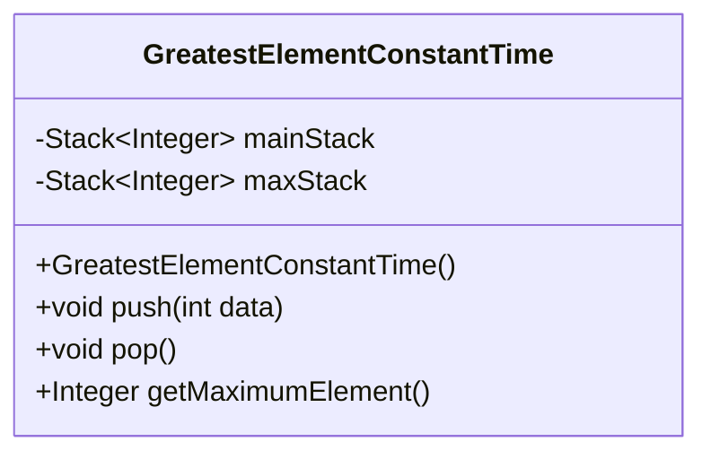
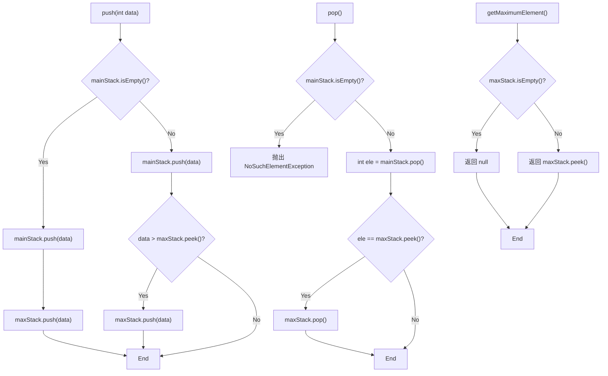
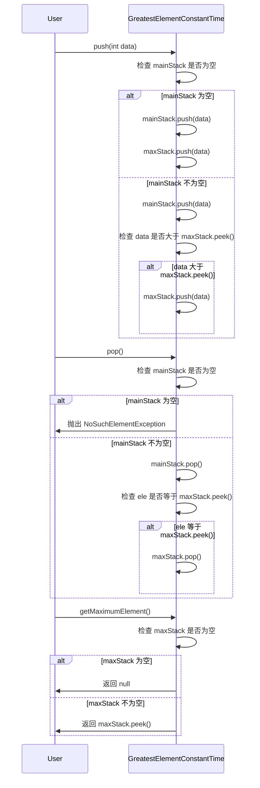

# 基础信息

|      |      |
|------|------|
| 名称 | GreatestElementConstantTime |
| 编码语言 | .java |
| 代码路径 | Java/src/main/java/com/thealgorithms/stacks/GreatestElementConstantTime.java |
| 包名 | com.thealgorithms.stacks |
| 依赖项 | ['java.util.NoSuchElementException', 'java.util.Stack'] |
| 概述说明 | 双栈结构实现常数时间获取栈中最大元素。 |

# 说明

实现常数时间获取栈中最大元素的双栈结构，通过使用两个栈来维护数据。一个栈用于存储常规元素，另一个栈用于存储当前最大元素。每当元素入栈时，常规栈直接压入元素，而最大栈则比较新元素与当前栈顶元素，压入较大者。这样，获取最大元素时只需查看最大栈的栈顶，确保操作在常数时间内完成。

# 类列表 Class Summary

| 名称   | 类型  | 说明 |
|-------|------|-------------|
| GreatestElementConstantTime | class | 实现常数时间获取栈中最大元素的双栈结构。 |


## 类 GreatestElementConstantTime

|      |      |
|------|------|
| 访问范围 | public |
| 类型 | class |
| 名称 | GreatestElementConstantTime |
| 说明 | 实现常数时间获取栈中最大元素的双栈结构。 |


### UML类图







**描述：**  
`GreatestElementConstantTime` 类通过维护两个栈 (`mainStack` 和 `maxStack`) 来实现常数时间内获取栈中最大元素的功能。`push` 方法在插入元素时更新 `maxStack`，`pop` 方法在移除元素时检查并更新 `maxStack`，`getMaximumElement` 方法直接返回 `maxStack` 的栈顶元素。通过这种方式，确保在任意时刻都能以 O(1) 的时间复杂度获取栈中的最大元素。


### 内部方法调用关系图

```mermaid
graph TD
    A["类GreatestElementConstantTime"]
    B["属性: Stack<Integer> mainStack"]
    C["属性: Stack<Integer> maxStack"]
    D["构造方法: GreatestElementConstantTime()"]
    E["方法: void push(int data)"]
    F["方法: void pop()"]
    G["方法: Integer getMaximumElement()"]
    H["条件: mainStack.isEmpty()"]
    I["操作: mainStack.push(data)"]
    J["操作: maxStack.push(data)"]
    K["条件: data > maxStack.peek()"]
    L["操作: mainStack.pop()"]
    M["操作: maxStack.pop()"]
    N["异常: NoSuchElementException"]
    O["条件: maxStack.isEmpty()"]
    P["返回: maxStack.peek()"]

    A --> B
    A --> C
    A --> D
    A --> E
    A --> F
    A --> G
    E --> H
    H -->|是| I
    H -->|是| J
    H -->|否| I
    I --> K
    K -->|是| J
    F --> H
    H -->|是| N
    H -->|否| L
    L -->|ele == maxStack.peek()| M
    G --> O
    O -->|是| null
    O -->|否| P
```

这段代码实现了一个能够在常数时间内获取栈中最大元素的数据结构。它通过维护两个栈来实现：一个主栈用于存储所有元素，另一个最大栈用于存储当前栈中的最大元素。在每次插入元素时，如果新元素大于当前最大元素，则将其压入最大栈；在弹出元素时，如果弹出的元素是当前最大元素，则同时从最大栈中弹出该元素。通过这种方式，可以在O(1)时间内获取栈中的最大元素。

### 字段列表 Field List

| 名称  | 类型  | 说明 |
|-------|-------|------|
| mainStack | Stack<Integer> | 私有整数栈主栈变量。 |
| maxStack | Stack<Integer> | 定义了一个私有整数栈maxStack。 |

### 方法列表 Method List

| 名称  | 类型  | 说明 |
|-------|-------|------|
| getMaximumElement | Integer | 获取最大元素，若栈空返回null。 |
| pop | void | pop方法弹出主栈顶元素，若与最大栈顶元素相同，则同时弹出最大栈顶元素。 |
| push | void | 方法`push`将数据压入主栈，若数据大于最大栈顶元素，则同时压入最大栈。 |


