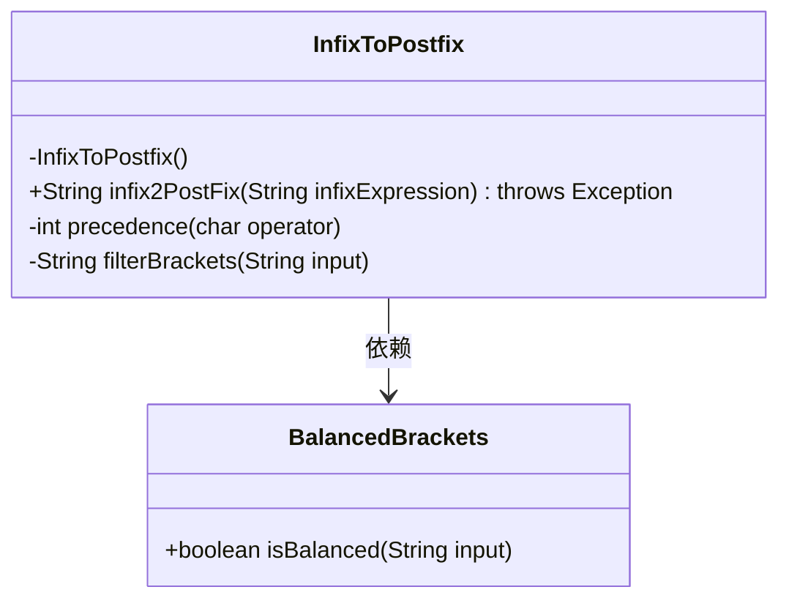

# 基础信息

|      |      |
|------|------|
| 名称 | InfixToPostfix |
| 编码语言 | .java |
| 代码路径 | Java/src/main/java/com/thealgorithms/stacks/InfixToPostfix.java |
| 包名 | com.thealgorithms.stacks |
| 依赖项 | ['java.util.Stack', 'java.util.regex.Matcher', 'java.util.regex.Pattern'] |
| 概述说明 | 中缀转后缀表达式，支持括号和运算符优先级。 |

# 说明

该内容描述了将中缀表达式转换为后缀表达式的功能，支持处理括号和运算符优先级。中缀表达式是人类常用的数学表达式形式，运算符位于操作数之间，如“3 + 4”。后缀表达式则是运算符位于操作数之后，如“3 4 +”，更适合计算机处理。转换过程中，需要根据运算符的优先级和括号的嵌套关系，确保表达式的计算顺序正确。这一功能在编译器和计算器类应用中尤为重要，能够提升表达式的解析和计算效率。

# 类列表 Class Summary

| 名称   | 类型  | 说明 |
|-------|------|-------------|
| InfixToPostfix | class | 将中缀表达式转换为后缀表达式，支持括号和运算符优先级。 |


## 类 InfixToPostfix

|      |      |
|------|------|
| 访问范围 | public final |
| 类型 | class |
| 名称 | InfixToPostfix |
| 说明 | 将中缀表达式转换为后缀表达式，支持括号和运算符优先级。 |


### UML类图



这段代码定义了一个名为 `InfixToPostfix` 的类，用于将中缀表达式转换为后缀表达式。`InfixToPostfix` 类包含一个私有构造函数，防止实例化。主要方法 `infix2PostFix` 接受一个中缀表达式字符串，并返回对应的后缀表达式。该方法依赖于 `BalancedBrackets` 类来检查表达式中的括号是否平衡。`precedence` 方法用于确定运算符的优先级，而 `filterBrackets` 方法则用于过滤出输入字符串中的括号字符。代码通过栈数据结构来处理运算符和括号的优先级，最终生成后缀表达式。


### 内部方法调用关系图

```mermaid
graph TD
    A["类InfixToPostfix"]
    B["私有构造方法: InfixToPostfix()"]
    C["公有静态方法: String infix2PostFix(String infixExpression)"]
    D["私有静态方法: int precedence(char operator)"]
    E["私有静态方法: String filterBrackets(String input)"]
    F["调用: BalancedBrackets.isBalanced(filterBrackets(infixExpression))"]
    G["抛出异常: throw new Exception('invalid expression')"]
    H["创建StringBuilder: output = new StringBuilder()"]
    I["创建Stack: stack = new Stack<>()"]
    J["遍历字符: for (char element : infixExpression.toCharArray())"]
    K["判断字符类型: Character.isLetterOrDigit(element)"]
    L["输出字符: output.append(element)"]
    M["判断字符是否为 '('"]
    N["压栈: stack.push(element)"]
    O["判断字符是否为 ')'"]
    P["出栈并输出: output.append(stack.pop())"]
    Q["出栈: stack.pop()"]
    R["判断运算符优先级: precedence(element) <= precedence(stack.peek())"]
    S["压栈: stack.push(element)"]
    T["剩余字符出栈: output.append(stack.pop())"]
    U["返回结果: return output.toString()"]

    A --> B
    A --> C
    A --> D
    A --> E
    C --> F
    F -->|false| G
    C --> H
    C --> I
    C --> J
    J --> K
    K -->|true| L
    J --> M
    M -->|true| N
    J --> O
    O -->|true| P
    P -->|stack.peek() != '('| P
    O --> Q
    J --> R
    R -->|true| P
    R -->|false| S
    C --> T
    C --> U
```

这段代码实现了一个将中缀表达式转换为后缀表达式的功能。首先，它通过`filterBrackets`方法过滤出输入字符串中的括号，然后使用`BalancedBrackets.isBalanced`方法检查括号是否平衡。如果不平衡，抛出异常。接着，代码遍历输入字符串中的每个字符，根据字符类型和运算符优先级，使用栈结构进行转换。最终，返回转换后的后缀表达式。

### 字段列表 Field List

| 名称  | 类型  | 说明 |
|-------|-------|------|

### 方法列表 Method List

| 名称  | 类型  | 说明 |
|-------|-------|------|
| filterBrackets | String | 该方法过滤字符串，仅保留括号类字符。 |
| infix2PostFix | String | 将中缀表达式转换为后缀表达式，处理括号和运算符优先级。 |
| precedence | int | 根据运算符返回优先级，+和-为0，*和/为1，^为2，否则返回-1。 |


