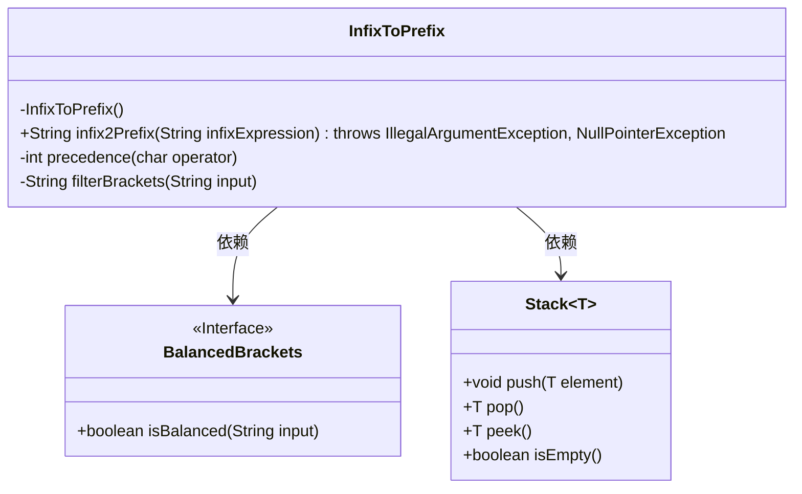
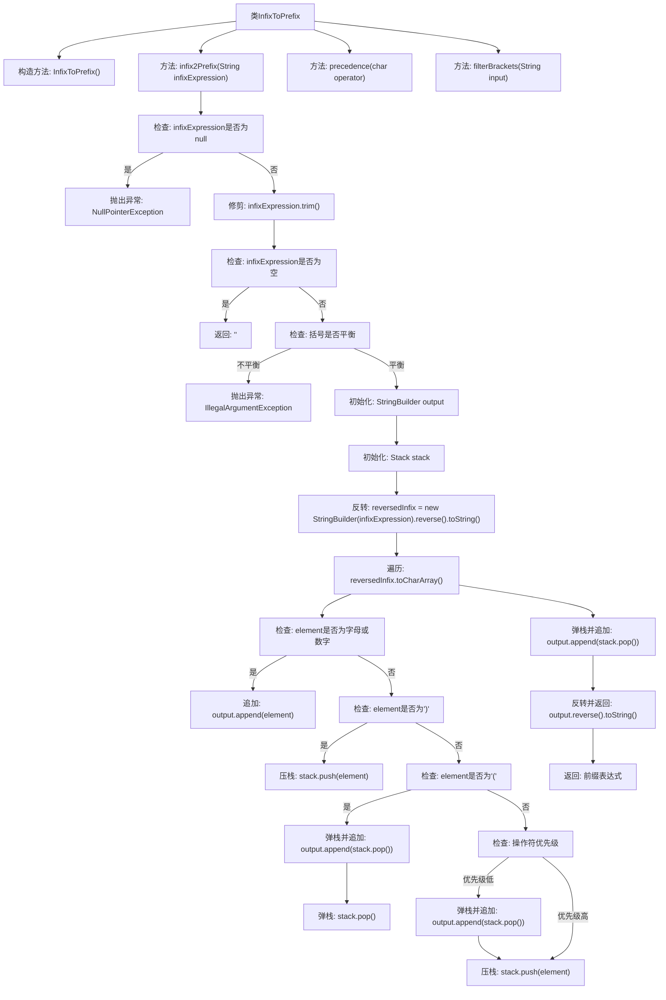

# 基础信息

|      |      |
|------|------|
| 名称 | InfixToPrefix |
| 编码语言 | .java |
| 代码路径 | Java/src/main/java/com/thealgorithms/stacks/InfixToPrefix.java |
| 包名 | com.thealgorithms.stacks |
| 依赖项 | ['java.util.Stack', 'java.util.regex.Matcher', 'java.util.regex.Pattern'] |
| 概述说明 | 中缀转前缀表达式，利用栈处理，支持括号与运算符优先级检查。 |

# 说明

中缀表达式转前缀表达式的过程涉及使用栈来处理运算符和括号。该方法首先检查表达式中括号的匹配情况，确保括号使用正确。在处理运算符时，根据运算符的优先级进行排序，确保高优先级运算符先被处理。通过栈的先进后出特性，最终将中缀表达式转换为前缀表达式。这一过程有效支持复杂表达式的转换，确保运算顺序的准确性。

# 类列表 Class Summary

| 名称   | 类型  | 说明 |
|-------|------|-------------|
| InfixToPrefix | class | 中缀表达式转前缀表达式，使用栈处理，支持括号检查与运算符优先级。 |

## 类 InfixToPrefix

|      |      |
|------|------|
| 访问范围 | public final |
| 类型 | class |
| 名称 | InfixToPrefix |
| 说明 | 中缀表达式转前缀表达式，使用栈处理，支持括号检查与运算符优先级。 |

### UML类图

这段代码定义了一个`InfixToPrefix`类，用于将中缀表达式转换为前缀表达式。该类依赖于`BalancedBrackets`接口来检查括号是否平衡，并使用`Stack`类来辅助转换过程。`InfixToPrefix`类包含三个方法：`infix2Prefix`用于执行转换，`precedence`用于确定操作符的优先级，`filterBrackets`用于过滤出输入字符串中的括号。代码通过反转中缀表达式并使用栈来处理操作符和括号，最终得到前缀表达式。

### 内部方法调用关系图

这段代码实现了一个将中缀表达式转换为前缀表达式的工具类。通过使用栈来处理操作符的优先级和括号的匹配，确保表达式的正确转换。代码首先检查输入的有效性，然后反转表达式并进行遍历，最终反转结果得到前缀表达式。流程图详细展示了每个步骤的逻辑流程和函数调用关系。

### 字段列表 Field List

| 名称  | 类型  | 说明 |
|-------|-------|------|

### 方法列表 Method List

| 名称  | 类型  | 说明 |
|-------|-------|------|
| filterBrackets | String | 过滤字符串中的括号，保留仅含括号字符。 |
| infix2Prefix | String | 将中缀表达式转换为前缀表达式，处理空值、空格及括号平衡，使用栈和优先级规则。 |
| precedence | int | 该方法返回运算符的优先级，加减为0，乘除为1，幂为2，其他为-1。 |

