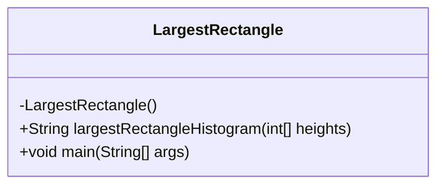
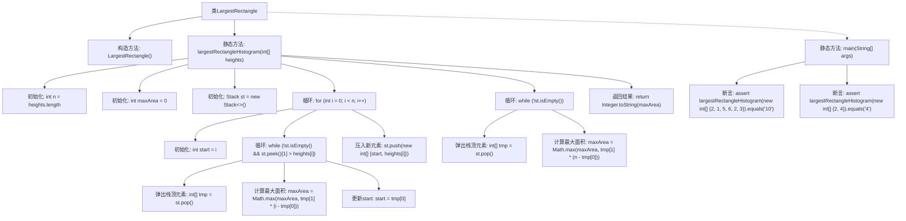

# 基础信息

|      |      |
|------|------|
| 名称 | LargestRectangle |
| 编码语言 | .java |
| 代码路径 | Java/src/main/java/com/thealgorithms/stacks/LargestRectangle.java |
| 包名 | com.thealgorithms.stacks |
| 依赖项 | ['java.util.Stack'] |
| 概述说明 | Java类通过栈优化算法计算直方图最大矩形面积。 |

# 说明

这是一个用于计算直方图中最大矩形面积的Java类，采用了栈优化算法。该算法通过栈数据结构高效地遍历直方图，确定每个柱子能够形成的最大矩形面积。具体实现中，栈用于存储柱子的索引，确保在遍历过程中能够快速找到左右边界，从而计算当前柱子的最大矩形面积。该算法的时间复杂度为O(n)，适用于处理大规模数据，能够高效地找到直方图中的最大矩形面积。

# 类列表 Class Summary

| 名称   | 类型  | 说明 |
|-------|------|-------------|
| LargestRectangle | class | 计算直方图中最大矩形面积的Java类，使用栈优化算法。 |

## 类 LargestRectangle

|      |      |
|------|------|
| 访问范围 | public final |
| 类型 | class |
| 名称 | LargestRectangle |
| 说明 | 计算直方图中最大矩形面积的Java类，使用栈优化算法。 |

### UML类图

类图描述：`LargestRectangle` 类是一个工具类，用于计算直方图中最大矩形的面积。它包含一个私有的构造函数，确保不能被实例化。类中的 `largestRectangleHistogram` 方法接受一个整数数组作为输入，返回最大矩形面积的字符串表示。`main` 方法用于测试 `largestRectangleHistogram` 方法的正确性，通过断言验证结果是否符合预期。

### 内部方法调用关系图

这段代码实现了一个名为 `LargestRectangle` 的类，其中包含一个静态方法 `largestRectangleHistogram`，用于计算直方图中的最大矩形面积。该方法使用栈来维护直方图中的柱子，并通过遍历和弹出栈顶元素来计算最大面积。`main` 方法包含两个断言，用于验证 `largestRectangleHistogram` 方法的正确性。流程图展示了类的结构、方法的调用顺序以及循环和条件判断的逻辑流程。

### 字段列表 Field List

| 名称  | 类型  | 说明 |
|-------|-------|------|

### 方法列表 Method List

| 名称  | 类型  | 说明 |
|-------|-------|------|
| largestRectangleHistogram | String | 计算直方图中最大矩形面积的Java方法。 |
| main | void | Java代码验证最大矩形面积计算函数。 |

