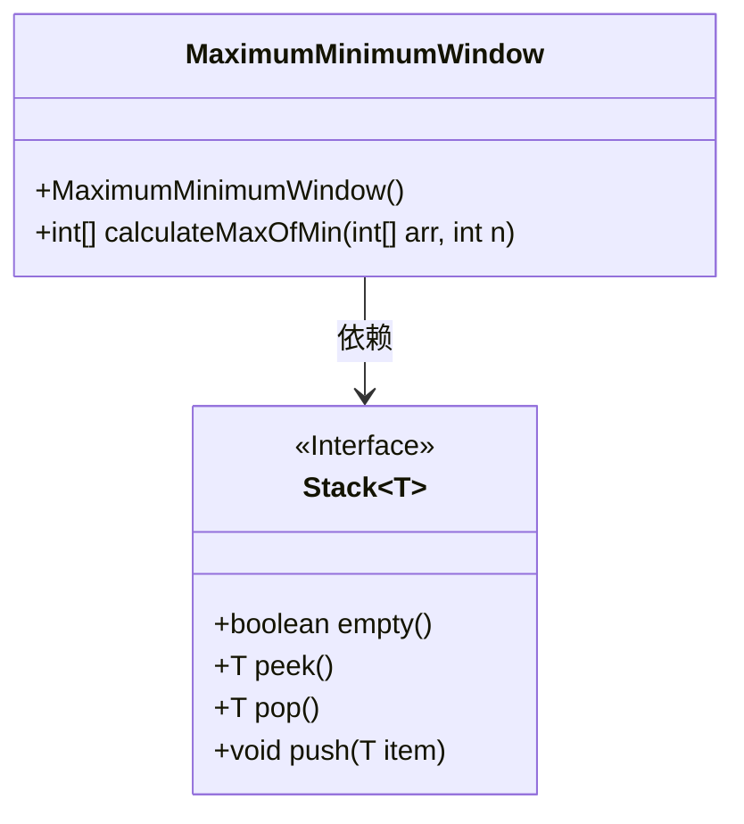
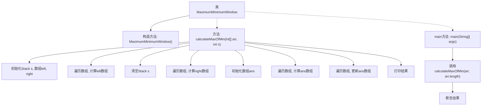

# 基础信息

|      |      |
|------|------|
| 名称 | MaximumMinimumWindow |
| 编码语言 | .java |
| 代码路径 | Java/src/main/java/com/thealgorithms/stacks/MaximumMinimumWindow.java |
| 包名 | com.thealgorithms.stacks |
| 依赖项 | ['java.util.Arrays', 'java.util.Stack'] |
| 概述说明 | 用栈计算数组窗口的最小值和最大值。 |

# 说明

使用栈结构计算数组中每个窗口大小的最小值和最大值。该方法通过维护一个栈来高效地处理数组中的元素，确保在每个窗口内快速找到最小值和最大值。栈结构帮助优化了时间复杂度，避免了重复计算，适用于需要频繁查询窗口内极值的场景。这种方法在处理滑动窗口问题时尤为有效，能够显著提升计算效率。

# 类列表 Class Summary

| 名称   | 类型  | 说明 |
|-------|------|-------------|
| MaximumMinimumWindow | class | 使用栈结构计算数组中每个窗口大小的最小值最大值。 |

## 类 MaximumMinimumWindow

|      |      |
|------|------|
| 访问范围 | public final |
| 类型 | class |
| 名称 | MaximumMinimumWindow |
| 说明 | 使用栈结构计算数组中每个窗口大小的最小值最大值。 |

### UML类图

这段代码定义了一个 `MaximumMinimumWindow` 类，该类包含一个私有构造函数和一个静态方法 `calculateMaxOfMin`。该方法使用栈数据结构来计算每个窗口大小的最小值中的最大值。`Stack` 是一个泛型接口，`MaximumMinimumWindow` 类依赖于 `Stack` 接口来实现其功能。代码的主要逻辑是通过遍历数组并使用栈来找到每个元素左右边界，然后计算每个窗口大小的最小值中的最大值，并最终返回结果数组。

### 内部方法调用关系图

这段代码实现了一个名为`MaximumMinimumWindow`的类，其中包含一个静态方法`calculateMaxOfMin`，用于计算数组中每个窗口大小的最小值中的最大值。代码通过使用栈数据结构来高效地计算每个元素的左右边界，然后根据这些边界计算每个窗口大小的最大值。最后，代码在`main`方法中调用该方法，并通过断言验证结果的正确性。

### 字段列表 Field List

| 名称  | 类型  | 说明 |
|-------|-------|------|

### 方法列表 Method List

| 名称  | 类型  | 说明 |
|-------|-------|------|
| calculateMaxOfMin | int[] | 计算数组中每个长度子数组的最小值最大值。 |
| main | void | Java代码示例：计算数组最小值最大值并验证结果。 |

