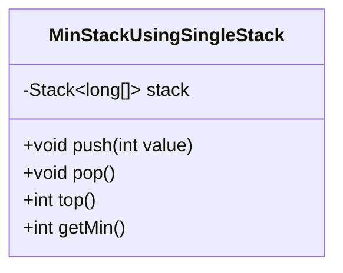
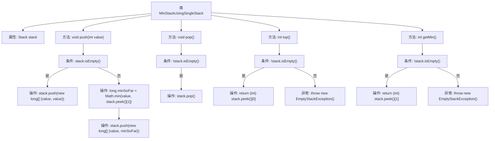

# 基础信息

|      |      |
|------|------|
| 名称 | MinStackUsingSingleStack |
| 编码语言 | .java |
| 代码路径 | Java/src/main/java/com/thealgorithms/stacks/MinStackUsingSingleStack.java |
| 包名 | com.thealgorithms.stacks |
| 依赖项 | ['java.util.EmptyStackException', 'java.util.Stack'] |
| 概述说明 | 单栈实现最小栈，存储值与当前最小，支持入栈、出栈、获取栈顶和最小值操作。 |

# 说明

单栈实现最小栈的方法是通过在栈中同时存储元素值和当前最小值。该结构支持入栈操作，将新元素及其对应的最小值压入栈中；出栈操作，移除栈顶元素；获取栈顶元素，返回栈顶的值；以及获取最小值操作，返回栈顶记录的最小值。这种方法确保了在常数时间内能够获取栈中的最小值，同时保持了栈的基本功能。

# 类列表 Class Summary

| 名称   | 类型  | 说明 |
|-------|------|-------------|
| MinStackUsingSingleStack | class | 单栈实现最小栈，存储值和当前最小值，支持入栈、出栈、获取栈顶和最小值操作。 |

## 类 MinStackUsingSingleStack

|      |      |
|------|------|
| 访问范围 | public |
| 类型 | class |
| 名称 | MinStackUsingSingleStack |
| 说明 | 单栈实现最小栈，存储值和当前最小值，支持入栈、出栈、获取栈顶和最小值操作。 |

### UML类图

类图描述：`MinStackUsingSingleStack` 类实现了一个支持获取最小值的栈结构。它使用一个 `Stack<long[]>` 来存储元素，其中每个元素是一个包含当前值和当前最小值的数组。类提供了 `push`、`pop`、`top` 和 `getMin` 方法，分别用于压入元素、弹出栈顶元素、获取栈顶元素以及获取当前栈中的最小值。通过这种方式，可以在常数时间内获取栈中的最小值。

### 内部方法调用关系图

这段代码实现了一个最小栈（MinStack），使用单个栈来存储元素及其当前最小值。`push`方法将新元素和当前最小值一起压入栈中；`pop`方法移除栈顶元素；`top`方法返回栈顶元素；`getMin`方法返回栈中的最小值。通过这种方式，可以在常数时间内获取最小值，同时保持栈的基本操作效率。

### 字段列表 Field List

| 名称  | 类型  | 说明 |
|-------|-------|------|
| stack = new Stack<>() | Stack<long[]> | 声明一个存储长整型数组的私有栈对象。 |

### 方法列表 Method List

| 名称  | 类型  | 说明 |
|-------|-------|------|
| push | void | 方法`push`将值及其当前最小值压入栈中。 |
| pop | void | 该方法检查栈非空后执行弹出操作。 |
| getMin | int | 获取栈中最小元素，若栈空则抛出异常。 |
| top | int | 获取栈顶元素，若栈为空则抛出异常。 |

