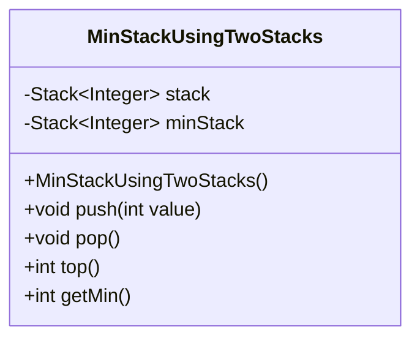
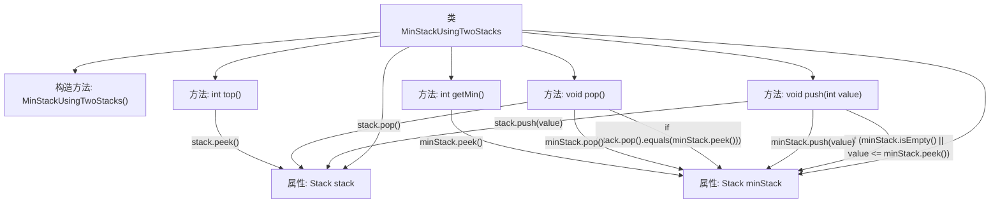

# 基础信息

|      |      |
|------|------|
| 名称 | MinStackUsingTwoStacks |
| 编码语言 | .java |
| 代码路径 | Java/src/main/java/com/thealgorithms/stacks/MinStackUsingTwoStacks.java |
| 包名 | com.thealgorithms.stacks |
| 依赖项 | ['java.util.Stack'] |
| 概述说明 | 双栈实现最小栈，支持push、pop、top和getMin操作。 |

# 说明

使用双栈实现最小栈的方法，支持四种基本操作：push、pop、top和getMin。push操作用于将元素压入栈中，pop操作用于移除栈顶元素，top操作用于获取栈顶元素，而getMin操作用于获取栈中的最小元素。通过维护两个栈，一个用于存储所有元素，另一个用于存储当前最小元素，可以高效地实现这些操作，确保在常数时间内获取最小元素。这种方法在空间复杂度上有所增加，但显著提升了获取最小元素的效率。

# 类列表 Class Summary

| 名称   | 类型  | 说明 |
|-------|------|-------------|
| MinStackUsingTwoStacks | class | 使用双栈实现最小栈，支持push、pop、top和getMin操作。 |

## 类 MinStackUsingTwoStacks

|      |      |
|------|------|
| 访问范围 | public final |
| 类型 | class |
| 名称 | MinStackUsingTwoStacks |
| 说明 | 使用双栈实现最小栈，支持push、pop、top和getMin操作。 |

### UML类图

这段代码定义了一个名为 `MinStackUsingTwoStacks` 的类，该类使用两个栈来实现一个最小栈。`stack` 用于存储所有元素，而 `minStack` 用于存储当前最小元素。`push` 方法将元素压入 `stack`，如果该元素小于或等于 `minStack` 的栈顶元素，则也将其压入 `minStack`。`pop` 方法从 `stack` 中弹出元素，如果该元素等于 `minStack` 的栈顶元素，则也从 `minStack` 中弹出。`top` 方法返回 `stack` 的栈顶元素，而 `getMin` 方法返回 `minStack` 的栈顶元素，即当前最小元素。

### 内部方法调用关系图

这段代码实现了一个最小栈（MinStack）数据结构，使用两个栈来维护元素和当前最小值。`push`方法将元素压入主栈，并在最小栈为空或新元素小于等于当前最小值时更新最小栈。`pop`方法从主栈弹出元素，如果该元素是最小值，则同时从最小栈弹出。`top`方法返回主栈的栈顶元素，`getMin`方法返回最小栈的栈顶元素，即当前最小值。

### 字段列表 Field List

| 名称  | 类型  | 说明 |
|-------|-------|------|
| stack = new Stack<>() | Stack<Integer> | 定义了一个私有的整型栈对象。 |
| minStack = new Stack<>() | Stack<Integer> | 声明一个私有的栈对象，用于存储整数最小值。 |

### 方法列表 Method List

| 名称  | 类型  | 说明 |
|-------|-------|------|
| top | int | 返回栈顶元素。 |
| getMin | int | 获取最小栈顶元素。 |
| pop | void | 弹出栈顶元素，若与最小栈顶相同则同时弹出。 |
| push | void | 该方法将值压入主栈，若最小栈为空或值小于等于最小栈顶，则同时压入最小栈。 |

