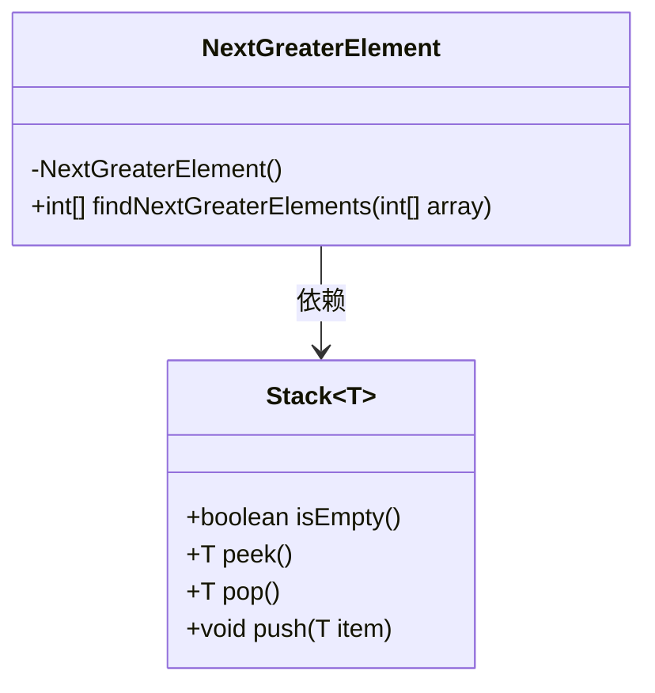
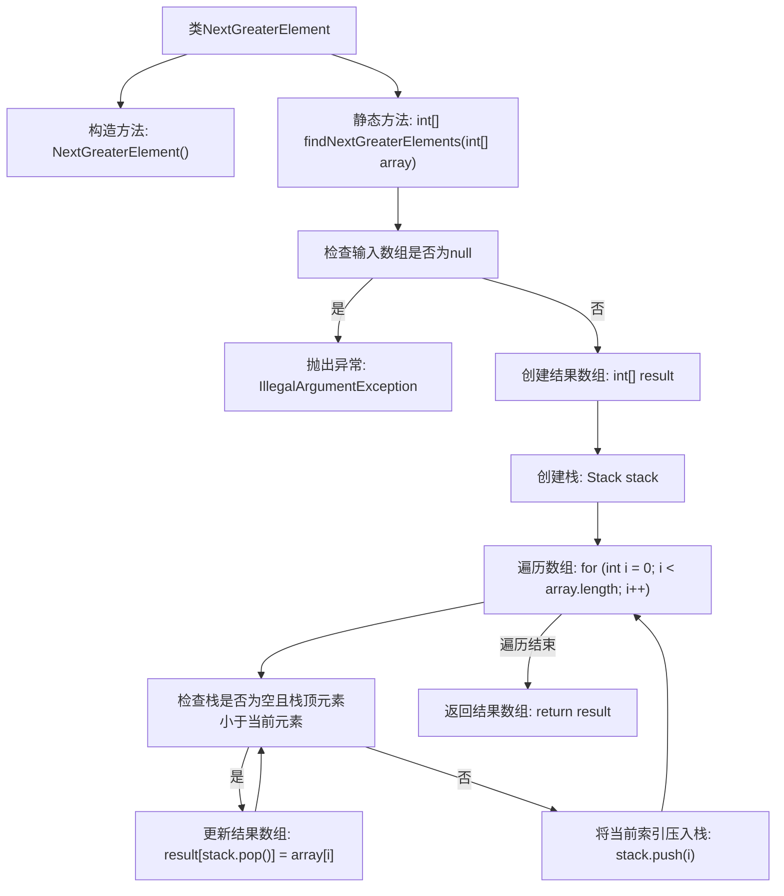

# 基础信息

|      |      |
|------|------|
| 名称 | NextGreaterElement |
| 编码语言 | .java |
| 代码路径 | Java/src/main/java/com/thealgorithms/stacks/NextGreaterElement.java |
| 包名 | com.thealgorithms.stacks |
| 依赖项 | ['java.util.Stack'] |
| 概述说明 | 查找数组元素右侧首个更大值，无则返回0。 |

# 说明

该任务要求在数组中查找每个元素右侧的下一个更大元素。如果某个元素右侧没有更大的元素，则返回0。这一过程需要遍历数组，对于每个元素，搜索其右侧的元素，找到第一个比它大的值。如果找到，则返回该值；如果遍历到数组末尾仍未找到，则返回0。此操作适用于需要快速确定每个元素右侧更大元素的情况，常用于解决数组相关的问题。

# 类列表 Class Summary

| 名称   | 类型  | 说明 |
|-------|------|-------------|
| NextGreaterElement | class | 查找数组中每个元素右侧的下一个更大元素，若无则返回0。 |

## 类 NextGreaterElement

|      |      |
|------|------|
| 访问范围 | public final |
| 类型 | class |
| 名称 | NextGreaterElement |
| 说明 | 查找数组中每个元素右侧的下一个更大元素，若无则返回0。 |

### UML类图

**描述：**  
`NextGreaterElement` 类是一个工具类，用于查找数组中每个元素的下一个更大元素。它包含一个私有构造函数，防止实例化，并提供一个静态方法 `findNextGreaterElements`，该方法接收一个整数数组并返回一个新数组，其中每个元素被替换为原数组中右侧第一个更大的元素，如果没有更大的元素则替换为0。该方法使用 `Stack` 类来辅助实现这一功能，通过遍历数组并利用栈来记录待处理的索引，从而高效地找到下一个更大元素。

### 内部方法调用关系图

这段代码定义了一个名为`NextGreaterElement`的类，其中包含一个静态方法`findNextGreaterElements`，用于查找数组中每个元素的下一个更大元素。方法首先检查输入数组是否为null，如果是则抛出异常。然后创建一个结果数组和一个栈，遍历输入数组，使用栈来记录未找到下一个更大元素的索引，并更新结果数组。最后返回结果数组。

### 字段列表 Field List

| 名称  | 类型  | 说明 |
|-------|-------|------|

### 方法列表 Method List

| 名称  | 类型  | 说明 |
|-------|-------|------|
| findNextGreaterElements | int[] | 查找数组中每个元素的下一个更大元素，使用栈实现。 |

