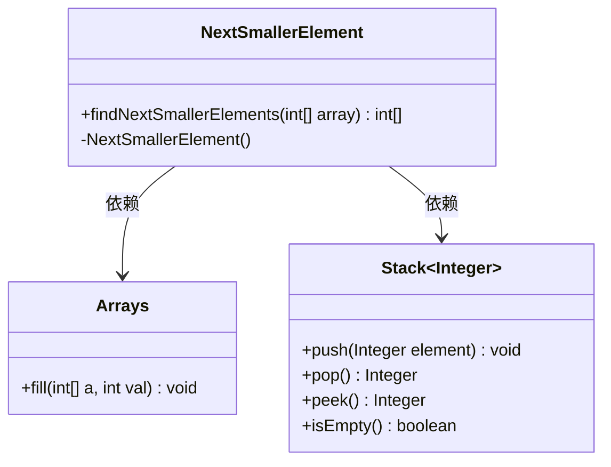
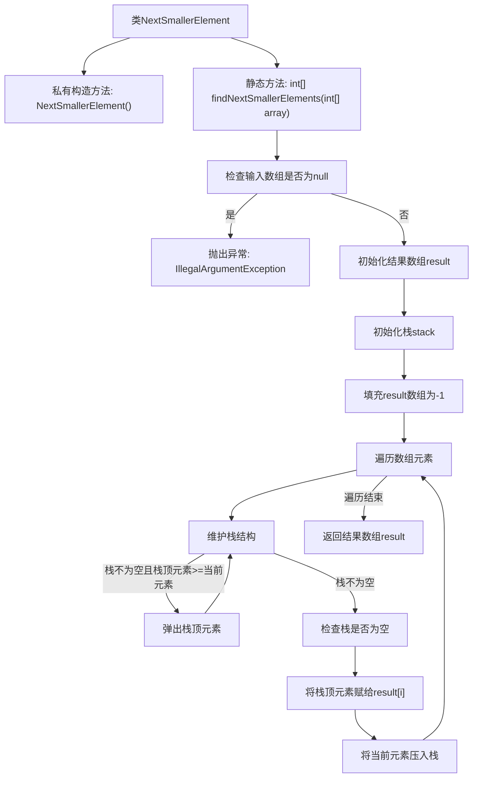

# 基础信息

|      |      |
|------|------|
| 名称 | NextSmallerElement |
| 编码语言 | .java |
| 代码路径 | Java/src/main/java/com/thealgorithms/stacks/NextSmallerElement.java |
| 包名 | com.thealgorithms.stacks |
| 依赖项 | ['java.util.Arrays', 'java.util.Stack'] |
| 概述说明 | 查找数组中每个元素左侧下一个更小的元素，若无则返回-1。 |

# 说明

该问题要求查找数组中每个元素左侧的下一个更小的元素。具体来说，对于数组中的每一个元素，需要在其左侧寻找第一个比它小的元素，并返回该元素的值。如果左侧没有比当前元素更小的元素，则返回-1。这个问题通常用于处理单调栈相关的算法场景，能够有效解决类似查找最近较小值的问题。

# 类列表 Class Summary

| 名称   | 类型  | 说明 |
|-------|------|-------------|
| NextSmallerElement | class | 查找数组中每个元素左侧下一个更小的元素，若无则返回-1。 |

## 类 NextSmallerElement

|      |      |
|------|------|
| 访问范围 | public final |
| 类型 | class |
| 名称 | NextSmallerElement |
| 说明 | 查找数组中每个元素左侧下一个更小的元素，若无则返回-1。 |

### UML类图

### 描述
`NextSmallerElement` 类包含一个静态方法 `findNextSmallerElements`，用于查找数组中每个元素的下一个较小元素。该方法使用 `Stack` 数据结构来维护当前元素的较小元素，并通过 `Arrays` 类初始化结果数组。`Stack` 类提供了基本的栈操作，如 `push`、`pop`、`peek` 和 `isEmpty`。`Arrays` 类提供了 `fill` 方法，用于将数组的所有元素初始化为指定值。

### 内部方法调用关系图

这段代码定义了一个名为`NextSmallerElement`的类，其中包含一个静态方法`findNextSmallerElements`，用于查找数组中每个元素的左侧下一个较小元素。方法首先检查输入数组是否为null，若为null则抛出异常。接着初始化结果数组和栈，遍历数组时维护栈结构以确保栈顶元素始终是当前元素的下一个较小元素，最终返回结果数组。流程图展示了方法的执行流程和逻辑判断。

### 字段列表 Field List

| 名称  | 类型  | 说明 |
|-------|-------|------|

### 方法列表 Method List

| 名称  | 类型  | 说明 |
|-------|-------|------|
| findNextSmallerElements | int[] | 查找数组中每个元素的下一个较小元素，使用栈实现，结果初始为-1。 |

