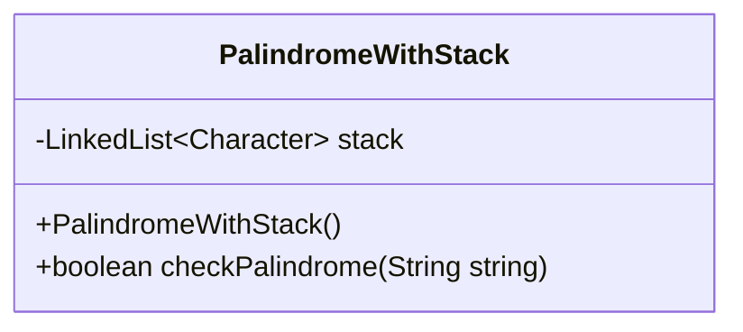
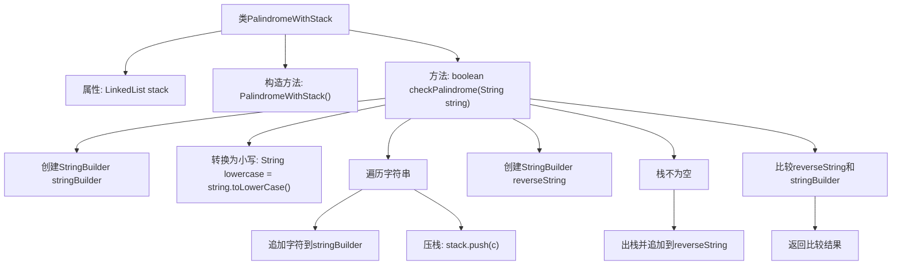

# 基础信息

|      |      |
|------|------|
| 名称 | PalindromeWithStack |
| 编码语言 | .java |
| 代码路径 | Java/src/main/java/com/thealgorithms/stacks/PalindromeWithStack.java |
| 包名 | com.thealgorithms.stacks |
| 依赖项 | ['java.util.LinkedList'] |
| 概述说明 | 使用栈比较字符串正反向是否相同，判断回文。 |

# 说明

使用栈数据结构来检查字符串是否为回文。具体方法是将字符串中的字符依次压入栈中，然后逐个弹出字符并与原字符串的字符进行比较。如果所有字符都匹配，则字符串为回文；否则，不是回文。这种方法通过比较正向和反向字符串来实现回文检测。

# 类列表 Class Summary

| 名称   | 类型  | 说明 |
|-------|------|-------------|
| PalindromeWithStack | class | 使用栈检查字符串是否为回文，比较正向和反向字符串。 |

## 类 PalindromeWithStack

|      |      |
|------|------|
| 访问范围 | public |
| 类型 | class |
| 名称 | PalindromeWithStack |
| 说明 | 使用栈检查字符串是否为回文，比较正向和反向字符串。 |

### UML类图

这段代码定义了一个 `PalindromeWithStack` 类，用于检查一个字符串是否是回文。类中包含一个私有的 `LinkedList<Character>` 类型的栈，用于存储字符。`checkPalindrome` 方法通过将字符串转换为小写，并将其字符逐个压入栈中，同时构建一个从左到右的字符串。然后，通过从栈中弹出字符构建一个反向字符串，最后比较这两个字符串是否相等，从而判断原字符串是否为回文。

### 内部方法调用关系图

这段代码定义了一个类`PalindromeWithStack`，用于检查一个字符串是否是回文。它通过将字符串中的字符压入栈中，然后再依次弹出字符来构建反转字符串，最后比较原字符串和反转字符串是否相等。流程图展示了类的结构以及`checkPalindrome`方法的执行步骤，包括字符串处理、栈操作和最终比较。

### 字段列表 Field List

| 名称  | 类型  | 说明 |
|-------|-------|------|
| stack | LinkedList<Character> | 私有链表存储字符类型的数据结构。 |

### 方法列表 Method List

| 名称  | 类型  | 说明 |
|-------|-------|------|
| checkPalindrome | boolean | 检查字符串是否为回文，通过构建正向和反向字符串并比较。 |

