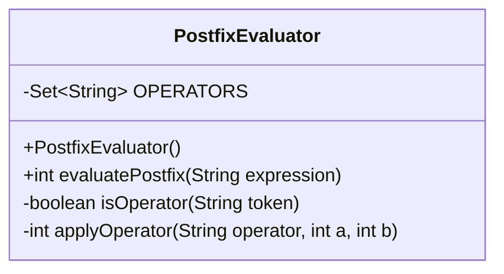
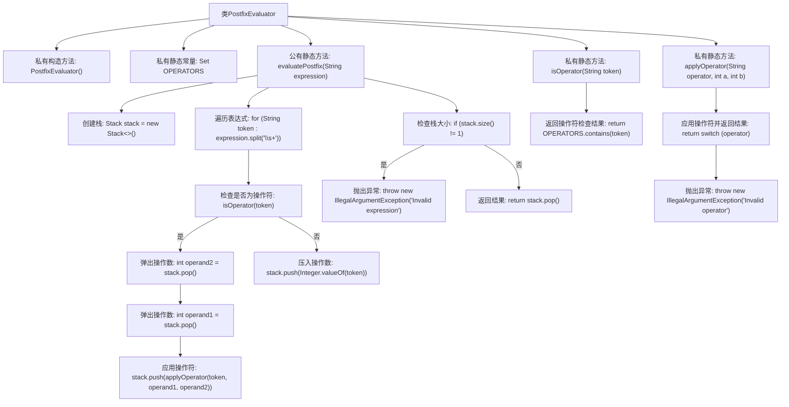

# 基础信息

|      |      |
|------|------|
| 名称 | PostfixEvaluator |
| 编码语言 | .java |
| 代码路径 | Java/src/main/java/com/thealgorithms/stacks/PostfixEvaluator.java |
| 包名 | com.thealgorithms.stacks |
| 依赖项 | ['java.util.Set', 'java.util.Stack'] |
| 概述说明 | PostfixEvaluator类用于计算后缀表达式，支持基本四则运算。 |

# 说明

PostfixEvaluator类是一个专门用于计算后缀表达式的工具，支持基本的四则运算操作，包括加法、减法、乘法和除法。它能够有效地解析和处理后缀表达式，确保计算结果的准确性。

# 类列表 Class Summary

| 名称   | 类型  | 说明 |
|-------|------|-------------|
| PostfixEvaluator | class | PostfixEvaluator类用于计算后缀表达式，支持加减乘除操作。 |

## 类 PostfixEvaluator

|      |      |
|------|------|
| 访问范围 | public final |
| 类型 | class |
| 名称 | PostfixEvaluator |
| 说明 | PostfixEvaluator类用于计算后缀表达式，支持加减乘除操作。 |

### UML类图

**描述：**
`PostfixEvaluator` 是一个用于计算后缀表达式的工具类。它包含一个私有的 `OPERATORS` 集合，用于存储支持的运算符。类中的 `evaluatePostfix` 方法接收一个后缀表达式字符串，使用栈结构进行计算，并返回结果。`isOperator` 方法用于检查某个标记是否为运算符，`applyOperator` 方法则根据运算符对两个操作数进行相应的运算。该类通过抛出 `IllegalArgumentException` 来处理无效的表达式或运算符。

### 内部方法调用关系图

这段代码实现了一个后缀表达式计算器，用于计算给定后缀表达式的结果。代码通过遍历表达式中的每个标记，判断是否为操作符，并根据操作符对操作数进行相应的计算。最终，如果栈中仅剩一个元素，则返回该元素作为结果，否则抛出异常表示表达式无效。

### 字段列表 Field List

| 名称  | 类型  | 说明 |
|-------|-------|------|
| OPERATORS = Set.of("+", "-", "*", "/") | Set<String> | 定义包含加、减、乘、除运算符的不可变集合。 |

### 方法列表 Method List

| 名称  | 类型  | 说明 |
|-------|-------|------|
| isOperator | boolean | 检查字符串是否为运算符。 |
| applyOperator | int | 静态方法根据运算符对两个整数进行加减乘除运算，无效运算符抛出异常。 |
| evaluatePostfix | int | 该方法用于计算后缀表达式，使用栈处理操作数和运算符，最终返回结果。 |

