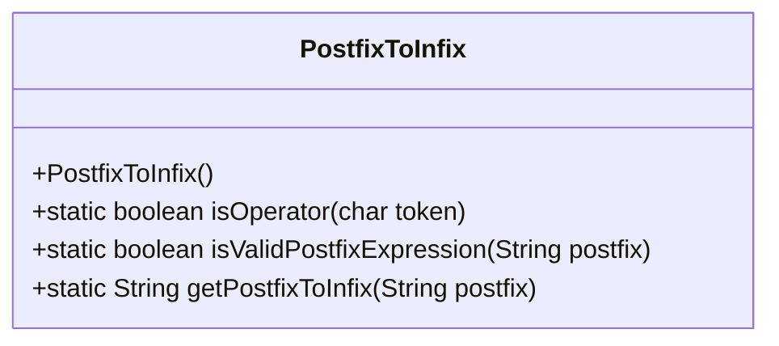
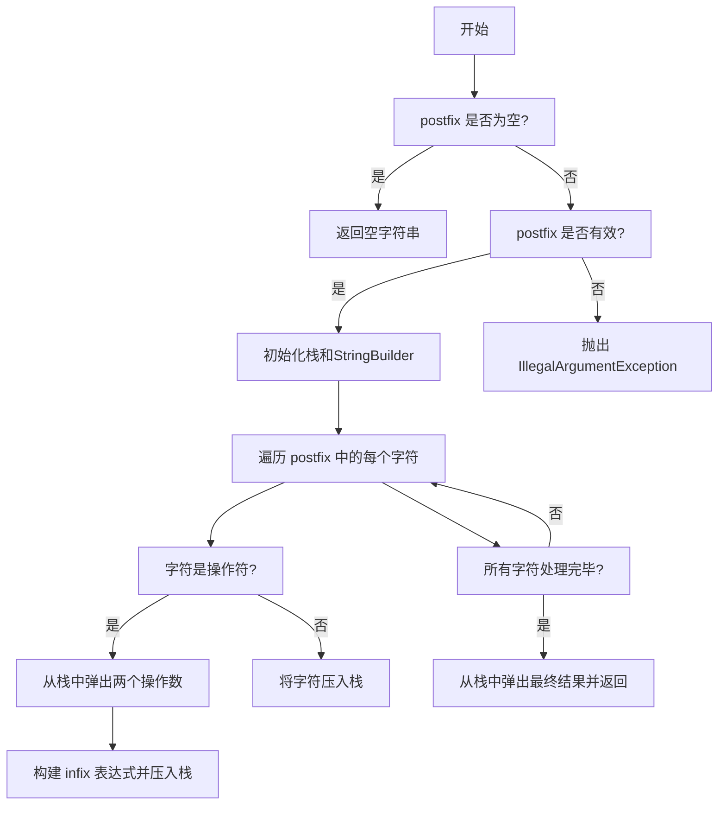
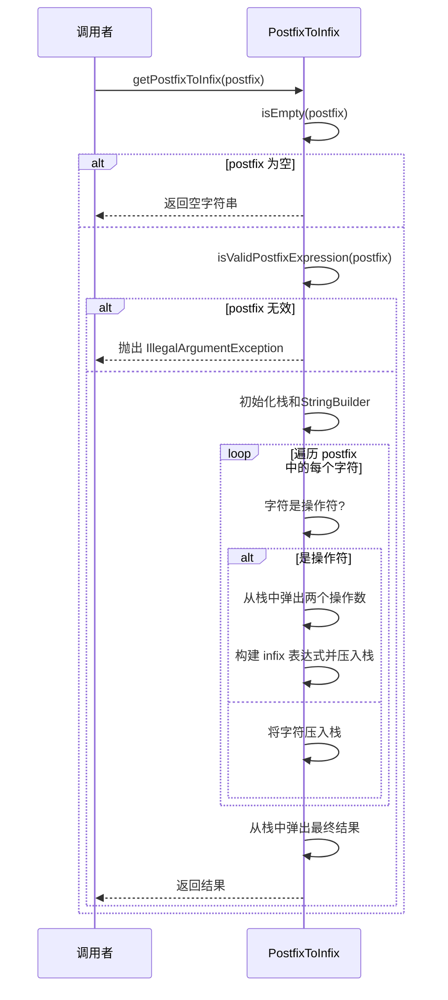
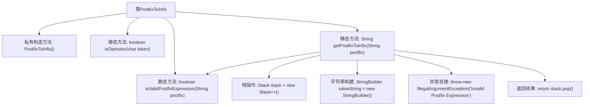

# 基础信息

|      |      |
|------|------|
| 名称 | PostfixToInfix |
| 编码语言 | .java |
| 代码路径 | Java/src/main/java/com/thealgorithms/stacks/PostfixToInfix.java |
| 包名 | com.thealgorithms.stacks |
| 依赖项 | ['java.util.Stack'] |
| 概述说明 | PostfixToInfix类实现后缀表达式验证及转换中缀表达式功能。 |

# 说明

PostfixToInfix类主要负责验证和转换后缀表达式为中缀表达式。该类具备多项功能，包括判断运算符的有效性、验证表达式的合法性以及执行后缀表达式到中缀表达式的转换。通过这些功能，确保输入的表达式符合要求，并能够准确转换为中缀形式。

# 类列表 Class Summary

| 名称   | 类型  | 说明 |
|-------|------|-------------|
| PostfixToInfix | class | PostfixToInfix类验证并转换后缀表达式为中缀表达式，包含运算符判断、表达式验证和转换功能。 |

## 类 PostfixToInfix

|      |      |
|------|------|
| 访问范围 | public final |
| 类型 | class |
| 名称 | PostfixToInfix |
| 说明 | PostfixToInfix类验证并转换后缀表达式为中缀表达式，包含运算符判断、表达式验证和转换功能。 |

### UML类图

**描述：**
`PostfixToInfix` 类提供了将后缀表达式转换为中缀表达式的功能。它包含三个静态方法：`isOperator` 用于判断字符是否为操作符，`isValidPostfixExpression` 用于验证后缀表达式的有效性，`getPostfixToInfix` 用于执行转换。类图展示了类的结构，流程图和时序图详细描述了方法的执行流程和交互过程。

### 内部方法调用关系图

这段代码定义了一个名为 `PostfixToInfix` 的类，用于将后缀表达式转换为中缀表达式。类中包含三个主要方法：`isOperator` 用于判断字符是否为运算符，`isValidPostfixExpression` 用于验证后缀表达式的有效性，`getPostfixToInfix` 用于执行实际的转换操作。转换过程中使用栈来存储操作数，并通过字符串构建器生成中缀表达式。如果输入的后缀表达式无效，方法会抛出 `IllegalArgumentException` 异常。

### 字段列表 Field List

| 名称  | 类型  | 说明 |
|-------|-------|------|

### 方法列表 Method List

| 名称  | 类型  | 说明 |
|-------|-------|------|
| isValidPostfixExpression | boolean | 检查后缀表达式有效性，确保操作数和运算符数量正确。 |
| isOperator | boolean | 判断字符是否为运算符（+、-、/、*、^）。 |
| getPostfixToInfix | String | 将后缀表达式转换为中缀表达式的Java方法。 |

