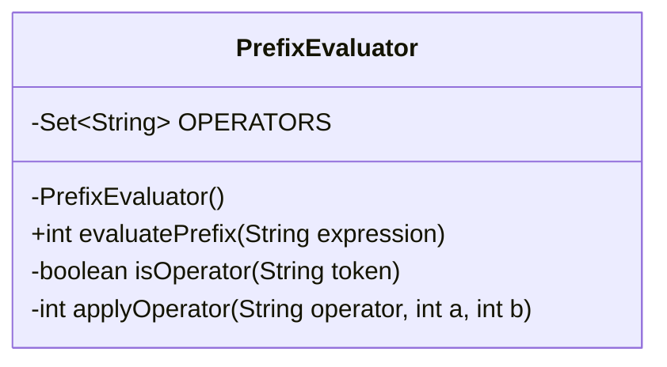
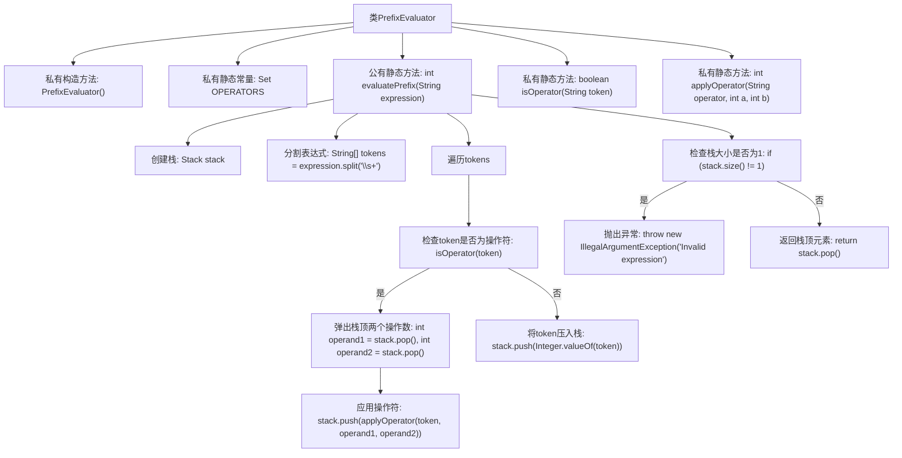

# 基础信息

|      |      |
|------|------|
| 名称 | PrefixEvaluator |
| 编码语言 | .java |
| 代码路径 | Java/src/main/java/com/thealgorithms/stacks/PrefixEvaluator.java |
| 包名 | com.thealgorithms.stacks |
| 依赖项 | ['java.util.Set', 'java.util.Stack'] |
| 概述说明 | PrefixEvaluator类通过栈计算前缀表达式，支持加减乘除。 |

# 说明

PrefixEvaluator类专门用于计算前缀表达式，支持基本的加减乘除运算操作。该类通过栈数据结构实现表达式计算，确保运算顺序和结果的准确性。前缀表达式是一种运算符位于操作数之前的表达式形式，PrefixEvaluator类能够有效解析并计算此类表达式，适用于需要处理前缀表达式的场景。

# 类列表 Class Summary

| 名称   | 类型  | 说明 |
|-------|------|-------------|
| PrefixEvaluator | class | PrefixEvaluator类用于计算前缀表达式，支持加减乘除操作，通过栈实现。 |

## 类 PrefixEvaluator

|      |      |
|------|------|
| 访问范围 | public final |
| 类型 | class |
| 名称 | PrefixEvaluator |
| 说明 | PrefixEvaluator类用于计算前缀表达式，支持加减乘除操作，通过栈实现。 |

### UML类图

**描述：**  
`PrefixEvaluator` 类是一个用于计算前缀表达式的工具类。它包含一个私有的构造函数，防止实例化，并通过静态方法 `evaluatePrefix` 来计算表达式。该类使用一个栈来处理操作数和运算符，并通过 `isOperator` 和 `applyOperator` 方法来辅助计算。`OPERATORS` 是一个包含有效运算符的集合，用于验证操作符的合法性。该类设计为不可实例化，所有方法均为静态，适用于单次计算任务。

### 内部方法调用关系图

这段代码实现了一个前缀表达式求值器。`PrefixEvaluator`类包含一个私有构造方法和三个静态方法：`evaluatePrefix`用于计算前缀表达式的结果，`isOperator`用于检查某个token是否为操作符，`applyOperator`用于将操作符应用到两个操作数上。`evaluatePrefix`方法首先将表达式分割成tokens，然后从后向前遍历tokens，遇到操作符时弹出栈顶的两个操作数并应用操作符，最后返回栈顶的结果。如果表达式无效，会抛出异常。

### 字段列表 Field List

| 名称  | 类型  | 说明 |
|-------|-------|------|
| OPERATORS = Set.of("+", "-", "*", "/") | Set<String> | 定义私有静态常量集合OPERATORS，包含加减乘除运算符。 |

### 方法列表 Method List

| 名称  | 类型  | 说明 |
|-------|-------|------|
| isOperator | boolean | 判断字符串是否为运算符。 |
| applyOperator | int | 静态方法根据运算符对两个整数进行相应运算并返回结果。 |
| evaluatePrefix | int | 该方法通过栈结构实现前缀表达式的求值，处理运算符和操作数，最终返回计算结果。 |

