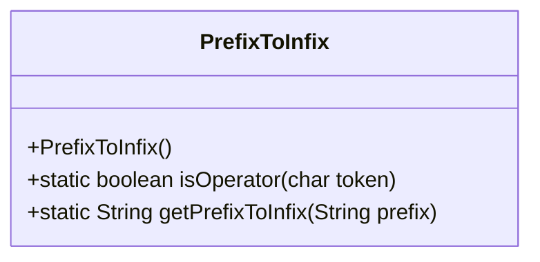
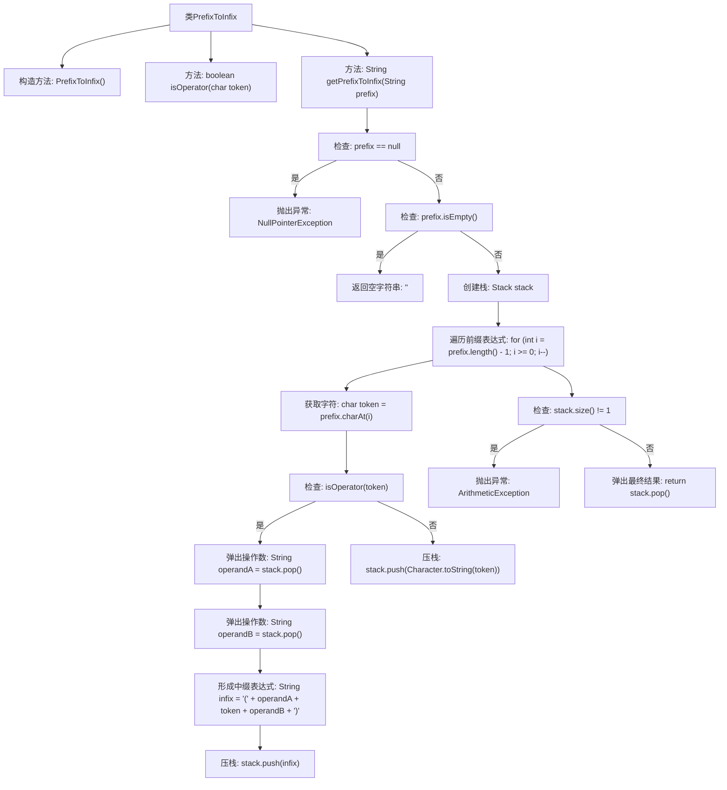

# 基础信息

|      |      |
|------|------|
| 名称 | PrefixToInfix |
| 编码语言 | .java |
| 代码路径 | Java/src/main/java/com/thealgorithms/stacks/PrefixToInfix.java |
| 包名 | com.thealgorithms.stacks |
| 依赖项 | ['java.util.Stack'] |
| 概述说明 | PrefixToInfix类实现前缀表达式到中缀表达式的转换，支持基本运算。 |

# 说明

PrefixToInfix类负责将前缀表达式转换为中缀表达式，支持包括加法、减法、乘法、除法和幂运算在内的多种基本运算操作。该类的功能旨在处理复杂的前缀表达式，并将其转换为更直观的中缀表达式形式，便于理解和计算。通过这一转换，用户能够更方便地处理和分析数学表达式。

# 类列表 Class Summary

| 名称   | 类型  | 说明 |
|-------|------|-------------|
| PrefixToInfix | class | PrefixToInfix类将前缀表达式转换为中缀表达式，支持加减乘除和幂运算。 |

## 类 PrefixToInfix

|      |      |
|------|------|
| 访问范围 | public final |
| 类型 | class |
| 名称 | PrefixToInfix |
| 说明 | PrefixToInfix类将前缀表达式转换为中缀表达式，支持加减乘除和幂运算。 |

### UML类图

**描述：**  
`PrefixToInfix` 类是一个工具类，用于将前缀表达式转换为中缀表达式。该类包含两个静态方法：`isOperator` 用于判断一个字符是否为有效的算术运算符，`getPrefixToInfix` 用于将给定的前缀表达式转换为中缀表达式。转换过程中，使用栈数据结构来辅助处理操作数和运算符，确保表达式的正确性和完整性。如果输入的前缀表达式为空或格式错误，方法会抛出相应的异常。

### 内部方法调用关系图

这段代码实现了一个将前缀表达式转换为中缀表达式的功能。它首先检查输入是否为空或null，然后从右到左遍历前缀表达式，使用栈来存储操作数和中间结果。如果遇到操作符，则从栈中弹出两个操作数，形成中缀表达式并压回栈中；如果遇到操作数，则直接压栈。最后，栈中应仅剩一个元素，即最终的中缀表达式。如果栈中元素数量不为1，则抛出异常表示前缀表达式格式错误。

### 字段列表 Field List

| 名称  | 类型  | 说明 |
|-------|-------|------|

### 方法列表 Method List

| 名称  | 类型  | 说明 |
|-------|-------|------|
| isOperator | boolean | 判断字符是否为运算符（+、-、/、*、^）。 |
| getPrefixToInfix | String | 将前缀表达式转换为中缀表达式，使用栈从右向左处理字符，确保表达式合法。 |

