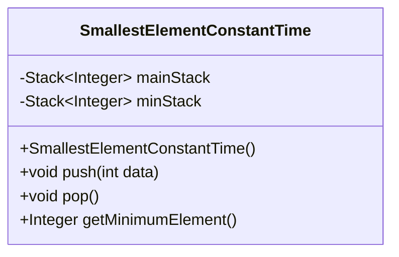
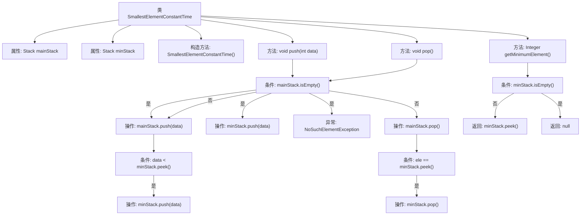

# 基础信息

|      |      |
|------|------|
| 名称 | SmallestElementConstantTime |
| 编码语言 | .java |
| 代码路径 | Java/src/main/java/com/thealgorithms/stacks/SmallestElementConstantTime.java |
| 包名 | com.thealgorithms.stacks |
| 依赖项 | ['java.util.NoSuchElementException', 'java.util.Stack'] |
| 概述说明 | 双栈结构实现栈最小元素常数时间获取。 |

# 说明

实现常数时间获取栈最小元素的双栈结构，通过使用两个栈来分别存储元素和当前最小元素。主栈用于存储所有元素，辅助栈用于存储当前的最小元素。每当有元素入栈时，主栈正常压入，同时检查辅助栈的栈顶元素，若新元素小于或等于辅助栈顶元素，则将其压入辅助栈。获取最小元素时，只需查看辅助栈的栈顶元素，确保在常数时间内完成操作。这种结构保证了在任意时刻都能快速获取栈中的最小元素。

# 类列表 Class Summary

| 名称   | 类型  | 说明 |
|-------|------|-------------|
| SmallestElementConstantTime | class | 实现常数时间获取栈最小元素的双栈结构。 |

## 类 SmallestElementConstantTime

|      |      |
|------|------|
| 访问范围 | public |
| 类型 | class |
| 名称 | SmallestElementConstantTime |
| 说明 | 实现常数时间获取栈最小元素的双栈结构。 |

### UML类图

类图描述：`SmallestElementConstantTime` 类通过使用两个栈 (`mainStack` 和 `minStack`) 来实现一个能够以常数时间获取最小元素的栈结构。`mainStack` 用于存储所有元素，而 `minStack` 则用于存储当前的最小元素。`push` 方法在将元素压入 `mainStack` 的同时，如果该元素小于或等于 `minStack` 的栈顶元素，则也将其压入 `minStack`。`pop` 方法在从 `mainStack` 弹出元素时，如果该元素等于 `minStack` 的栈顶元素，则也从 `minStack` 弹出。`getMinimumElement` 方法则直接返回 `minStack` 的栈顶元素，从而以常数时间获取当前最小元素。

### 内部方法调用关系图

这段代码实现了一个能够在常数时间内获取最小元素的栈结构。通过维护两个栈（`mainStack`和`minStack`），`push`方法在插入元素时更新最小栈，`pop`方法在删除元素时同步更新最小栈，而`getMinimumElement`方法则直接从最小栈中获取当前最小元素。该设计确保了获取最小元素的操作时间复杂度为O(1)。

### 字段列表 Field List

| 名称  | 类型  | 说明 |
|-------|-------|------|
| minStack | Stack<Integer> | 定义了一个存储整数的最小栈对象。 |
| mainStack | Stack<Integer> | 主栈存储整数类型数据。 |

### 方法列表 Method List

| 名称  | 类型  | 说明 |
|-------|-------|------|
| getMinimumElement | Integer | 获取最小元素，若栈为空则返回空。 |
| push | void | push方法将数据压入主栈，若数据小于最小栈顶元素，则同时压入最小栈。 |
| pop | void | pop方法从主栈弹出元素，若等于最小栈顶元素则同时弹出。 |

