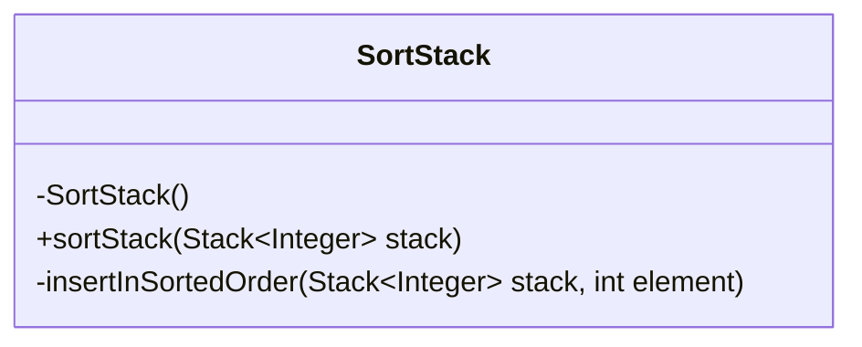
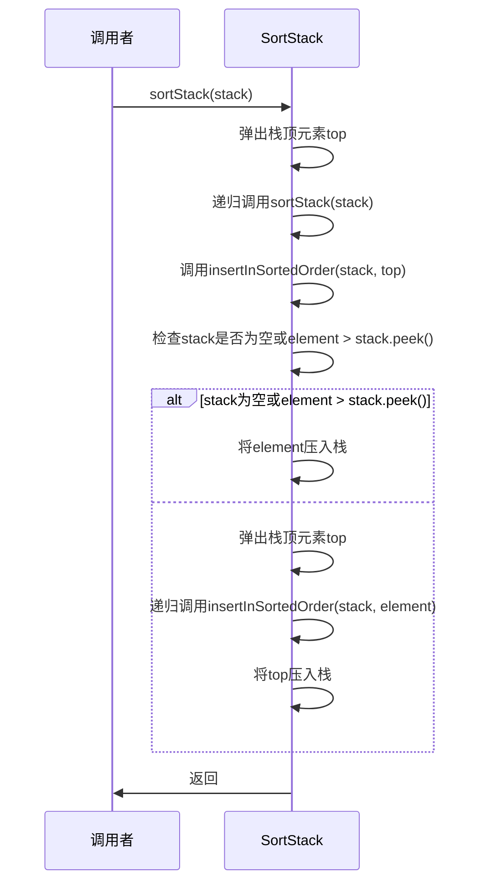
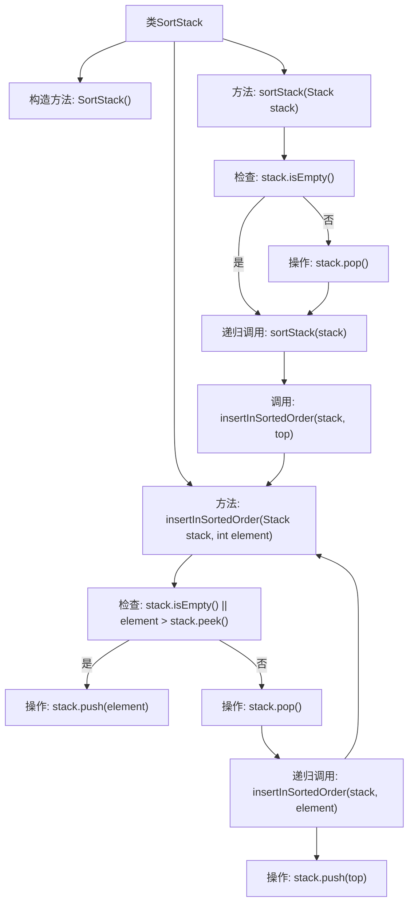

# 基础信息

|      |      |
|------|------|
| 名称 | SortStack |
| 编码语言 | .java |
| 代码路径 | Java/src/main/java/com/thealgorithms/stacks/SortStack.java |
| 包名 | com.thealgorithms.stacks |
| 依赖项 | ['java.util.Stack'] |
| 概述说明 | SortStack类通过递归实现栈排序，确保最大元素位于栈顶。 |

# 说明

SortStack类通过递归方法对栈进行排序，确保栈中最大元素始终位于栈顶。该类的核心功能是通过递归调用，逐步将栈中的元素按从大到小的顺序排列。具体实现过程中，SortStack类会先移除栈顶元素，然后递归地对剩余栈进行排序，最后将移除的元素重新插入到正确的位置，以确保栈顶始终是当前最大元素。这一过程持续进行，直到整个栈完全排序。

# 类列表 Class Summary

| 名称   | 类型  | 说明 |
|-------|------|-------------|
| SortStack | class | SortStack类递归排序栈，确保最大元素在栈顶。 |


## 类 SortStack

|      |      |
|------|------|
| 访问范围 | public final |
| 类型 | class |
| 名称 | SortStack |
| 说明 | SortStack类递归排序栈，确保最大元素在栈顶。 |


### UML类图



```mermaid
flowchart TD
    A["开始"] --> B{stack是否为空?}
    B -- 是 --> C["结束"]
    B -- 否 --> D["弹出栈顶元素top"]
    D --> E["递归调用sortStack(stack)"]
    E --> F["调用insertInSortedOrder(stack, top)"]
    F --> G{stack是否为空或element > stack.peek()?}
    G -- 是 --> H["将element压入栈"]
    G -- 否 --> I["弹出栈顶元素top"]
    I --> J["递归调用insertInSortedOrder(stack, element)"]
    J --> K["将top压入栈"]
    K --> L["结束"]
    H --> L
```



这段代码定义了一个`SortStack`类，用于对整数栈进行升序排序。`sortStack`方法通过递归方式移除栈顶元素，递归排序剩余栈，然后将移除的元素插入到正确位置。`insertInSortedOrder`方法则负责将元素插入到已排序栈的适当位置，确保栈保持升序。整个排序过程通过递归和栈操作实现，最终修改原始栈，不返回新栈。


### 内部方法调用关系图



这段代码实现了一个递归排序栈的功能。`sortStack`方法通过递归地移除栈顶元素、排序剩余栈，并将移除的元素按顺序插入回栈中，最终使栈按升序排列。`insertInSortedOrder`方法是一个辅助方法，用于将元素插入到已排序栈的正确位置，确保栈的升序性。整个流程通过递归调用和栈操作实现，最终使栈中的元素按升序排列。

### 字段列表 Field List

| 名称  | 类型  | 说明 |
|-------|-------|------|

### 方法列表 Method List

| 名称  | 类型  | 说明 |
|-------|-------|------|
| insertInSortedOrder | void | 在栈中按顺序插入元素，递归保持栈排序。 |
| sortStack | void | 递归排序栈顶元素并保持栈有序。 |


