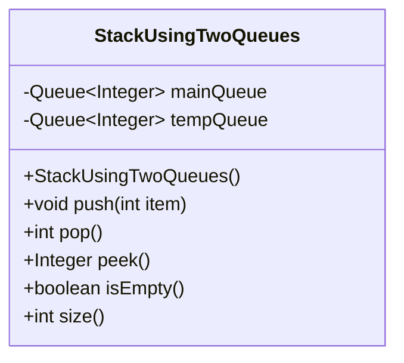
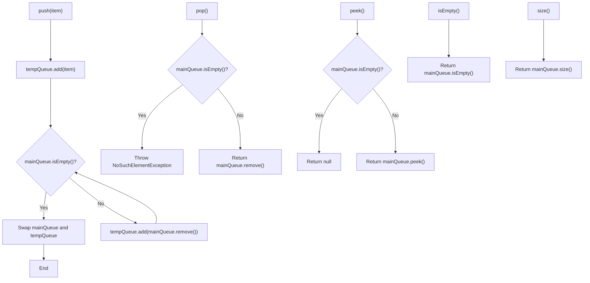
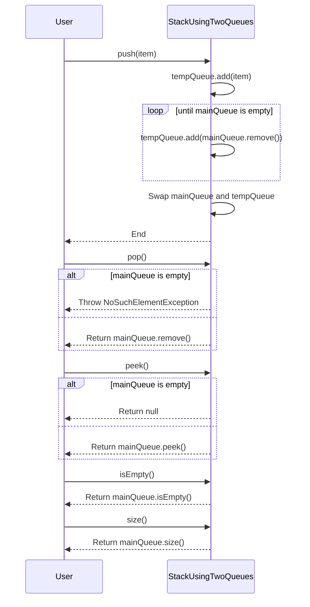
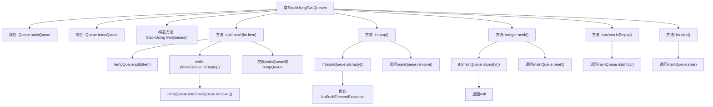

# 基础信息

|      |      |
|------|------|
| 名称 | StackUsingTwoQueues |
| 编码语言 | .java |
| 代码路径 | Java/src/main/java/com/thealgorithms/stacks/StackUsingTwoQueues.java |
| 包名 | com.thealgorithms.stacks |
| 依赖项 | ['java.util.LinkedList', 'java.util.NoSuchElementException', 'java.util.Queue'] |
| 概述说明 | 双队列实现栈，支持压栈、弹栈、查看栈顶、判空及获取大小功能。 |

# 说明

使用两个队列实现栈结构，该结构支持多种操作，包括压栈、弹栈、查看栈顶元素、判断栈是否为空以及获取栈的大小。通过巧妙地利用两个队列的先进先出特性，可以实现栈的后进先出特性。具体实现过程中，两个队列交替作为主队列和辅助队列，确保栈操作的正确性和高效性。这种方法在保证功能完整性的同时，也展示了数据结构之间的灵活转换和高效利用。

# 类列表 Class Summary

| 名称   | 类型  | 说明 |
|-------|------|-------------|
| StackUsingTwoQueues | class | 使用两个队列实现栈，支持压栈、弹栈、查看栈顶、判空和获取大小操作。 |

## 类 StackUsingTwoQueues

|      |      |
|------|------|
| 访问范围 | public |
| 类型 | class |
| 名称 | StackUsingTwoQueues |
| 说明 | 使用两个队列实现栈，支持压栈、弹栈、查看栈顶、判空和获取大小操作。 |

### UML类图

**描述**：  
`StackUsingTwoQueues` 类使用两个队列实现了栈的数据结构。`push` 方法将元素压入栈顶，通过将元素先加入临时队列，再将主队列中的所有元素转移到临时队列，最后交换两个队列的引用，确保新元素位于栈顶。`pop` 方法移除并返回栈顶元素，若栈为空则抛出异常。`peek` 方法返回栈顶元素但不移除，若栈为空则返回 `null`。`isEmpty` 和 `size` 方法分别用于判断栈是否为空和获取栈的大小。

### 内部方法调用关系图

这段代码实现了一个使用两个队列模拟栈的类。栈的LIFO（后进先出）特性通过维护两个队列来实现，`push`操作通过将元素添加到临时队列并交换主队列和临时队列的顺序来保持栈的顺序。`pop`、`peek`、`isEmpty`和`size`方法分别用于移除栈顶元素、查看栈顶元素、检查栈是否为空以及获取栈的大小。

### 字段列表 Field List

| 名称  | 类型  | 说明 |
|-------|-------|------|
| tempQueue | Queue<Integer> | 私有队列存储整数类型数据。 |
| mainQueue | Queue<Integer> | 私有整型队列mainQueue。 |

### 方法列表 Method List

| 名称  | 类型  | 说明 |
|-------|-------|------|
| isEmpty | boolean | 检查主队列是否为空。 |
| push | void | 使用两个队列实现栈的push操作，确保LIFO顺序。 |
| pop | int | 弹出栈顶元素，若栈为空则抛出异常。 |
| size | int | 该方法返回主队列的大小。 |
| peek | Integer | peek方法检查主队列是否为空，若空返回null，否则返回队列头部元素。 |

