# 基础信息

|      |      |
|------|------|
| 名称 | stacks |
| 编码语言 | .java |
| 代码路径 | Java/src/main/java/com/thealgorithms/stacks |
| 包名 | Java.src.main.java.com.thealgorithms.stacks |
| 概述说明 | 各类栈算法实现，包括排序、表达式转换、名人查找、极值获取、回文检测等，均通过栈数据结构高效完成。 |

# 说明

## 概述

该代码模块主要围绕栈（Stack）数据结构展开，提供了多种与栈相关的算法和功能实现。模块中的类和方法涵盖了栈的基本操作、栈在表达式计算中的应用、栈在数组和矩阵问题中的优化处理，以及栈与其他数据结构（如队列）的交互。通过这些实现，模块展示了栈在算法中的广泛应用，包括排序、表达式解析、极值查找、括号匹配、回文检测等场景。

## 主要业务场景

1. **栈的排序与极值查找**：
   - `SortStack`：通过递归方法对栈进行排序，确保最大元素始终位于栈顶。
   - `SmallestElementConstantTime` 和 `GreatestElementConstantTime`：使用双栈结构在常数时间内获取栈中的最小或最大元素。
   - `MinStackUsingTwoStacks` 和 `MinStackUsingSingleStack`：通过双栈或单栈实现最小栈，支持在常数时间内获取最小元素。

2. **表达式计算与转换**：
   - `StackPostfixNotation` 和 `PostfixEvaluator`：实现后缀表达式的计算，支持基本的加减乘除运算。
   - `InfixToPostfix` 和 `InfixToPrefix`：将中缀表达式转换为后缀或前缀表达式，支持处理括号和运算符优先级。
   - `PrefixEvaluator`：计算前缀表达式，支持基本的加减乘除运算。
   - `PostfixToInfix` 和 `PrefixToInfix`：将后缀或前缀表达式转换为中缀表达式，便于理解和计算。

3. **括号匹配与检测**：
   - `BalancedBrackets`：检查括号是否配对和平衡，支持多种括号类型。
   - `DuplicateBrackets`：检测表达式中是否存在多余或冗余的括号。

4. **数组与矩阵问题**：
   - `NextSmallerElement` 和 `NextGreaterElement`：查找数组中每个元素左侧或右侧的下一个更小或更大的元素。
   - `MaximumMinimumWindow`：使用栈计算数组中每个窗口大小的最小值和最大值。
   - `LargestRectangle`：计算直方图中的最大矩形面积，采用栈优化算法。
   - `CelebrityFinder`：在二维矩阵中查找名人索引，采用栈算法逐步排除候选者。

5. **回文检测与进制转换**：
   - `PalindromeWithStack`：使用栈检测字符串是否为回文。
   - `DecimalToAnyUsingStack`：将十进制数转换为指定进制，使用栈实现数位的存储和输出。

6. **栈与队列的交互**：
   - `StackUsingTwoQueues`：使用两个队列实现栈结构，支持多种栈操作。

通过这些业务场景，该模块展示了栈数据结构在算法中的强大功能，适用于多种计算和优化问题。

### 包内部结构视图

```mermaid
graph TD
    stacks --> SortStack.java
    stacks --> StackPostfixNotation.java
    stacks --> CelebrityFinder.java
    stacks --> NextSmallerElement.java
    stacks --> InfixToPostfix.java
    stacks --> SmallestElementConstantTime.java
    stacks --> MinStackUsingTwoStacks.java
    stacks --> LargestRectangle.java
    stacks --> StackUsingTwoQueues.java
    stacks --> PrefixEvaluator.java
    stacks --> InfixToPrefix.java
    stacks --> MinStackUsingSingleStack.java
    stacks --> GreatestElementConstantTime.java
    stacks --> PalindromeWithStack.java
    stacks --> DuplicateBrackets.java
    stacks --> BalancedBrackets.java
    stacks --> NextGreaterElement.java
    stacks --> MaximumMinimumWindow.java
    stacks --> PostfixEvaluator.java
    stacks --> PostfixToInfix.java
    stacks --> PrefixToInfix.java
    stacks --> DecimalToAnyUsingStack.java
```

该流程图展示了`stacks`目录下的所有文件及其层级关系。`stacks`作为根节点，直接连接到多个具体的Java文件，这些文件分别实现了不同的栈相关算法和功能，如排序栈、后缀表达式计算、中缀转前缀等。每个文件都直接依赖于`stacks`目录，没有进一步的子目录层级。

# 文件列表 File List

| 名称   | 类型  | 说明 |
|-------|------|-------------|
| [SortStack.java](SortStack.md) | file | SortStack类通过递归实现栈排序，确保最大元素位于栈顶。 |
| [DecimalToAnyUsingStack.java](DecimalToAnyUsingStack.md) | file | 十进制转2到16进制，利用栈实现转换。 |
| [PostfixToInfix.java](PostfixToInfix.md) | file | PostfixToInfix类实现后缀表达式验证及转换中缀表达式功能。 |
| [BalancedBrackets.java](BalancedBrackets.md) | file | BalancedBrackets类用于检测括号是否配对和平衡。 |
| [InfixToPrefix.java](InfixToPrefix.md) | file | 中缀转前缀表达式，利用栈处理，支持括号与运算符优先级检查。 |
| [MinStackUsingTwoStacks.java](MinStackUsingTwoStacks.md) | file | 双栈实现最小栈，支持push、pop、top和getMin操作。 |
| [LargestRectangle.java](LargestRectangle.md) | file | Java类通过栈优化算法计算直方图最大矩形面积。 |
| [PrefixToInfix.java](PrefixToInfix.md) | file | PrefixToInfix类实现前缀表达式到中缀表达式的转换，支持基本运算。 |
| [PostfixEvaluator.java](PostfixEvaluator.md) | file | PostfixEvaluator类用于计算后缀表达式，支持基本四则运算。 |
| [MaximumMinimumWindow.java](MaximumMinimumWindow.md) | file | 用栈计算数组窗口的最小值和最大值。 |
| [NextGreaterElement.java](NextGreaterElement.md) | file | 查找数组元素右侧首个更大值，无则返回0。 |
| [DuplicateBrackets.java](DuplicateBrackets.md) | file | 检查表达式括号是否冗余，返回布尔值。 |
| [PalindromeWithStack.java](PalindromeWithStack.md) | file | 使用栈比较字符串正反向是否相同，判断回文。 |
| [GreatestElementConstantTime.java](GreatestElementConstantTime.md) | file | 双栈结构实现常数时间获取栈中最大元素。 |
| [MinStackUsingSingleStack.java](MinStackUsingSingleStack.md) | file | 单栈实现最小栈，存储值与当前最小，支持入栈、出栈、获取栈顶和最小值操作。 |
| [PrefixEvaluator.java](PrefixEvaluator.md) | file | PrefixEvaluator类通过栈计算前缀表达式，支持加减乘除。 |
| [StackUsingTwoQueues.java](StackUsingTwoQueues.md) | file | 双队列实现栈，支持压栈、弹栈、查看栈顶、判空及获取大小功能。 |
| [SmallestElementConstantTime.java](SmallestElementConstantTime.md) | file | 双栈结构实现栈最小元素常数时间获取。 |
| [InfixToPostfix.java](InfixToPostfix.md) | file | 中缀转后缀表达式，支持括号和运算符优先级。 |
| [NextSmallerElement.java](NextSmallerElement.md) | file | 查找数组中每个元素左侧下一个更小的元素，若无则返回-1。 |
| [CelebrityFinder.java](CelebrityFinder.md) | file | CelebrityFinder类使用栈算法在二维矩阵中查找名人索引，若无名人则返回-1。 |
| [StackPostfixNotation.java](StackPostfixNotation.md) | file | 实现后缀表达式计算，支持加减乘除操作。 |

