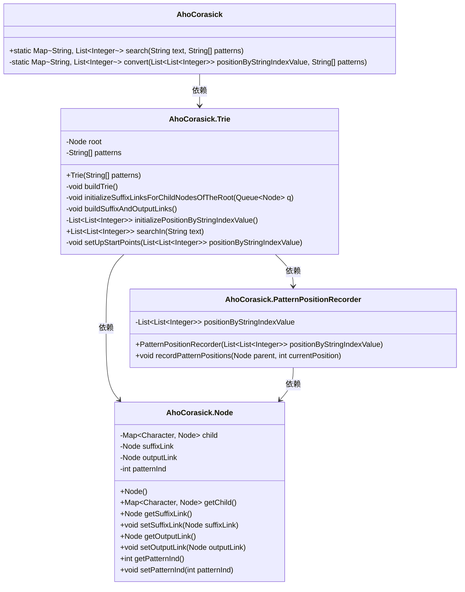

# 基础信息

|      |      |
|------|------|
| 名称 | AhoCorasick |
| 编码语言 | .java |
| 代码路径 | Java/src/main/java/com/thealgorithms/strings/AhoCorasick.java |
| 包名 | com.thealgorithms.strings |
| 依赖项 | ['java.util.ArrayList', 'java.util.HashMap', 'java.util.LinkedList', 'java.util.List', 'java.util.Map', 'java.util.Queue'] |
| 概述说明 | AhoCorasick算法实现多模式字符串匹配，支持文本搜索和模式位置记录。 |

# 说明

AhoCorasick算法是一种高效的多模式字符串匹配算法，通过构建Trie树、创建后缀链接和输出链接来实现。该算法能够快速在文本中搜索多个模式，并记录每个模式的出现位置。Trie树用于存储所有模式，后缀链接用于在匹配失败时跳转到其他节点，输出链接则用于记录匹配成功的模式。该算法适用于需要同时搜索多个关键词的场景，具有较高的时间和空间效率。

# 类列表 Class Summary

| 名称   | 类型  | 说明 |
|-------|------|-------------|
| AhoCorasick | class | AhoCorasick算法实现，用于多模式字符串匹配，包含Trie构建、后缀链接和输出链接的创建，支持文本搜索和模式位置记录。 |

## 类 AhoCorasick

|      |      |
|------|------|
| 访问范围 | public final |
| 类型 | class |
| 名称 | AhoCorasick |
| 说明 | AhoCorasick算法实现，用于多模式字符串匹配，包含Trie构建、后缀链接和输出链接的创建，支持文本搜索和模式位置记录。 |

### UML类图

这段代码实现了Aho-Corasick算法，用于在文本中高效地搜索多个模式字符串。核心类包括`AhoCorasick`、`Node`、`Trie`和`PatternPositionRecorder`。`Trie`类负责构建Trie树，并建立后缀链接和输出链接，以优化搜索过程。`PatternPositionRecorder`类用于记录模式在文本中的位置。`AhoCorasick`类提供了搜索接口，将结果转换为易于理解的格式。整体设计通过Trie树和链接机制，实现了多模式匹配的高效性。

### 内部方法调用关系图

```mermaid
graph TD
    A["类AhoCorasick"]
    B["私有构造方法: AhoCorasick()"]
    C["内部类: Node"]
    D["属性: Map<Character, Node> child"]
    E["属性: Node suffixLink"]
    F["属性: Node outputLink"]
    G["属性: int patternInd"]
    H["方法: Map<Character, Node> getChild()"]
    I["方法: Node getSuffixLink()"]
    J["方法: void setSuffixLink(Node suffixLink)"]
    K["方法: Node getOutputLink()"]
    L["方法: void setOutputLink(Node outputLink)"]
    M["方法: int getPatternInd()"]
    N["方法: void setPatternInd(int patternInd)"]
    O["内部类: Trie"]
    P["属性: Node root"]
    Q["属性: String[] patterns"]
    R["构造方法: Trie(String[] patterns)"]
    S["方法: void buildTrie()"]
    T["方法: void initializeSuffixLinksForChildNodesOfTheRoot(Queue<Node> q)"]
    U["方法: void buildSuffixAndOutputLinks()"]
    V["方法: List<List<Integer>> initializePositionByStringIndexValue()"]
    W["方法: List<List<Integer>> searchIn(String text)"]
    X["方法: void setUpStartPoints(List<List<Integer>> positionByStringIndexValue)"]
    Y["内部类: PatternPositionRecorder"]
    Z["方法: void recordPatternPositions(Node parent, int currentPosition)"]
    AA["方法: static Map<String, List<Integer>> search(String text, String[] patterns)"]
    AB["方法: static Map<String, List<Integer>> convert(List<List<Integer>> positionByStringIndexValue, String[] patterns)"]

    A --> B
    A --> C
    C --> D
    C --> E
    C --> F
    C --> G
    C --> H
    C --> I
    C --> J
    C --> K
    C --> L
    C --> M
    C --> N
    A --> O
    O --> P
    O --> Q
    O --> R
    R --> S
    U --> T
    R --> U
    W --> V
    W --> X
    A --> Y
    Y --> Z
    A --> AA
    AA --> AB
```

这段代码实现了一个Aho-Corasick算法，用于在文本中高效地搜索多个模式字符串。它通过构建一个Trie树，并为其节点添加后缀链接和输出链接，来优化搜索过程。代码的核心部分包括Trie树的构建、后缀链接和输出链接的建立，以及在文本中搜索模式并记录其位置。最后，搜索结果被转换为一个映射，其中键是模式字符串，值是该模式在文本中出现的位置列表。

### 字段列表 Field List

| 名称  | 类型  | 说明 |
|-------|-------|------|

### 方法列表 Method List

| 名称  | 类型  | 说明 |
|-------|-------|------|
| search | Map<String, List<Integer>> | 静态方法搜索文本中模式，返回模式与位置的映射。 |
| convert | Map<String, List<Integer>> | 将字符串索引值列表转换为模式与位置列表的映射。 |

