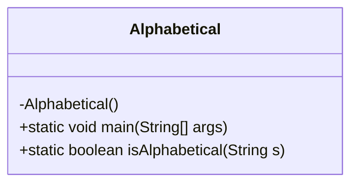
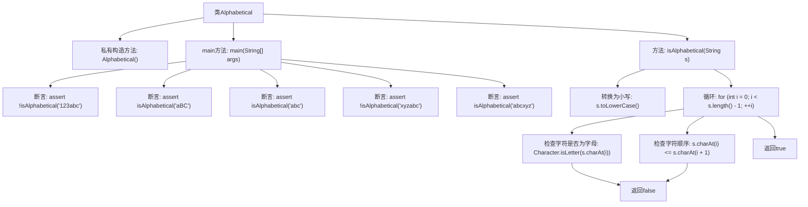

# 基础信息

|      |      |
|------|------|
| 名称 | Alphabetical |
| 编码语言 | .java |
| 代码路径 | Java/src/main/java/com/thealgorithms/strings/Alphabetical.java |
| 包名 | com.thealgorithms.strings |
| 依赖项 | [] |
| 概述说明 | Java类Alphabetical用于检查字符串是否按字母顺序排列。 |

# 说明

Java类Alphabetical用于检查一个字符串是否按字母顺序排列。该类的核心功能是通过遍历字符串中的字符，比较相邻字符的Unicode值，确保每个字符都小于或等于下一个字符。如果所有字符都满足这一条件，则字符串被视为按字母顺序排列；否则，返回不按字母顺序排列的结果。此方法适用于任何Unicode字符，能够处理大小写敏感或非敏感的情况，具体取决于实现时的配置。

# 类列表 Class Summary

| 名称   | 类型  | 说明 |
|-------|------|-------------|
| Alphabetical | class | Java类Alphabetical检查字符串是否按字母顺序排列。 |

## 类 Alphabetical

|      |      |
|------|------|
| 访问范围 | final |
| 类型 | class |
| 名称 | Alphabetical |
| 说明 | Java类Alphabetical检查字符串是否按字母顺序排列。 |

### UML类图

这段代码定义了一个名为 `Alphabetical` 的 final 类，包含一个私有构造函数和一个静态方法 `isAlphabetical`。该方法用于检查给定字符串是否按字母顺序排列。`main` 方法通过断言验证了 `isAlphabetical` 方法的正确性。类图展示了 `Alphabetical` 类的结构，包括其私有构造函数和两个公有静态方法。

### 内部方法调用关系图

这段代码定义了一个名为`Alphabetical`的类，包含一个私有构造方法和一个静态方法`isAlphabetical`，用于检查字符串是否按字母顺序排列。`main`方法通过多个断言测试`isAlphabetical`方法的正确性。`isAlphabetical`方法首先将字符串转换为小写，然后逐个字符检查是否为字母且顺序是否正确，如果发现不符合条件的字符，则返回`false`，否则返回`true`。

### 字段列表 Field List

| 名称  | 类型  | 说明 |
|-------|-------|------|

### 方法列表 Method List

| 名称  | 类型  | 说明 |
|-------|-------|------|
| isAlphabetical | boolean | 该方法检查字符串是否按字母顺序排列，忽略大小写，返回布尔值。 |
| main | void | Java代码验证字符串是否为纯字母。 |

