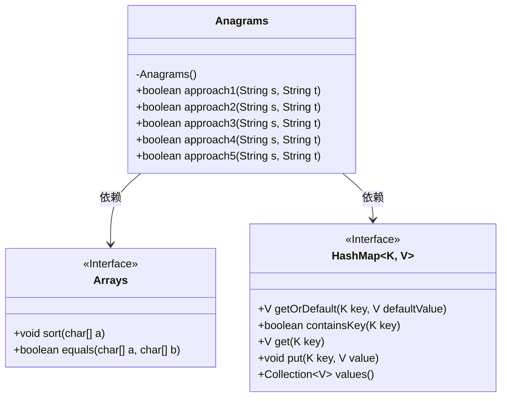
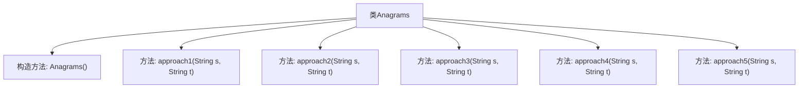

# 基础信息

|      |      |
|------|------|
| 名称 | Anagrams |
| 编码语言 | .java |
| 代码路径 | Java/src/main/java/com/thealgorithms/strings/Anagrams.java |
| 包名 | com.thealgorithms.strings |
| 依赖项 | ['java.util.Arrays', 'java.util.HashMap'] |
| 概述说明 | Anagrams类提供五种方法检测字符串变位词，涵盖排序、字符计数和哈希表技术。 |

# 说明

Anagrams类提供了五种方法来检测字符串是否为变位词，这些方法分别利用了排序、字符计数和哈希表等技术。通过这些技术手段，可以有效地判断两个字符串是否互为变位词，确保检测的准确性和高效性。

# 类列表 Class Summary

| 名称   | 类型  | 说明 |
|-------|------|-------------|
| Anagrams | class | Anagrams类提供五种方法检测字符串是否为变位词，涉及排序、字符计数和哈希表等技术。 |

## 类 Anagrams

|      |      |
|------|------|
| 访问范围 | public final |
| 类型 | class |
| 名称 | Anagrams |
| 说明 | Anagrams类提供五种方法检测字符串是否为变位词，涉及排序、字符计数和哈希表等技术。 |

### UML类图

这段代码定义了一个 `Anagrams` 类，该类提供了五种不同的方法来判断两个字符串是否是变位词。每种方法使用了不同的算法和数据结构来实现这一功能，包括字符排序、字符频率统计和哈希表等。`Anagrams` 类依赖于 `Arrays` 和 `HashMap` 接口来完成其功能。每种方法的时间复杂度和空间复杂度在注释中详细说明，帮助开发者选择最适合其需求的方法。

### 内部方法调用关系图

该流程图展示了`Anagrams`类的结构及其内部方法。`Anagrams`类是一个不可继承的类，包含一个私有构造方法和五个静态方法，分别用于检查两个字符串是否为变位词。每个方法都通过不同的方式实现相同的功能，包括排序字符数组、字符频率计数和使用哈希表等。这些方法的时间复杂度和空间复杂度各不相同，适用于不同的场景需求。

### 字段列表 Field List

| 名称  | 类型  | 说明 |
|-------|-------|------|

### 方法列表 Method List

| 名称  | 类型  | 说明 |
|-------|-------|------|
| approach1 | boolean | 比较两字符串长度及排序后字符数组是否相同。 |
| approach2 | boolean | 方法判断两字符串字符频率是否相同。 |
| approach4 | boolean | 检查两个字符串是否为相同字符的不同排列。 |
| approach5 | boolean | 方法判断两字符串长度相等且字符频率相同则返回真。 |
| approach3 | boolean | 比较两字符串字符频率，相同则返回真，否则返回假。 |

