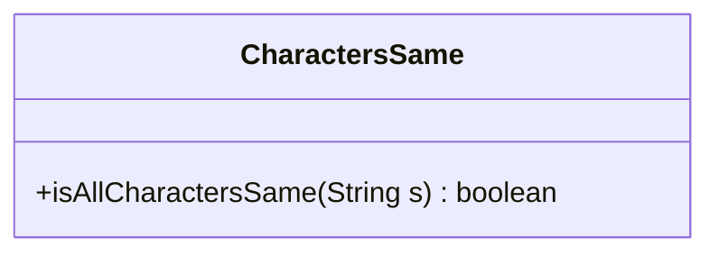
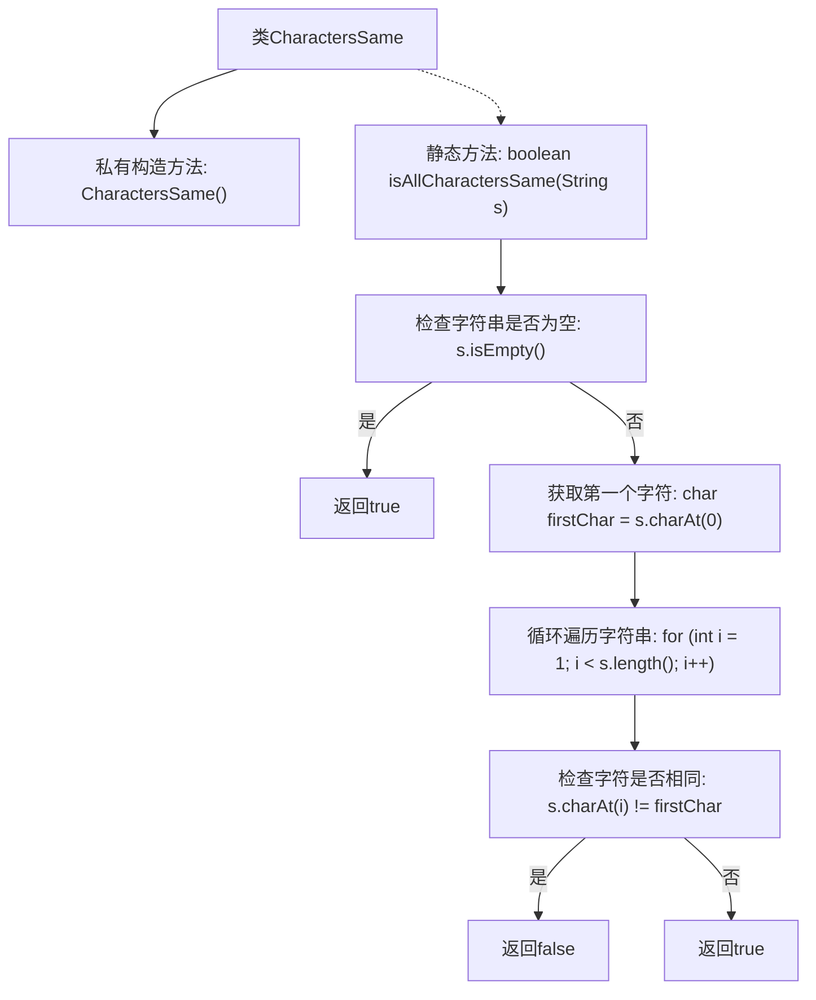

# 基础信息

|      |      |
|------|------|
| 名称 | CharactersSame |
| 编码语言 | .java |
| 代码路径 | Java/src/main/java/com/thealgorithms/strings/CharactersSame.java |
| 包名 | com.thealgorithms.strings |
| 依赖项 | [] |
| 概述说明 | 检查字符串所有字符是否相同，空字符串返回true。 |

# 说明

该功能用于检查一个字符串中的所有字符是否完全相同。如果字符串为空，即不包含任何字符，则默认返回true。这个功能的核心目的是验证字符串的字符一致性，适用于需要确认字符串内容是否统一的场景。

# 类列表 Class Summary

| 名称   | 类型  | 说明 |
|-------|------|-------------|
| CharactersSame | class | 检查字符串中所有字符是否相同，空字符串返回true。 |

## 类 CharactersSame

|      |      |
|------|------|
| 访问范围 | public final |
| 类型 | class |
| 名称 | CharactersSame |
| 说明 | 检查字符串中所有字符是否相同，空字符串返回true。 |

### UML类图

类图描述：
`CharactersSame` 类是一个工具类，用于检查字符串中的所有字符是否相同。它包含一个静态方法 `isAllCharactersSame`，该方法接受一个字符串作为参数，并返回一个布尔值。如果字符串为空或所有字符都相同，则返回 `true`，否则返回 `false`。该类被设计为不可实例化，因此其构造函数是私有的。

### 内部方法调用关系图

这段代码定义了一个名为`CharactersSame`的类，其中包含一个私有构造方法和一个静态方法`isAllCharactersSame`。该方法用于检查字符串中的所有字符是否相同。如果字符串为空，则返回`true`；否则，获取第一个字符并遍历字符串中的每个字符，如果发现任何字符与第一个字符不同，则返回`false`。如果所有字符都相同，则返回`true`。流程图清晰地展示了该方法的执行逻辑和判断流程。

### 字段列表 Field List

| 名称  | 类型  | 说明 |
|-------|-------|------|

### 方法列表 Method List

| 名称  | 类型  | 说明 |
|-------|-------|------|
| isAllCharactersSame | boolean | 判断字符串所有字符是否相同，空字符串视为相同。 |

