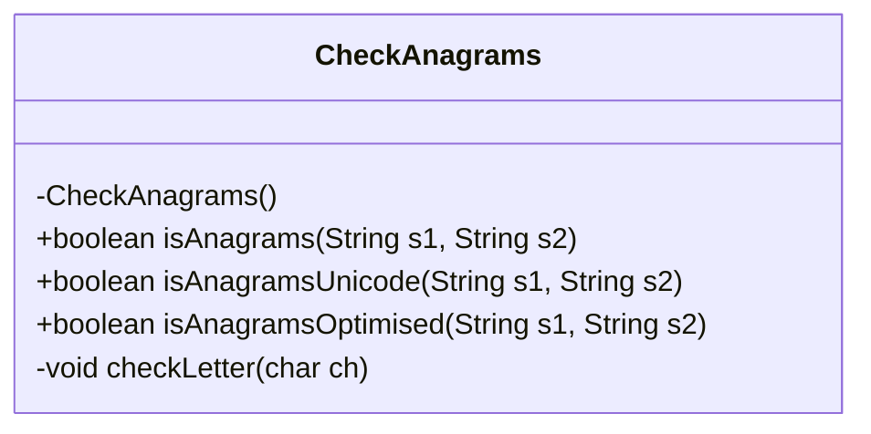

# 基础信息

|      |      |
|------|------|
| 名称 | CheckAnagrams |
| 编码语言 | .java |
| 代码路径 | Java/src/main/java/com/thealgorithms/strings/CheckAnagrams.java |
| 包名 | com.thealgorithms.strings |
| 依赖项 | ['java.util.HashMap', 'java.util.Map'] |
| 概述说明 | CheckAnagrams类提供三种方法检查字符串变位词，涵盖普通字符、Unicode字符和优化小写英文字符。 |

# 说明

CheckAnagrams类提供了三种方法来检查字符串是否为变位词。第一种方法适用于普通字符，第二种方法处理Unicode字符，第三种方法则针对优化后的小写英文字符进行检测。这些方法分别针对不同的字符类型，确保在各种情况下都能准确判断字符串是否为变位词。

# 类列表 Class Summary

| 名称   | 类型  | 说明 |
|-------|------|-------------|
| CheckAnagrams | class | CheckAnagrams类提供三种方法检查字符串是否为变位词，分别处理普通字符、Unicode字符和优化的小写英文字符。 |

## 类 CheckAnagrams

|      |      |
|------|------|
| 访问范围 | public final |
| 类型 | class |
| 名称 | CheckAnagrams |
| 说明 | CheckAnagrams类提供三种方法检查字符串是否为变位词，分别处理普通字符、Unicode字符和优化的小写英文字符。 |

### UML类图

**描述：**
`CheckAnagrams` 类是一个工具类，提供了三种方法来检查两个字符串是否为变位词（Anagrams）。`isAnagrams` 方法适用于一般的字符串，通过字符计数的方式进行比较；`isAnagramsUnicode` 方法适用于包含Unicode字符的字符串，使用固定大小的数组进行字符计数；`isAnagramsOptimised` 方法则针对仅包含小写英文字母的字符串进行了优化，通过减去字符 'a' 的整数值来映射字符到数组索引。`checkLetter` 是一个私有方法，用于验证字符是否为小写英文字母。

### 内部方法调用关系图

```mermaid
graph TD
    A["类CheckAnagrams"]
    B["构造方法: CheckAnagrams()"]
    C["方法: boolean isAnagrams(String s1, String s2)"]
    D["方法: boolean isAnagramsUnicode(String s1, String s2)"]
    E["方法: boolean isAnagramsOptimised(String s1, String s2)"]
    F["方法: void checkLetter(char ch)"]

    A --> B
    A --> C
    A --> D
    A --> E
    A --> F

    C --> G["计算字符串长度: s1.length(), s2.length()"]
    C --> H["转换为小写: s1.toLowerCase(), s2.toLowerCase()"]
    C --> I["创建HashMap: Map<Character, Integer> charAppearances = new HashMap<>()"]
    C --> J["遍历s1，统计字符出现次数"]
    C --> K["遍历s2，检查字符是否在HashMap中"]
    C --> L["遍历HashMap，检查字符出现次数是否一致"]
    C --> M["返回结果: true/false"]

    D --> N["创建数组: int[] dict = new int[128]"]
    D --> O["遍历s1，统计字符出现次数"]
    D --> P["遍历s2，减少字符出现次数"]
    D --> Q["遍历数组，检查字符出现次数是否一致"]
    D --> R["返回结果: true/false"]

    E --> S["创建数组: int[] dict = new int[26]"]
    E --> T["遍历s1，统计字符出现次数"]
    E --> U["遍历s2，减少字符出现次数"]
    E --> V["遍历数组，检查字符出现次数是否一致"]
    E --> W["返回结果: true/false"]

    E --> X["调用方法: checkLetter(char ch)"]
    F --> Y["检查字符是否为小写字母"]
    F --> Z["抛出异常: IllegalArgumentException"]
```

这段代码定义了一个名为 `CheckAnagrams` 的类，其中包含三个静态方法 `isAnagrams`、`isAnagramsUnicode` 和 `isAnagramsOptimised`，用于检查两个字符串是否为变位词。`isAnagrams` 方法使用 `HashMap` 统计字符出现次数，`isAnagramsUnicode` 方法使用数组处理 Unicode 字符，`isAnagramsOptimised` 方法则优化为仅处理小写英文字母。`checkLetter` 方法用于验证字符是否为小写字母，若不是则抛出异常。流程图展示了类中方法的调用关系和每个方法的执行步骤。

### 字段列表 Field List

| 名称  | 类型  | 说明 |
|-------|-------|------|

### 方法列表 Method List

| 名称  | 类型  | 说明 |
|-------|-------|------|
| isAnagrams | boolean | 检查两个字符串是否为变位词，通过字符计数实现。 |
| isAnagramsUnicode | boolean | 该方法检查两个字符串是否为Unicode变位词，通过字符计数实现。 |
| isAnagramsOptimised | boolean | 优化后的判断两字符串是否为字母异位词的方法。 |
| checkLetter | void | 检查字符是否为小写字母，否则抛出异常。 |

