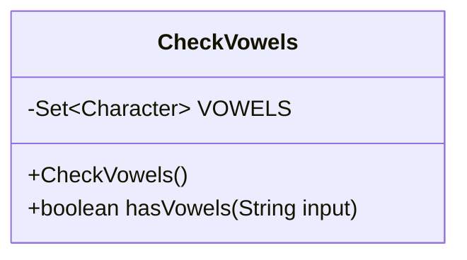
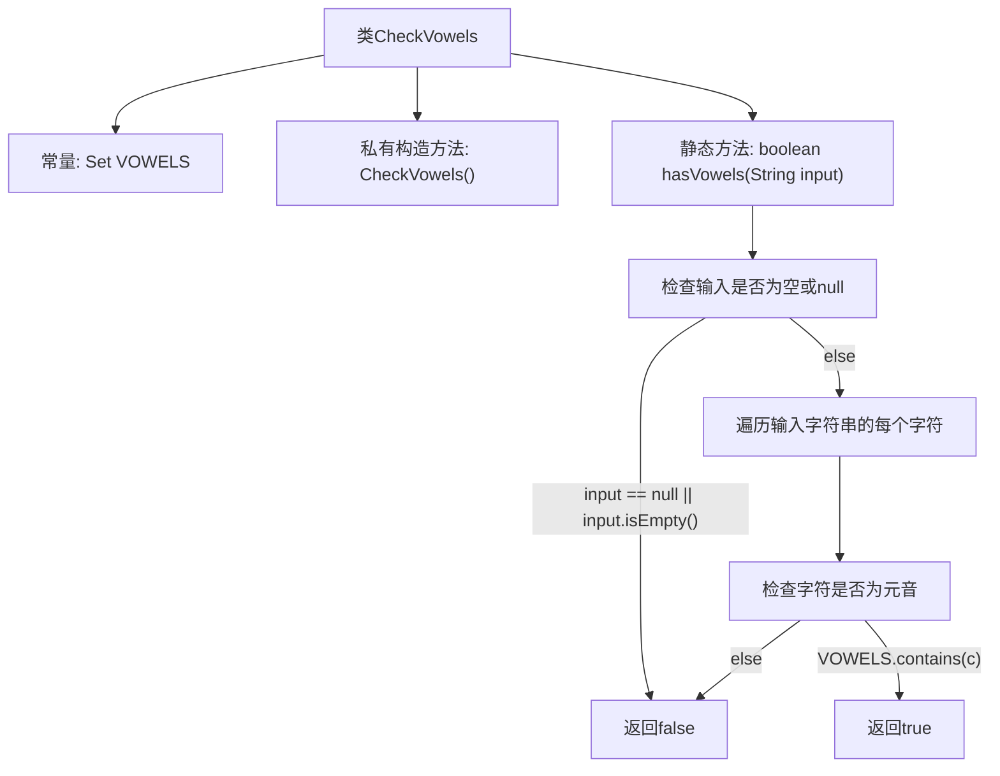

# 基础信息

|      |      |
|------|------|
| 名称 | CheckVowels |
| 编码语言 | .java |
| 代码路径 | Java/src/main/java/com/thealgorithms/strings/CheckVowels.java |
| 包名 | com.thealgorithms.strings |
| 依赖项 | ['java.util.Set'] |
| 概述说明 | 检查字符串中是否存在元音字母。 |

# 说明

该任务要求检查一个字符串中是否包含元音字母。元音字母通常指英文字母中的a、e、i、o、u。实现这一功能需要遍历字符串中的每个字符，并判断其是否为元音字母。如果发现任何元音字母，即可确认字符串包含元音；否则，字符串不包含元音。此操作适用于文本处理、输入验证等场景。

# 类列表 Class Summary

| 名称   | 类型  | 说明 |
|-------|------|-------------|
| CheckVowels | class | 检查字符串是否包含元音字母。 |

## 类 CheckVowels

|      |      |
|------|------|
| 访问范围 | public final |
| 类型 | class |
| 名称 | CheckVowels |
| 说明 | 检查字符串是否包含元音字母。 |

### UML类图

这段代码定义了一个名为 `CheckVowels` 的不可变类，用于检查字符串中是否包含元音字母。类中包含一个静态的、不可变的元音字母集合 `VOWELS`，并通过私有构造函数防止实例化。`hasVowels` 方法接受一个字符串参数，检查该字符串是否为空或为 `null`，如果为空或 `null` 则返回 `false`，否则遍历字符串中的每个字符，判断是否为元音字母，如果找到元音字母则返回 `true`，否则返回 `false`。

### 内部方法调用关系图

该流程图描述了`CheckVowels`类中的`hasVowels`方法的执行流程。首先，检查输入字符串是否为空或null，如果是，则返回`false`。否则，遍历字符串的每个字符，检查是否为元音。如果找到元音，返回`true`；否则，继续遍历直到结束并返回`false`。流程图清晰地展示了方法的逻辑结构和决策路径。

### 字段列表 Field List

| 名称  | 类型  | 说明 |
|-------|-------|------|
| VOWELS = Set.of('a', 'e', 'i', 'o', 'u') | Set<Character> | 定义包含元音字母的不可变集合。 |

### 方法列表 Method List

| 名称  | 类型  | 说明 |
|-------|-------|------|
| hasVowels | boolean | 该方法检查字符串是否包含元音字母，空或null返回false。 |

