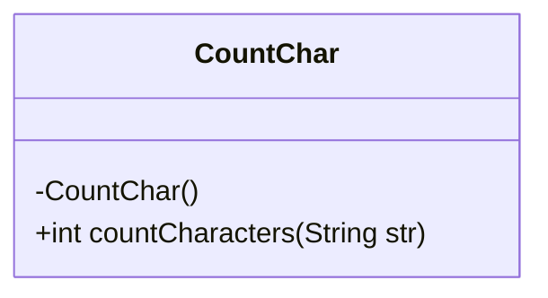
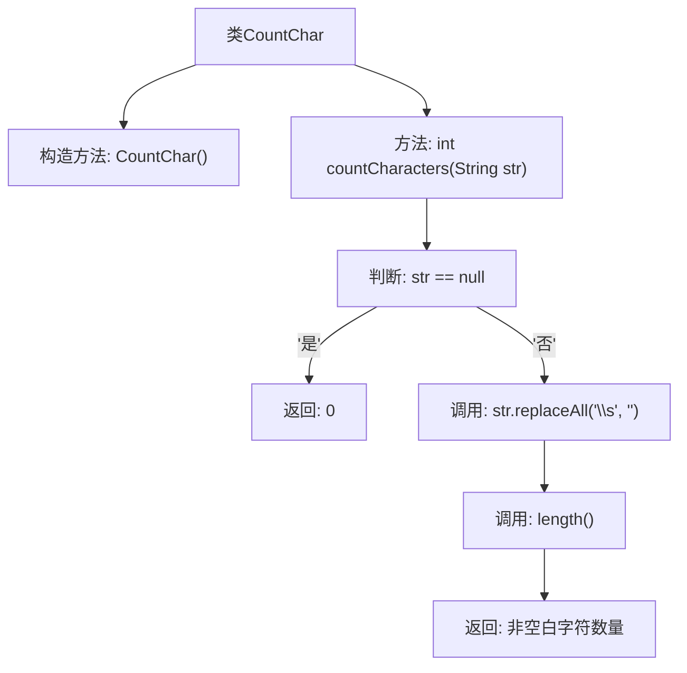

# 基础信息

|      |      |
|------|------|
| 名称 | CountChar |
| 编码语言 | .java |
| 代码路径 | Java/src/main/java/com/thealgorithms/strings/CountChar.java |
| 包名 | com.thealgorithms.strings |
| 依赖项 | [] |
| 概述说明 | 类CountChar的静态方法countCharacters用于计算字符串非空白字符数。 |

# 说明

类CountChar包含一个静态方法countCharacters，该方法用于计算给定字符串中非空白字符的数量。该方法不接受参数，返回一个整数，表示字符串中非空白字符的总数。此方法适用于需要统计字符串中有效字符数量的场景。

# 类列表 Class Summary

| 名称   | 类型  | 说明 |
|-------|------|-------------|
| CountChar | class | 类CountChar提供静态方法countCharacters，用于计算字符串中非空白字符的数量。 |

## 类 CountChar

|      |      |
|------|------|
| 访问范围 | public final |
| 类型 | class |
| 名称 | CountChar |
| 说明 | 类CountChar提供静态方法countCharacters，用于计算字符串中非空白字符的数量。 |

### UML类图

类图描述：  
`CountChar` 是一个工具类，用于统计字符串中非空白字符的数量。该类包含一个私有的构造函数，确保无法实例化。`countCharacters` 是一个静态方法，接收一个字符串参数，如果字符串为 `null` 则返回 0，否则通过正则表达式去除所有空白字符后返回剩余字符的长度。该类设计为不可实例化，适用于提供单一功能的工具类场景。

### 内部方法调用关系图

该流程图描述了`CountChar`类的结构及其`countCharacters`方法的执行流程。首先，类包含一个私有构造方法和一个静态方法`countCharacters`。该方法首先检查输入字符串是否为`null`，如果是则返回`0`；否则，通过`replaceAll`方法移除所有空白字符并计算剩余字符的长度，最后返回非空白字符的数量。

### 字段列表 Field List

| 名称  | 类型  | 说明 |
|-------|-------|------|

### 方法列表 Method List

| 名称  | 类型  | 说明 |
|-------|-------|------|
| countCharacters | int | 统计字符串非空字符数，忽略空格。 |

