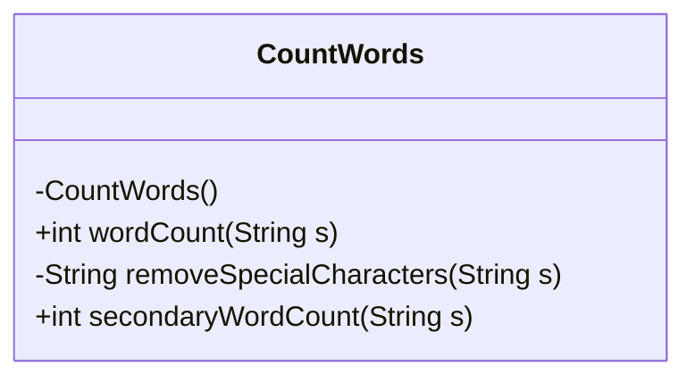
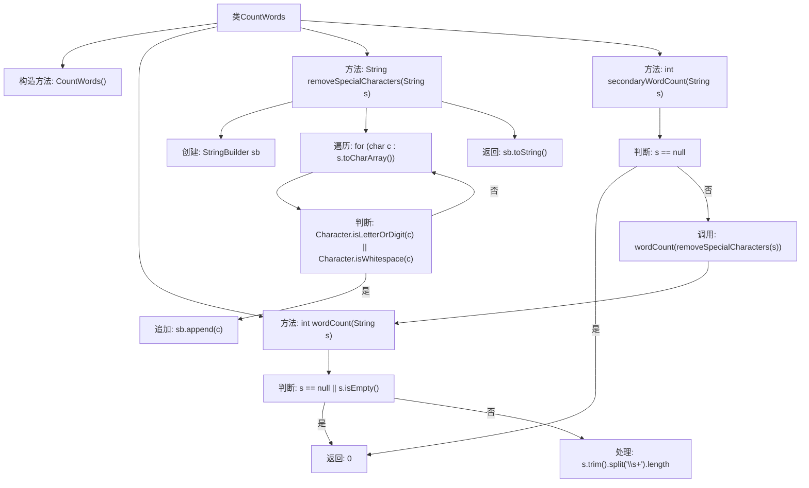

# 基础信息

|      |      |
|------|------|
| 名称 | CountWords |
| 编码语言 | .java |
| 代码路径 | Java/src/main/java/com/thealgorithms/strings/CountWords.java |
| 包名 | com.thealgorithms.strings |
| 依赖项 | [] |
| 概述说明 | CountWords类统计字符串单词数，支持去除特殊字符。 |

# 说明

CountWords类主要用于统计字符串中的单词数量，具备去除特殊字符的功能，确保统计结果的准确性。

# 类列表 Class Summary

| 名称   | 类型  | 说明 |
|-------|------|-------------|
| CountWords | class | CountWords类提供统计字符串中单词数量的功能，支持去除特殊字符。 |

## 类 CountWords

|      |      |
|------|------|
| 访问范围 | public final |
| 类型 | class |
| 名称 | CountWords |
| 说明 | CountWords类提供统计字符串中单词数量的功能，支持去除特殊字符。 |

### UML类图

该代码定义了一个 `CountWords` 类，包含三个方法：`wordCount` 用于计算字符串中的单词数，`removeSpecialCharacters` 用于移除字符串中的特殊字符，`secondaryWordCount` 结合前两个方法，计算移除特殊字符后的单词数。`CountWords` 类的构造函数是私有的，防止外部实例化。`wordCount` 和 `secondaryWordCount` 是公有方法，`removeSpecialCharacters` 是私有方法。

### 内部方法调用关系图

这段代码定义了一个名为 `CountWords` 的类，提供了三个方法：`wordCount`、`removeSpecialCharacters` 和 `secondaryWordCount`。`wordCount` 方法用于计算输入字符串中的单词数量，忽略空字符串或 null 值。`removeSpecialCharacters` 方法用于移除字符串中的特殊字符，仅保留字母、数字和空格。`secondaryWordCount` 方法结合了前两个方法的功能，先移除特殊字符，再计算单词数量。代码通过简单的逻辑和字符串操作，实现了高效的字数统计功能。

### 字段列表 Field List

| 名称  | 类型  | 说明 |
|-------|-------|------|

### 方法列表 Method List

| 名称  | 类型  | 说明 |
|-------|-------|------|
| wordCount | int | 统计字符串中单词数量的静态方法。 |
| removeSpecialCharacters | String | 该方法移除字符串中的特殊字符，仅保留字母、数字和空格。 |
| secondaryWordCount | int | 静态方法统计字符串单词数，忽略特殊字符，空字符串返回0。 |

