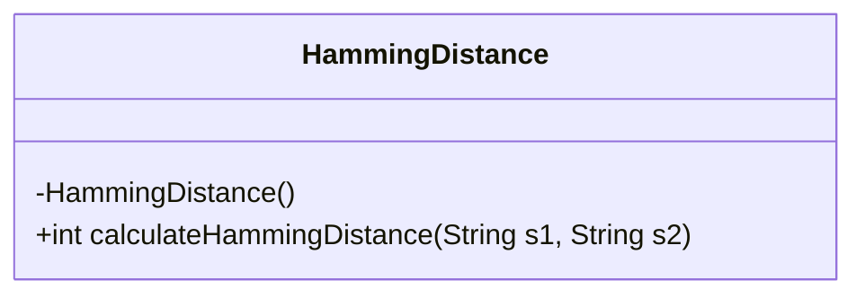
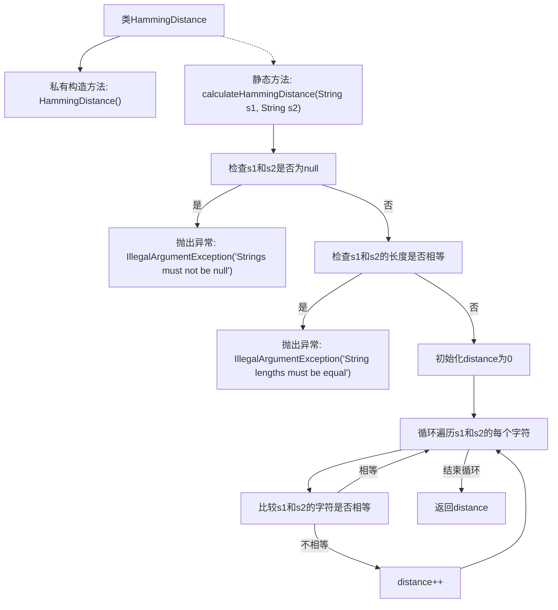

# 基础信息

|      |      |
|------|------|
| 名称 | HammingDistance |
| 编码语言 | .java |
| 代码路径 | Java/src/main/java/com/thealgorithms/strings/HammingDistance.java |
| 包名 | com.thealgorithms.strings |
| 依赖项 | [] |
| 概述说明 | 计算等长字符串的汉明距离，长度不等时抛出异常。 |

# 说明

计算等长字符串的汉明距离时，首先需要确保两个字符串的长度相等。如果长度不等，则抛出异常。汉明距离是指两个等长字符串在相同位置上不同字符的数量。该操作适用于比较二进制数据或字符串的相似性，常用于错误检测和纠正、信息检索等领域。

# 类列表 Class Summary

| 名称   | 类型  | 说明 |
|-------|------|-------------|
| HammingDistance | class | 计算等长字符串的汉明距离，长度不等时抛出异常。 |

## 类 HammingDistance

|      |      |
|------|------|
| 访问范围 | public final |
| 类型 | class |
| 名称 | HammingDistance |
| 说明 | 计算等长字符串的汉明距离，长度不等时抛出异常。 |

### UML类图

**描述：**  
`HammingDistance` 类是一个工具类，用于计算两个等长字符串之间的汉明距离。汉明距离是指两个字符串在相同位置上字符不同的次数。该类包含一个私有构造函数，防止实例化，以及一个静态方法 `calculateHammingDistance`，该方法接受两个字符串参数，并返回它们之间的汉明距离。如果输入的字符串为空或长度不等，方法会抛出 `IllegalArgumentException` 异常。

### 内部方法调用关系图

这段代码定义了一个名为 `HammingDistance` 的类，其中包含一个私有构造方法和一个静态方法 `calculateHammingDistance`。该方法用于计算两个等长字符串之间的汉明距离。首先，方法会检查输入字符串是否为 `null` 或长度是否相等，如果不满足条件则抛出异常。接着，方法通过遍历字符串的每个字符，比较对应位置的字符是否相同，统计不同字符的数量并返回结果。

### 字段列表 Field List

| 名称  | 类型  | 说明 |
|-------|-------|------|

### 方法列表 Method List

| 名称  | 类型  | 说明 |
|-------|-------|------|
| calculateHammingDistance | int | 计算两个等长字符串的汉明距离，若为空或长度不等则抛出异常。 |

