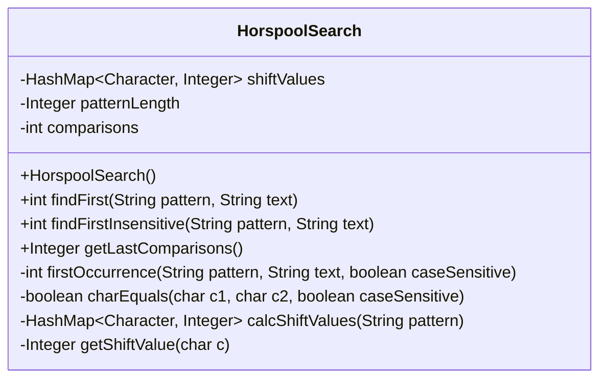
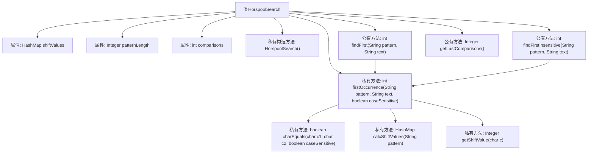

# 基础信息

|      |      |
|------|------|
| 名称 | HorspoolSearch |
| 编码语言 | .java |
| 代码路径 | Java/src/main/java/com/thealgorithms/strings/HorspoolSearch.java |
| 包名 | com.thealgorithms.strings |
| 依赖项 | ['java.util.HashMap'] |
| 概述说明 | HorspoolSearch类实现Horspool算法，支持大小写敏感与不敏感匹配，返回模式首次出现位置。 |

# 说明

HorspoolSearch类实现了Horspool算法，用于在文本中查找模式串的首次出现位置。该算法支持大小写敏感和不敏感两种匹配模式，用户可以根据需求选择相应的匹配方式。通过该类的功能，用户可以高效地在目标文本中定位模式串的起始位置，适用于各种字符串搜索场景。

# 类列表 Class Summary

| 名称   | 类型  | 说明 |
|-------|------|-------------|
| HorspoolSearch | class | HorspoolSearch类实现Horspool算法，支持大小写敏感与不敏感匹配，返回模式首次出现位置。 |

## 类 HorspoolSearch

|      |      |
|------|------|
| 访问范围 | public final |
| 类型 | class |
| 名称 | HorspoolSearch |
| 说明 | HorspoolSearch类实现Horspool算法，支持大小写敏感与不敏感匹配，返回模式首次出现位置。 |

### UML类图

**描述：**  
`HorspoolSearch` 类实现了Horspool字符串搜索算法，用于在文本中查找模式字符串的首次出现。该类包含两个公有方法 `findFirst` 和 `findFirstInsensitive`，分别用于区分大小写和不区分大小写的搜索。类内部维护了一个坏字符表 `shiftValues`，用于在匹配失败时计算模式串的移动距离。`firstOccurrence` 方法实现了核心搜索逻辑，`charEquals` 方法用于字符比较，`calcShiftValues` 方法用于构建坏字符表，`getShiftValue` 方法用于获取字符对应的移动距离。

### 内部方法调用关系图

**描述：**
该代码实现了Horspool字符串搜索算法，支持区分大小写和不区分大小写的搜索。`HorspoolSearch`类包含多个私有属性和方法，用于计算字符位移值、比较字符以及执行搜索。`findFirst`和`findFirstInsensitive`方法分别用于执行区分大小写和不区分大小写的搜索，而`firstOccurrence`方法是核心搜索逻辑的实现。`calcShiftValues`方法用于构建字符位移表，`charEquals`方法用于字符比较，`getShiftValue`方法用于获取字符的位移值。

### 字段列表 Field List

| 名称  | 类型  | 说明 |
|-------|-------|------|
| shiftValues | HashMap<Character, Integer> | 定义静态HashMap存储字符与整数的映射关系。 |
| patternLength | Integer | 定义了一个私有的静态整型变量patternLength。 |
| comparisons = 0 | int | 定义了一个私有静态整型变量comparisons，用于记录比较次数。 |

### 方法列表 Method List

| 名称  | 类型  | 说明 |
|-------|-------|------|
| getLastComparisons | Integer | 获取HorspoolSearch算法中最后一次比较的次数。 |
| calcShiftValues | HashMap<Character, Integer> | 该方法计算字符串中字符的偏移值，并存储在哈希表中返回。 |
| findFirst | int | 查找字符串在文本中的首次出现位置。 |
| firstOccurrence | int | 该方法在文本中查找模式首次出现的位置，支持大小写敏感匹配。 |
| findFirstInsensitive | int | 静态方法findFirstInsensitive返回字符串pattern在text中首次出现的位置，忽略大小写。 |
| charEquals | boolean | 比较两个字符，区分大小写时直接比较，否则转为小写后比较。 |
| getShiftValue | Integer | 获取字符c的偏移值，若不存在则返回模式长度。 |

