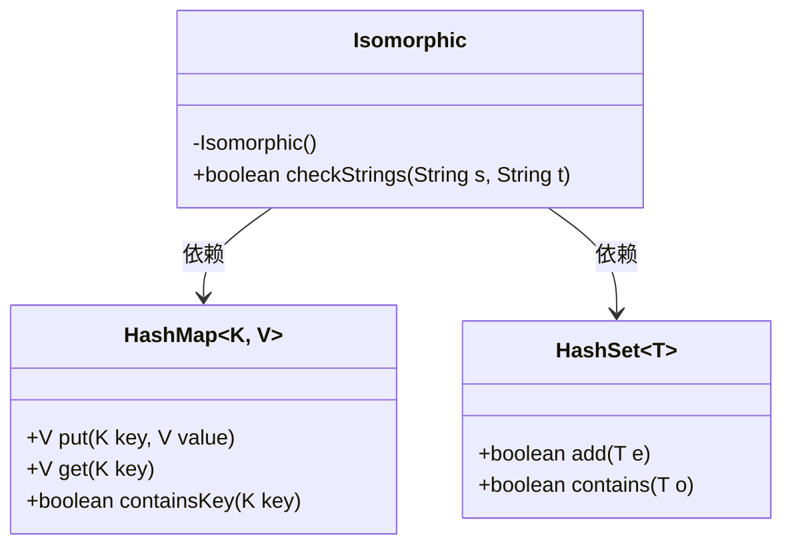
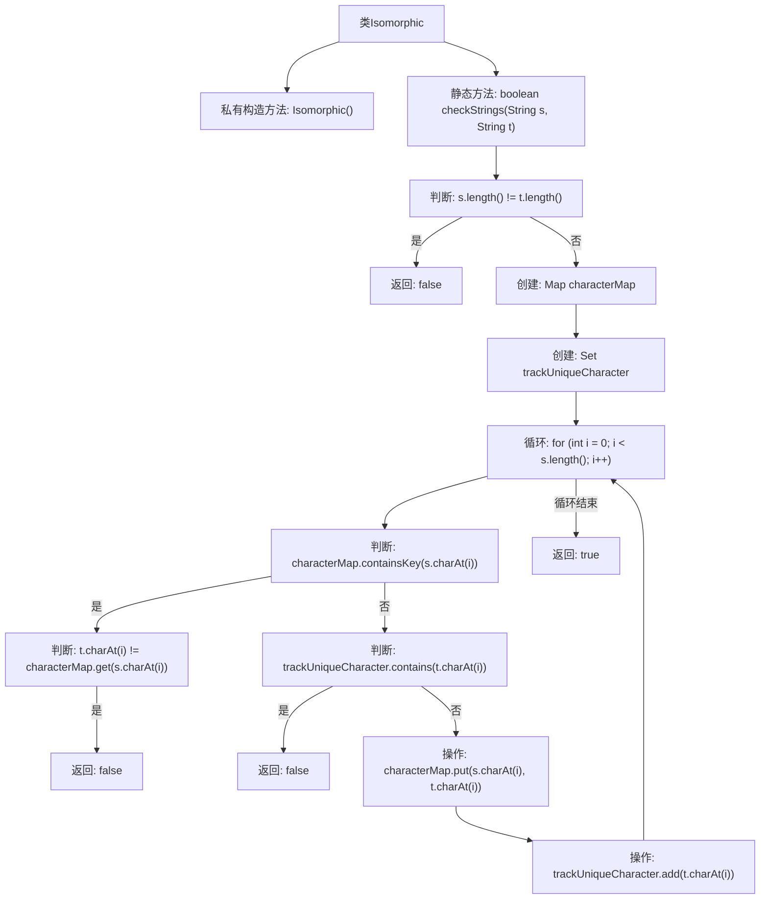

# 基础信息

|      |      |
|------|------|
| 名称 | Isomorphic |
| 编码语言 | .java |
| 代码路径 | Java/src/main/java/com/thealgorithms/strings/Isomorphic.java |
| 包名 | com.thealgorithms.strings |
| 依赖项 | ['java.util.HashMap', 'java.util.HashSet', 'java.util.Map', 'java.util.Set'] |
| 概述说明 | 判断两字符串长度相同且字符一一映射。 |

# 说明

该内容描述了一个用于检查两个字符串是否为同构的算法要求。同构字符串的定义是，两个字符串的长度必须相同，并且字符之间的映射关系必须唯一。这意味着每个字符在第一个字符串中的出现位置，必须与第二个字符串中对应位置的字符保持一致，且不能出现一对多或多对一的映射情况。这种检查确保了字符串之间的结构一致性。

# 类列表 Class Summary

| 名称   | 类型  | 说明 |
|-------|------|-------------|
| Isomorphic | class | 检查两个字符串是否为同构，长度相同且字符映射唯一。 |

## 类 Isomorphic

|      |      |
|------|------|
| 访问范围 | public final |
| 类型 | class |
| 名称 | Isomorphic |
| 说明 | 检查两个字符串是否为同构，长度相同且字符映射唯一。 |

### UML类图

类图描述：
`Isomorphic` 类是一个工具类，用于检查两个字符串是否同构。它依赖于 `HashMap` 和 `HashSet` 来存储和跟踪字符映射关系。`checkStrings` 方法通过遍历字符串，使用 `HashMap` 记录字符映射，并使用 `HashSet` 确保字符映射的唯一性，最终返回两个字符串是否同构的布尔值。

### 内部方法调用关系图

这段代码用于检查两个字符串是否同构。通过使用`Map`和`Set`数据结构，代码逐字符比较两个字符串的映射关系，确保每个字符在第一个字符串中的映射与第二个字符串中的字符一致，并且每个字符的映射是唯一的。如果字符串长度不同或映射关系不一致，则返回`false`，否则返回`true`。

### 字段列表 Field List

| 名称  | 类型  | 说明 |
|-------|-------|------|

### 方法列表 Method List

| 名称  | 类型  | 说明 |
|-------|-------|------|
| checkStrings | boolean | 检查两个字符串是否可通过字符映射匹配。 |

