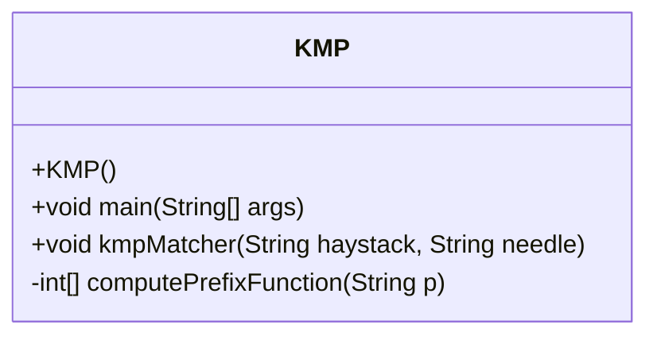
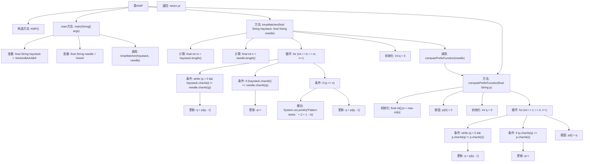

# 基础信息

|      |      |
|------|------|
| 名称 | KMP |
| 编码语言 | .java |
| 代码路径 | Java/src/main/java/com/thealgorithms/strings/KMP.java |
| 包名 | com.thealgorithms.strings |
| 依赖项 | [] |
| 概述说明 | KMP算法通过前缀函数高效匹配字符串并定位子串。 |

# 说明

KMP算法用于高效实现字符串匹配，通过计算前缀函数来优化查找过程。前缀函数记录了模式串中每个位置的最长相同前缀后缀长度，避免不必要的字符比较。查找子串时，利用前缀函数在文本串中滑动模式串，快速定位子串的起始位置，提升匹配效率。

# 类列表 Class Summary

| 名称   | 类型  | 说明 |
|-------|------|-------------|
| KMP | class | KMP算法实现字符串匹配，计算前缀函数并查找子串起始位置。 |

## 类 KMP

|      |      |
|------|------|
| 访问范围 | public final |
| 类型 | class |
| 名称 | KMP |
| 说明 | KMP算法实现字符串匹配，计算前缀函数并查找子串起始位置。 |

### UML类图

### 描述：
`KMP` 类实现了一个用于字符串匹配的 Knuth-Morris-Pratt (KMP) 算法。该类包含一个私有的构造方法 `KMP()`，确保无法实例化该类。`kmpMatcher` 方法用于在目标字符串 `haystack` 中查找子字符串 `needle` 的起始位置，并打印匹配的起始索引。`computePrefixFunction` 方法计算子字符串的前缀函数，用于优化匹配过程。`main` 方法提供了一个示例，展示了如何使用 `kmpMatcher` 方法进行字符串匹配。

### 内部方法调用关系图

这段代码实现了KMP（Knuth-Morris-Pratt）字符串匹配算法，用于在主字符串中查找子字符串的起始位置。代码首先通过`computePrefixFunction`计算子字符串的前缀函数，然后在`kmpMatcher`方法中使用该前缀函数进行匹配。流程图展示了从主方法`main`到`kmpMatcher`和`computePrefixFunction`的调用关系，以及内部循环和条件判断的逻辑流程。

### 字段列表 Field List

| 名称  | 类型  | 说明 |
|-------|-------|------|

### 方法列表 Method List

| 名称  | 类型  | 说明 |
|-------|-------|------|
| main | void | Java代码查找子串"AAAA"在主串"AAAAABAAABA"中的位置。 |
| kmpMatcher | void | KMP算法实现字符串匹配，输出模式串起始位置。 |
| computePrefixFunction | int[] | 计算字符串前缀函数，生成前缀数组。 |

