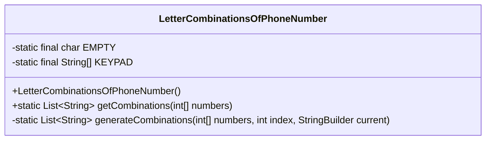
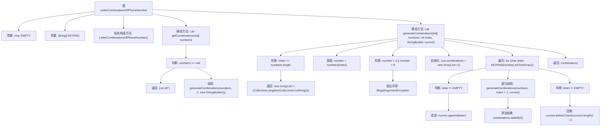

# 基础信息

|      |      |
|------|------|
| 名称 | LetterCombinationsOfPhoneNumber |
| 编码语言 | .java |
| 代码路径 | Java/src/main/java/com/thealgorithms/strings/LetterCombinationsOfPhoneNumber.java |
| 包名 | com.thealgorithms.strings |
| 依赖项 | ['java.util.ArrayList', 'java.util.Collections', 'java.util.List'] |
| 概述说明 | 递归生成电话键盘数字对应字母组合。 |

# 说明

该内容描述了一个类，其功能是生成电话键盘数字对应的字母组合。实现方法采用了递归技术，通过递归调用逐步构建所有可能的字母组合。递归方法在处理此类组合问题时具有高效性和简洁性，能够系统地遍历所有可能的组合情况。该类的设计旨在模拟传统电话键盘的数字与字母映射关系，适用于需要生成此类组合的应用场景。

# 类列表 Class Summary

| 名称   | 类型  | 说明 |
|-------|------|-------------|
| LetterCombinationsOfPhoneNumber | class | 类生成电话键盘数字对应的字母组合，使用递归方法实现。 |

## 类 LetterCombinationsOfPhoneNumber

|      |      |
|------|------|
| 访问范围 | public final |
| 类型 | class |
| 名称 | LetterCombinationsOfPhoneNumber |
| 说明 | 类生成电话键盘数字对应的字母组合，使用递归方法实现。 |

### UML类图

**描述：**  
`LetterCombinationsOfPhoneNumber` 类用于生成电话号码对应的所有可能的字母组合。该类包含一个私有的静态常量 `EMPTY` 表示空字符，以及一个私有的静态数组 `KEYPAD` 存储电话号码键盘上每个数字对应的字母。`getCombinations` 方法接收一个整数数组作为输入，调用 `generateCombinations` 方法递归生成所有可能的字母组合。`generateCombinations` 方法通过回溯算法逐步构建组合，并在处理完所有数字后返回结果。

### 内部方法调用关系图

这段代码实现了一个生成电话号码对应字母组合的功能。通过递归和回溯的方法，代码遍历输入的数字数组，并根据电话键盘的映射关系生成所有可能的字母组合。代码首先检查输入是否为空，然后通过递归调用生成组合，并在每次递归后回溯以继续生成其他组合。最终返回所有可能的字母组合列表。

### 字段列表 Field List

| 名称  | 类型  | 说明 |
|-------|-------|------|
| EMPTY = '\0' | char | 定义静态常量EMPTY，值为空字符'\0'。 |
| KEYPAD = new String[] {" ", String.valueOf(EMPTY), "abc", "def", "ghi", "jkl", "mno", "pqrs", "tuv", "wxyz"} | String[] | 定义静态字符串数组KEYPAD，包含数字对应字母。 |

### 方法列表 Method List

| 名称  | 类型  | 说明 |
|-------|-------|------|
| generateCombinations | List<String> | 递归生成数字对应键盘字母组合，支持回溯。 |
| getCombinations | List<String> | 静态方法生成整数数组所有组合，返回字符串列表。 |

