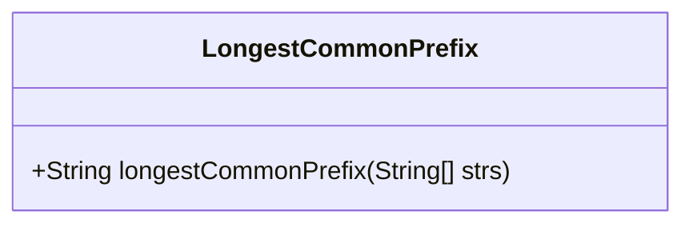
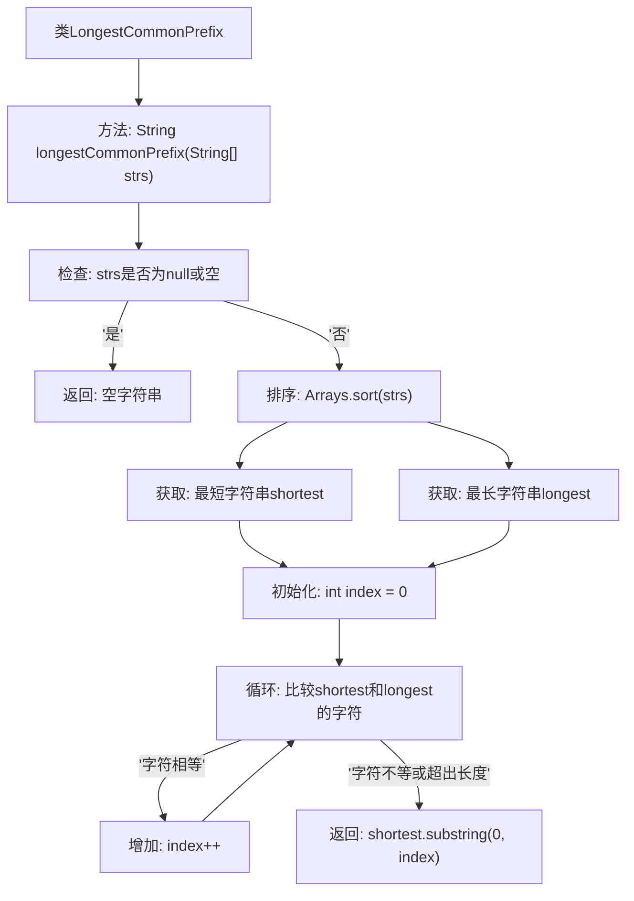

# 基础信息

|      |      |
|------|------|
| 名称 | LongestCommonPrefix |
| 编码语言 | .java |
| 代码路径 | Java/src/main/java/com/thealgorithms/strings/LongestCommonPrefix.java |
| 包名 | com.thealgorithms.strings |
| 依赖项 | ['java.util.Arrays'] |
| 概述说明 | 通过排序和比较最短与最长字符串查找数组最长公共前缀。 |

# 说明

该内容描述了一种查找字符串数组中最长公共前缀的方法。通过将字符串数组进行排序，然后比较排序后的最短字符串和最长字符串，找出它们之间的公共前缀。这种方法通过排序和比较简化了查找过程，提高了效率。

# 类列表 Class Summary

| 名称   | 类型  | 说明 |
|-------|------|-------------|
| LongestCommonPrefix | class | 查找字符串数组中最长公共前缀，通过排序和比较最短与最长字符串实现。 |

## 类 LongestCommonPrefix

|      |      |
|------|------|
| 访问范围 | public final |
| 类型 | class |
| 名称 | LongestCommonPrefix |
| 说明 | 查找字符串数组中最长公共前缀，通过排序和比较最短与最长字符串实现。 |

### UML类图

这段代码定义了一个名为 `LongestCommonPrefix` 的类，其中包含一个公有方法 `longestCommonPrefix`，用于查找字符串数组中的最长公共前缀。该方法首先检查数组是否为空或长度为0，如果是则返回空字符串。然后对数组进行排序，并比较第一个和最后一个字符串的字符，直到找到不匹配的字符为止，最后返回最长公共前缀。

### 内部方法调用关系图

这段代码定义了一个名为 `LongestCommonPrefix` 的类，其中包含一个 `longestCommonPrefix` 方法。该方法用于查找字符串数组中的最长公共前缀。首先，方法会检查输入数组是否为空或为 `null`，如果是则返回空字符串。接着，对数组进行排序，获取最短和最长的字符串，然后通过逐个字符比较来找到最长的公共前缀，并返回该前缀。流程图清晰地展示了方法的执行步骤和逻辑判断过程。

### 字段列表 Field List

| 名称  | 类型  | 说明 |
|-------|-------|------|

### 方法列表 Method List

| 名称  | 类型  | 说明 |
|-------|-------|------|
| longestCommonPrefix | String | 查找字符串数组的最长公共前缀。 |

