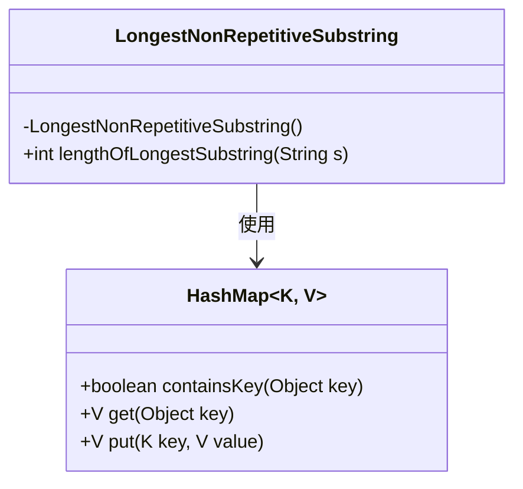
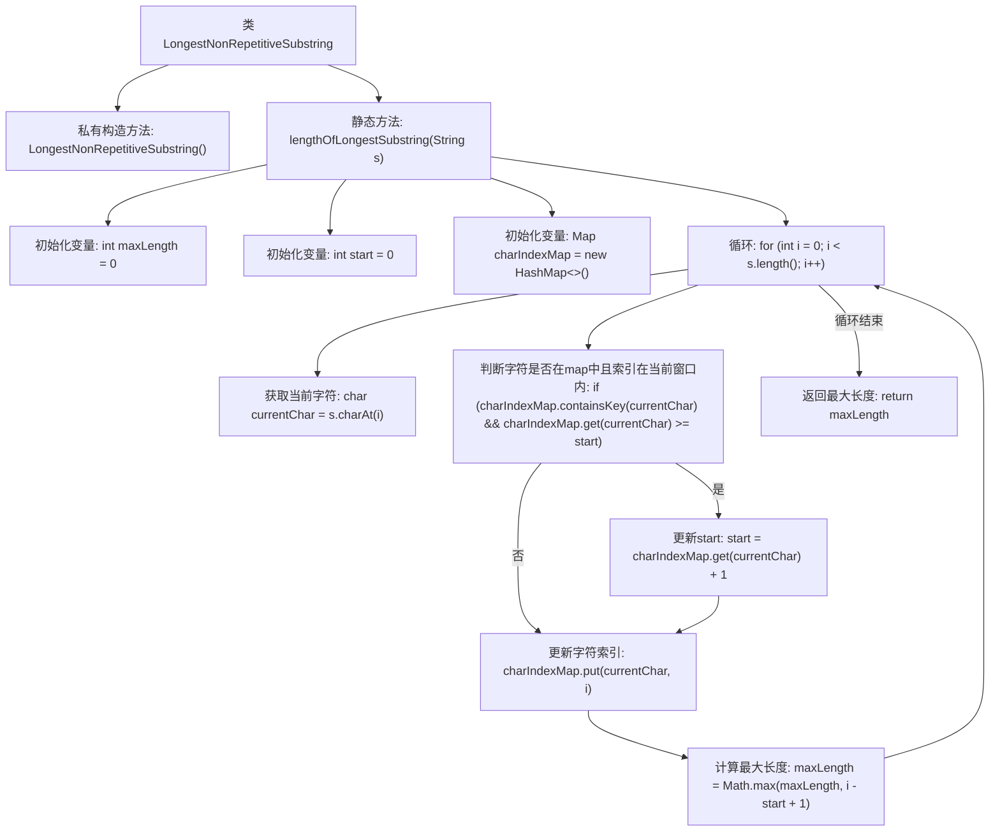

# 基础信息

|      |      |
|------|------|
| 名称 | LongestNonRepetitiveSubstring |
| 编码语言 | .java |
| 代码路径 | Java/src/main/java/com/thealgorithms/strings/LongestNonRepetitiveSubstring.java |
| 包名 | com.thealgorithms.strings |
| 依赖项 | ['java.util.HashMap', 'java.util.Map'] |
| 概述说明 | 计算字符串中最长无重复字符子串的长度。 |

# 说明

该任务要求计算给定字符串中最长不重复子串的长度。子串是指字符串中连续的一段字符，且这些字符都不重复。目标是通过遍历字符串，找到其中最长的不包含重复字符的子串，并返回其长度。此问题通常通过滑动窗口技术解决，利用哈希表记录字符的最近出现位置，动态调整窗口边界，确保窗口内字符唯一，从而高效地找到最长不重复子串的长度。

# 类列表 Class Summary

| 名称   | 类型  | 说明 |
|-------|------|-------------|
| LongestNonRepetitiveSubstring | class | 计算字符串中最长不重复子串的长度。 |

## 类 LongestNonRepetitiveSubstring

|      |      |
|------|------|
| 访问范围 | final |
| 类型 | class |
| 名称 | LongestNonRepetitiveSubstring |
| 说明 | 计算字符串中最长不重复子串的长度。 |

### UML类图

这段代码定义了一个名为 `LongestNonRepetitiveSubstring` 的类，其中包含一个私有构造函数和一个公有静态方法 `lengthOfLongestSubstring`。该方法用于计算给定字符串中最长不重复子串的长度。方法内部使用了 `HashMap` 来存储字符及其最后出现的位置，通过滑动窗口的策略来动态调整子串的起始位置，并最终返回最大长度。类图展示了 `LongestNonRepetitiveSubstring` 类与 `HashMap` 类之间的依赖关系。

### 内部方法调用关系图

这段代码的流程图描述了如何查找字符串中最长无重复字符子串的长度。代码通过维护一个滑动窗口和字符索引映射来跟踪字符的最近出现位置，从而动态调整窗口的起始位置，并计算当前窗口的最大长度。最终返回整个字符串中最大无重复字符子串的长度。

### 字段列表 Field List

| 名称  | 类型  | 说明 |
|-------|-------|------|

### 方法列表 Method List

| 名称  | 类型  | 说明 |
|-------|-------|------|
| lengthOfLongestSubstring | int | 计算字符串中最长无重复字符子串的长度。 |

