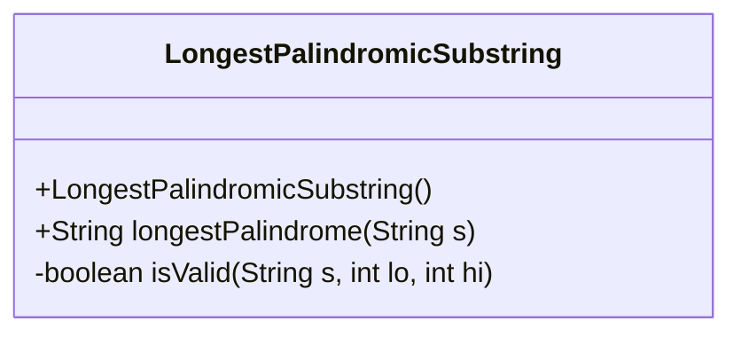
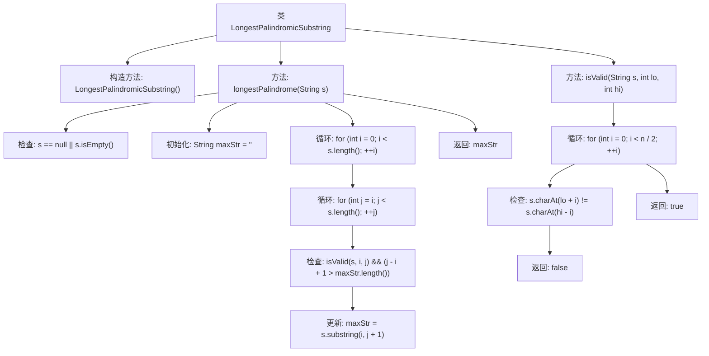

# 基础信息

|      |      |
|------|------|
| 名称 | LongestPalindromicSubstring |
| 编码语言 | .java |
| 代码路径 | Java/src/main/java/com/thealgorithms/strings/LongestPalindromicSubstring.java |
| 包名 | com.thealgorithms.strings |
| 依赖项 | [] |
| 概述说明 | 查找字符串中最长回文子串的算法。 |

# 说明

查找字符串中最长回文子串的算法旨在从给定字符串中找出最长的回文子串。回文子串是指正读和反读都相同的子串。该算法通常通过动态规划或中心扩展法实现。动态规划法利用二维数组记录子串是否为回文，逐步扩展子串长度。中心扩展法则从每个字符或每对字符为中心向两侧扩展，寻找最长回文。两种方法均能有效解决该问题，时间复杂度为O(n^2)，其中n为字符串长度。

# 类列表 Class Summary

| 名称   | 类型  | 说明 |
|-------|------|-------------|
| LongestPalindromicSubstring | class | 查找字符串中最长回文子串的算法。 |

## 类 LongestPalindromicSubstring

|      |      |
|------|------|
| 访问范围 | final |
| 类型 | class |
| 名称 | LongestPalindromicSubstring |
| 说明 | 查找字符串中最长回文子串的算法。 |

### UML类图

**描述：**  
`LongestPalindromicSubstring` 类包含一个私有构造函数和一个公有静态方法 `longestPalindrome`，用于查找给定字符串中的最长回文子串。该类还包含一个私有静态方法 `isValid`，用于检查指定范围内的子串是否为回文。`longestPalindrome` 方法通过遍历字符串的所有可能子串，并使用 `isValid` 方法验证是否为回文，最终返回最长的回文子串。该类设计为不可继承的 `final` 类，且构造函数为私有，确保无法实例化。

### 内部方法调用关系图

这段代码定义了一个名为`LongestPalindromicSubstring`的类，用于查找给定字符串中的最长回文子串。`longestPalindrome`方法通过双重循环遍历所有可能的子串，并调用`isValid`方法检查是否为回文。如果是回文且长度大于当前记录的最大回文子串，则更新最大回文子串。`isValid`方法通过比较字符来验证子串是否为回文。最终，`longestPalindrome`方法返回找到的最长回文子串。

### 字段列表 Field List

| 名称  | 类型  | 说明 |
|-------|-------|------|

### 方法列表 Method List

| 名称  | 类型  | 说明 |
|-------|-------|------|
| longestPalindrome | String | 查找字符串中最长的回文子串。 |
| isValid | boolean | 检查字符串s在lo到hi范围内是否为回文。 |

