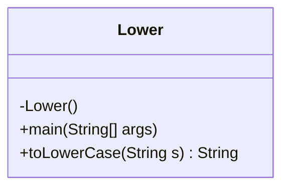
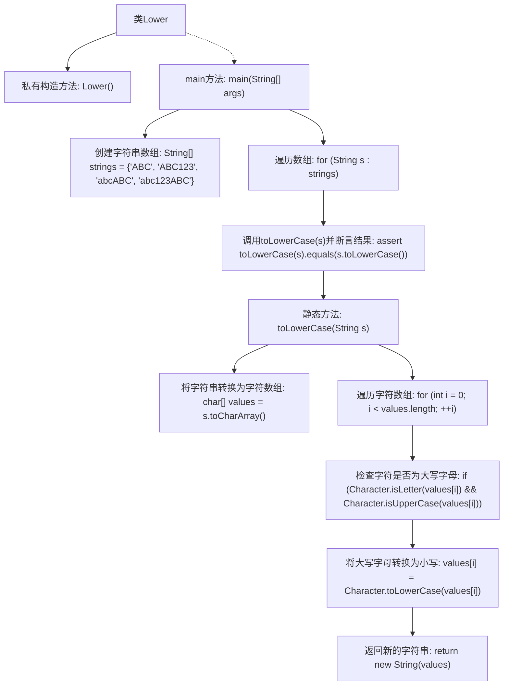

# 基础信息

|      |      |
|------|------|
| 名称 | Lower |
| 编码语言 | .java |
| 代码路径 | Java/src/main/java/com/thealgorithms/strings/Lower.java |
| 包名 | com.thealgorithms.strings |
| 依赖项 | [] |
| 概述说明 | Lower类实现字符串转小写功能并通过测试验证。 |

# 说明

Lower类设计用于将字符串转换为小写形式，其功能通过专门的测试用例进行了验证，确保转换的准确性和可靠性。测试过程涵盖了多种输入情况，以确认类在各种场景下均能正确执行字符串的小写转换。

# 类列表 Class Summary

| 名称   | 类型  | 说明 |
|-------|------|-------------|
| Lower | class | Lower类实现字符串转小写功能，并通过测试验证。 |

## 类 Lower

|      |      |
|------|------|
| 访问范围 | public final |
| 类型 | class |
| 名称 | Lower |
| 说明 | Lower类实现字符串转小写功能，并通过测试验证。 |

### UML类图

**描述：**
`Lower` 类是一个工具类，用于将字符串转换为小写。它包含一个私有的构造函数以防止实例化，以及两个静态方法：`main` 用于测试 `toLowerCase` 方法的正确性，`toLowerCase` 方法则将输入的字符串中的所有大写字母转换为小写字母并返回结果。该类通过遍历字符数组并逐个检查字符是否为大写字母来实现转换功能。

### 内部方法调用关系图

这段代码定义了一个名为`Lower`的不可继承类，包含一个私有构造方法和两个静态方法。`main`方法初始化一个字符串数组，并遍历数组中的每个字符串，调用`toLowerCase`方法将其转换为小写，并使用断言验证转换结果。`toLowerCase`方法将字符串转换为字符数组，遍历数组中的每个字符，如果是大写字母则转换为小写，最后返回转换后的字符串。

### 字段列表 Field List

| 名称  | 类型  | 说明 |
|-------|-------|------|

### 方法列表 Method List

| 名称  | 类型  | 说明 |
|-------|-------|------|
| main | void | Java代码验证字符串转小写功能正确性。 |
| toLowerCase | String | 将字符串中所有大写字母转换为小写并返回结果。 |

