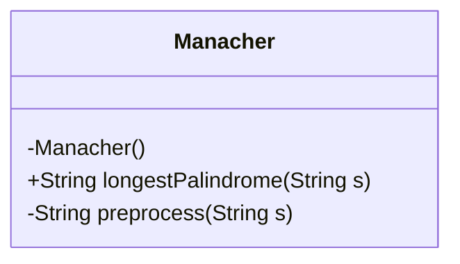
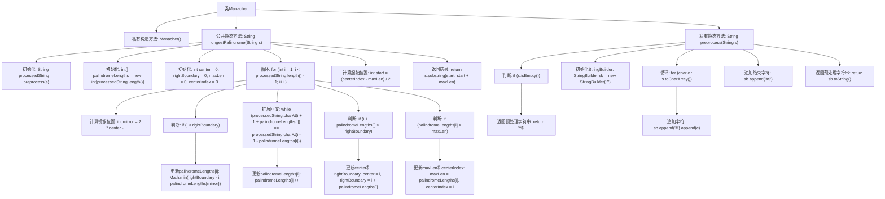

# 基础信息

|      |      |
|------|------|
| 名称 | Manacher |
| 编码语言 | .java |
| 代码路径 | Java/src/main/java/com/thealgorithms/strings/Manacher.java |
| 包名 | com.thealgorithms.strings |
| 依赖项 | [] |
| 概述说明 | Manacher算法用于快速查找字符串中最长回文子串。 |

# 说明

Manacher算法是一种高效查找字符串中最长回文子串的算法。该算法通过预处理字符串，在每个字符之间插入特殊字符，将奇偶长度的回文子串统一处理。算法利用回文串的对称性，通过维护一个中心点和回文半径数组，避免重复计算，从而在线性时间内找到最长回文子串。其核心思想是利用已知的回文信息，减少不必要的比较，提升查找效率。Manacher算法在处理大规模字符串时表现出色，广泛应用于字符串匹配和文本分析领域。

# 类列表 Class Summary

| 名称   | 类型  | 说明 |
|-------|------|-------------|
| Manacher | class | Manacher算法实现，用于查找字符串中最长回文子串。 |

## 类 Manacher

|      |      |
|------|------|
| 访问范围 | public final |
| 类型 | class |
| 名称 | Manacher |
| 说明 | Manacher算法实现，用于查找字符串中最长回文子串。 |

### UML类图

这段代码定义了一个名为 `Manacher` 的类，该类包含一个私有的构造函数和两个静态方法。`longestPalindrome` 方法使用 Manacher 算法来查找输入字符串中的最长回文子串，而 `preprocess` 方法用于预处理输入字符串，以便在算法中避免边界条件。`Manacher` 类是一个工具类，因此构造函数被声明为私有，以防止实例化。通过 `longestPalindrome` 方法，用户可以轻松地找到字符串中的最长回文子串，而无需关心算法的具体实现细节。

### 内部方法调用关系图

这段代码实现了Manacher算法，用于查找字符串中的最长回文子串。代码首先对输入字符串进行预处理，插入特殊字符以避免边界问题。然后通过维护一个数组`palindromeLengths`来记录每个位置的回文长度，并通过中心扩展法来更新这些长度。最终，根据记录的最大回文长度和中心位置，提取并返回最长回文子串。

### 字段列表 Field List

| 名称  | 类型  | 说明 |
|-------|-------|------|

### 方法列表 Method List

| 名称  | 类型  | 说明 |
|-------|-------|------|
| longestPalindrome | String | 查找字符串中最长回文子串的算法实现。 |
| preprocess | String | 预处理字符串，添加分隔符并返回。 |

