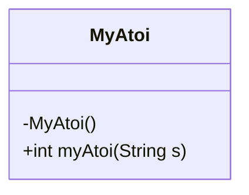
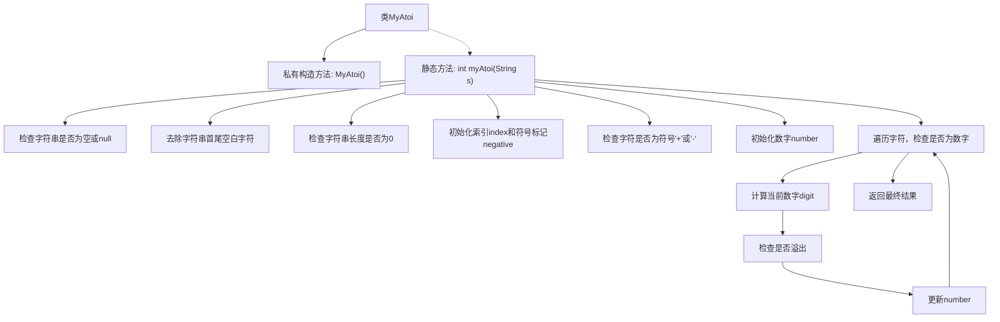

# 基础信息

|      |      |
|------|------|
| 名称 | MyAtoi |
| 编码语言 | .java |
| 代码路径 | Java/src/main/java/com/thealgorithms/strings/MyAtoi.java |
| 包名 | com.thealgorithms.strings |
| 依赖项 | [] |
| 概述说明 | MyAtoi类将字符串转32位整数，处理前导空格、正负号及溢出。 |

# 说明

MyAtoi类的主要功能是将字符串转换为32位整数。该类的处理流程包括去除字符串前导空格、识别正负号以及处理数值溢出情况。具体而言，它首先忽略字符串开头可能存在的空格，然后检查紧随其后的字符是否为加号或减号，以确定整数的符号。接着，类会逐字符解析后续的数字部分，并将其转换为整数。在转换过程中，MyAtoi类会检查数值是否超出32位有符号整数的范围，即是否小于-2^31或大于2^31-1，若超出则返回相应的边界值，确保转换结果的正确性和安全性。

# 类列表 Class Summary

| 名称   | 类型  | 说明 |
|-------|------|-------------|
| MyAtoi | class | MyAtoi类将字符串转换为32位整数，处理前导空格、正负号和溢出情况。 |

## 类 MyAtoi

|      |      |
|------|------|
| 访问范围 | public final |
| 类型 | class |
| 名称 | MyAtoi |
| 说明 | MyAtoi类将字符串转换为32位整数，处理前导空格、正负号和溢出情况。 |

### UML类图

**描述：**  
`MyAtoi` 类是一个工具类，用于将字符串转换为 32 位有符号整数。它包含一个私有构造函数，防止类被实例化。`myAtoi` 方法是核心功能，处理字符串的转换逻辑，包括去除前导空格、处理符号、解析数字以及处理溢出情况。如果字符串无法有效转换，则返回 0。该方法考虑了多种边缘情况，如空字符串、无效字符和数值溢出。

### 内部方法调用关系图

这段代码实现了一个将字符串转换为32位有符号整数的函数。首先检查字符串是否为空或仅包含空白字符，然后去除空白字符并检查符号。接着遍历字符串中的字符，将其转换为数字，并在过程中检查是否溢出。最后根据符号返回转换后的整数。该函数处理了各种边界情况，如空字符串、无效字符、溢出等，确保转换的准确性和鲁棒性。

### 字段列表 Field List

| 名称  | 类型  | 说明 |
|-------|-------|------|

### 方法列表 Method List

| 名称  | 类型  | 说明 |
|-------|-------|------|
| myAtoi | int | 将字符串转换为整数，处理符号和溢出，返回结果。 |

