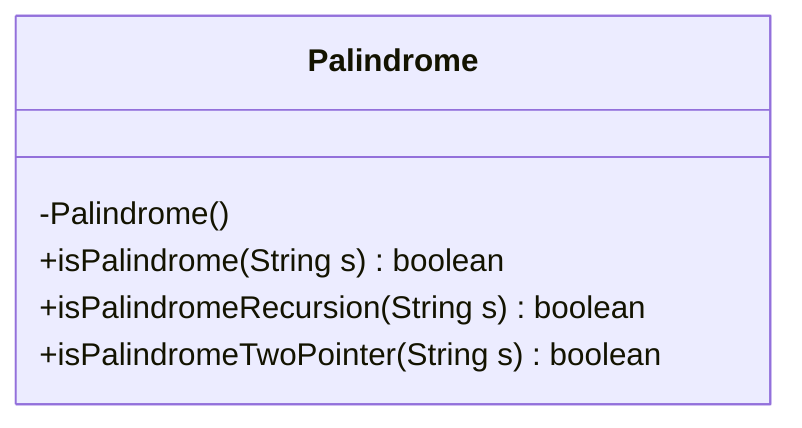
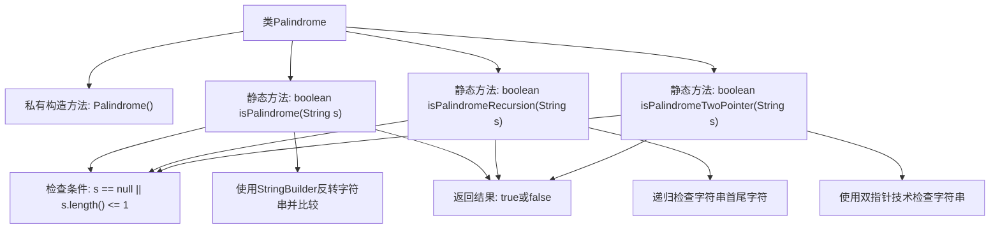

# 基础信息

|      |      |
|------|------|
| 名称 | Palindrome |
| 编码语言 | .java |
| 代码路径 | Java/src/main/java/com/thealgorithms/strings/Palindrome.java |
| 包名 | com.thealgorithms.strings |
| 依赖项 | [] |
| 概述说明 | 类Palindrome提供三种方法检查回文：StringBuilder、递归和双指针。 |

# 说明

类Palindrome提供了三种方法用于检查字符串是否为回文。第一种方法使用StringBuilder，通过反转字符串并与原字符串进行比较来判断。第二种方法是递归，通过比较字符串的首尾字符并递归检查中间部分来实现。第三种方法是双指针，使用两个指针分别从字符串的两端向中间移动，逐一比较字符是否相同。这三种方法各有特点，适用于不同的场景和需求。

# 类列表 Class Summary

| 名称   | 类型  | 说明 |
|-------|------|-------------|
| Palindrome | class | 类Palindrome提供三种方法检查字符串是否为回文：StringBuilder、递归和双指针。 |

## 类 Palindrome

|      |      |
|------|------|
| 访问范围 | final |
| 类型 | class |
| 名称 | Palindrome |
| 说明 | 类Palindrome提供三种方法检查字符串是否为回文：StringBuilder、递归和双指针。 |

### UML类图

这段代码定义了一个名为 `Palindrome` 的最终类，该类包含三个静态方法用于检查字符串是否为回文。`isPalindrome` 方法使用 `StringBuilder` 的反转功能来检查回文；`isPalindromeRecursion` 方法通过递归比较字符串的首尾字符来检查回文；`isPalindromeTwoPointer` 方法使用双指针技术从字符串的两端向中间遍历来检查回文。所有方法都处理了空字符串或长度为1的字符串的情况，确保代码的健壮性。

### 内部方法调用关系图

这段代码定义了一个名为 `Palindrome` 的最终类，该类包含三个静态方法，用于检查字符串是否为回文。`isPalindrome` 方法使用 `StringBuilder` 反转字符串并比较；`isPalindromeRecursion` 方法通过递归检查字符串的首尾字符；`isPalindromeTwoPointer` 方法使用双指针技术从字符串的两端向中间比较字符。每个方法都首先检查字符串是否为空或长度为1，如果是则直接返回 `true`，否则进行相应的回文检查并返回结果。

### 字段列表 Field List

| 名称  | 类型  | 说明 |
|-------|-------|------|

### 方法列表 Method List

| 名称  | 类型  | 说明 |
|-------|-------|------|
| isPalindromeTwoPointer | boolean | 双指针法判断字符串是否为回文。 |
| isPalindrome | boolean | 判断字符串是否为回文，空或单字符直接返回真，否则反转后比较。 |
| isPalindromeRecursion | boolean | 递归判断字符串是否为回文。 |

