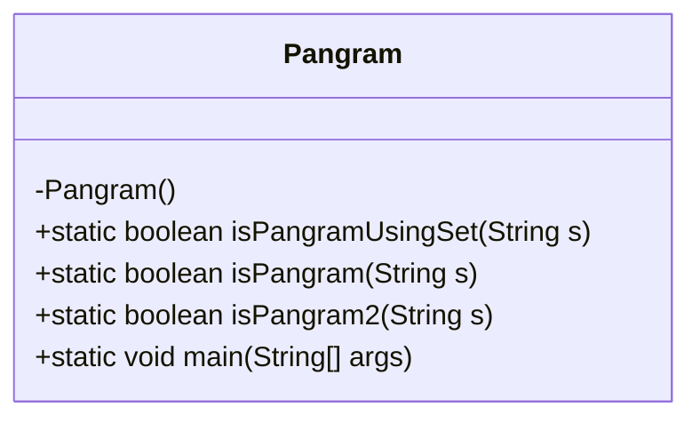
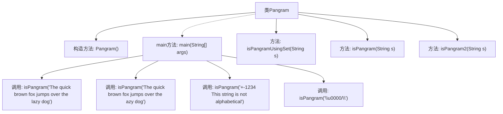

# 基础信息

|      |      |
|------|------|
| 名称 | Pangram |
| 编码语言 | .java |
| 代码路径 | Java/src/main/java/com/thealgorithms/strings/Pangram.java |
| 包名 | com.thealgorithms.strings |
| 依赖项 | ['java.util.HashSet'] |
| 概述说明 | Pangram类提供三种方法检测字符串是否为全字母句。 |

# 说明

Pangram类提供了三种方法，专门用于检测一个字符串是否为全字母句。全字母句是指包含英语字母表中所有26个字母的句子。这些方法通过不同的逻辑和算法来实现检测功能，确保字符串中每个字母至少出现一次。通过使用这些方法，用户可以方便地验证输入的字符串是否满足全字母句的条件。

# 类列表 Class Summary

| 名称   | 类型  | 说明 |
|-------|------|-------------|
| Pangram | class | Pangram类包含三种方法，用于检测字符串是否为全字母句。 |

## 类 Pangram

|      |      |
|------|------|
| 访问范围 | public final |
| 类型 | class |
| 名称 | Pangram |
| 说明 | Pangram类包含三种方法，用于检测字符串是否为全字母句。 |

### UML类图

**类图描述：**
`Pangram` 类是一个工具类，包含多个静态方法用于判断一个字符串是否为全字母句（Pangram）。该类包含三个主要方法：`isPangramUsingSet` 使用 `HashSet` 来判断字符串是否包含所有字母；`isPangram` 使用布尔数组来记录字母是否出现；`isPangram2` 通过遍历字母表并检查字符串中是否包含每个字母来判断。`main` 方法用于测试这些方法的功能。由于该类是工具类，构造函数被私有化以防止实例化。

### 内部方法调用关系图

这段代码定义了一个名为`Pangram`的类，用于判断一个字符串是否为全字母句（Pangram）。类中包含三个静态方法：`isPangramUsingSet`、`isPangram`和`isPangram2`，分别通过不同的方式实现全字母句的检测。`main`方法中通过断言测试了这些方法的正确性。流程图展示了类及其方法的调用关系，帮助理解代码结构和执行流程。

### 字段列表 Field List

| 名称  | 类型  | 说明 |
|-------|-------|------|

### 方法列表 Method List

| 名称  | 类型  | 说明 |
|-------|-------|------|
| isPangram2 | boolean | 判断字符串是否包含所有字母，长度小于26返回false，否则遍历字母检查。 |
| isPangram | boolean | 判断字符串是否为全字母句，遍历并标记字母存在，最终检查所有字母是否均出现。 |
| isPangramUsingSet | boolean | 该方法使用集合判断字符串是否为全字母句，返回布尔值。 |
| main | void | Java代码测试isPangram方法，验证字符串是否为全字母句。 |

