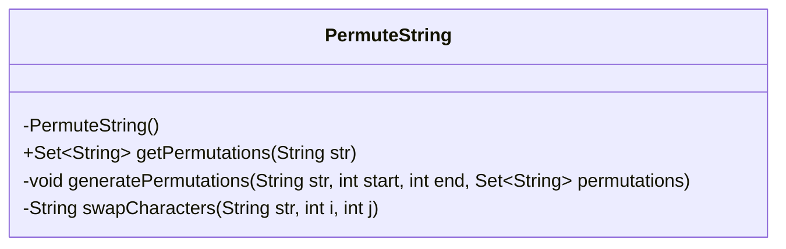
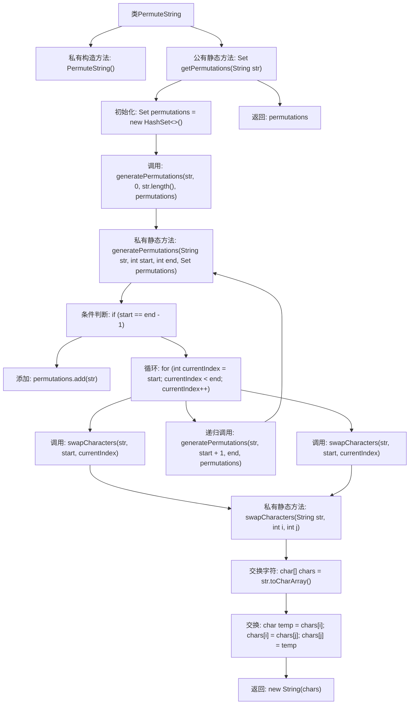

# 基础信息

|      |      |
|------|------|
| 名称 | PermuteString |
| 编码语言 | .java |
| 代码路径 | Java/src/main/java/com/thealgorithms/strings/PermuteString.java |
| 包名 | com.thealgorithms.strings |
| 依赖项 | ['java.util.HashSet', 'java.util.Set'] |
| 概述说明 | 递归生成字符串所有唯一排列。 |

# 说明

生成字符串所有唯一排列的递归方法是一种通过递归调用来实现字符串所有可能排列的算法。该方法通过逐步交换字符串中的字符，生成所有可能的排列组合，并确保每个排列都是唯一的。递归过程中，算法会固定一个字符，然后对剩余的字符进行递归排列，直到所有字符都被固定，生成完整的排列。这种方法能够有效地处理字符串的排列问题，适用于需要生成所有可能排列的场景。

# 类列表 Class Summary

| 名称   | 类型  | 说明 |
|-------|------|-------------|
| PermuteString | class | 生成字符串所有唯一排列的递归方法。 |

## 类 PermuteString

|      |      |
|------|------|
| 访问范围 | public final |
| 类型 | class |
| 名称 | PermuteString |
| 说明 | 生成字符串所有唯一排列的递归方法。 |

### UML类图

**描述：**  
`PermuteString` 类是一个工具类，用于生成给定字符串的所有唯一排列。它包含一个私有的构造函数，防止实例化。类中的 `getPermutations` 方法返回一个包含所有唯一排列的 `Set`。`generatePermutations` 方法通过递归和回溯算法生成排列，而 `swapCharacters` 方法用于交换字符串中的字符位置。该类确保了即使输入字符串包含重复字符，生成的排列也是唯一的。

### 内部方法调用关系图

这段代码定义了一个名为`PermuteString`的类，用于生成给定字符串的所有唯一排列。`getPermutations`方法初始化一个集合，并调用递归方法`generatePermutations`来生成所有可能的排列。`generatePermutations`方法通过交换字符并递归调用自身来生成排列，最后将结果添加到集合中。`swapCharacters`方法用于交换字符串中的两个字符。整个流程通过递归和回溯确保生成所有唯一的排列，并最终返回结果集合。

### 字段列表 Field List

| 名称  | 类型  | 说明 |
|-------|-------|------|

### 方法列表 Method List

| 名称  | 类型  | 说明 |
|-------|-------|------|
| getPermutations | Set<String> | 静态方法获取字符串所有排列组合。 |
| generatePermutations | void | 递归生成字符串所有排列并存储在集合中。 |
| swapCharacters | String | 静态方法交换字符串中指定位置的字符并返回新字符串。 |

