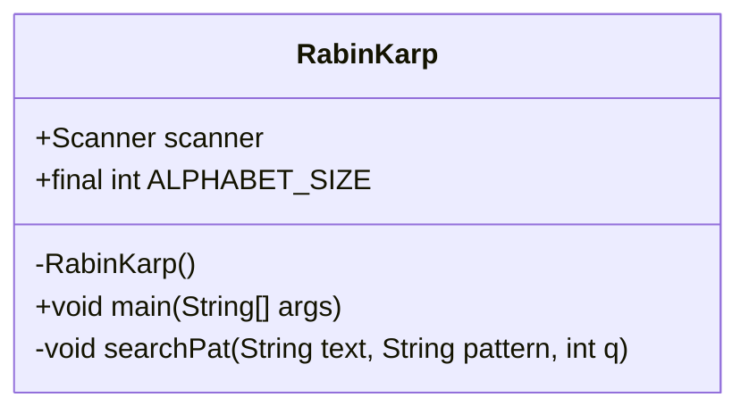
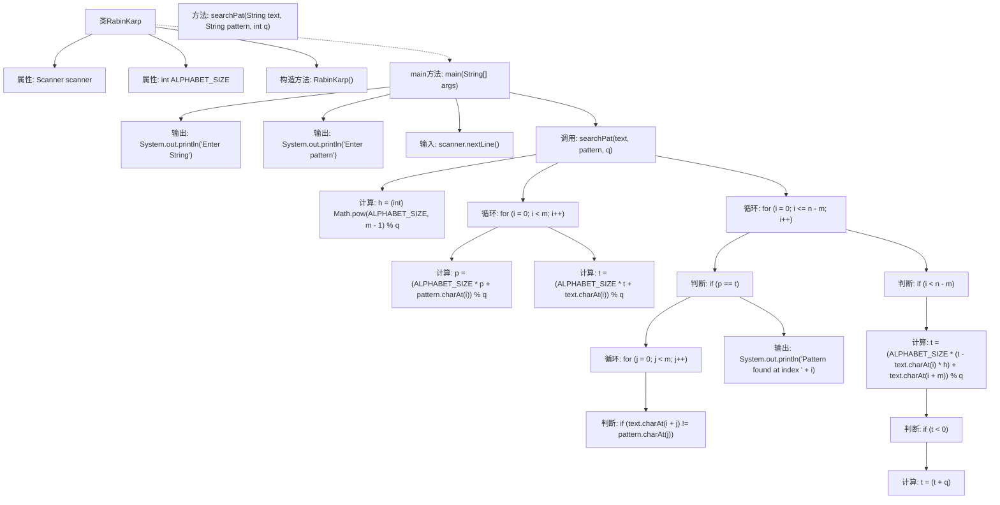

# 基础信息

|      |      |
|------|------|
| 名称 | RabinKarp |
| 编码语言 | .java |
| 代码路径 | Java/src/main/java/com/thealgorithms/strings/RabinKarp.java |
| 包名 | com.thealgorithms.strings |
| 依赖项 | ['java.util.Scanner'] |
| 概述说明 | RabinKarp类通过哈希值比较快速实现字符串模式匹配。 |

# 说明

RabinKarp类是一种用于字符串模式匹配的算法，通过计算和比较哈希值来快速定位模式在文本中的位置。该方法利用哈希函数将字符串转换为数值，从而在匹配时减少字符逐个比较的次数，提高匹配效率。RabinKarp算法特别适用于在长文本中查找固定长度的模式，其核心思想是通过滑动窗口机制逐步计算文本子串的哈希值，并与模式的哈希值进行比较，若哈希值匹配则进一步验证字符是否完全一致。这种方法在特定场景下能显著提升匹配速度。

# 类列表 Class Summary

| 名称   | 类型  | 说明 |
|-------|------|-------------|
| RabinKarp | class | RabinKarp类实现字符串模式匹配，通过哈希值比较快速定位模式位置。 |

## 类 RabinKarp

|      |      |
|------|------|
| 访问范围 | public final |
| 类型 | class |
| 名称 | RabinKarp |
| 说明 | RabinKarp类实现字符串模式匹配，通过哈希值比较快速定位模式位置。 |

### UML类图

**描述：**  
`RabinKarp` 类是一个用于实现Rabin-Karp字符串匹配算法的工具类。该类包含一个私有的构造函数，确保不能被实例化。`scanner` 用于从标准输入读取数据，`ALPHABET_SIZE` 定义了字符集的大小。`main` 方法负责读取输入字符串和模式，并调用 `searchPat` 方法进行模式匹配。`searchPat` 方法通过计算哈希值来高效地查找模式在文本中的位置，并在匹配时输出匹配的索引。

### 内部方法调用关系图

**描述：**  
该流程图展示了RabinKarp算法的实现过程。首先，程序通过`main`方法获取用户输入的字符串和模式，然后调用`searchPat`方法进行模式匹配。在`searchPat`方法中，首先计算哈希值的基础参数`h`，然后通过循环计算模式和文本的初始哈希值。接着，程序通过滑动窗口的方式逐个检查文本中的子串是否与模式匹配，如果哈希值匹配则进一步比较字符，匹配成功则输出匹配位置。如果哈希值不匹配，则更新滑动窗口的哈希值并继续检查下一个窗口。

### 字段列表 Field List

| 名称  | 类型  | 说明 |
|-------|-------|------|
| scanner = null | Scanner | 声明并初始化一个静态Scanner对象，初始值为null。 |
| ALPHABET_SIZE = 256 | int | 定义了常量ALPHABET_SIZE，值为256。 |

### 方法列表 Method List

| 名称  | 类型  | 说明 |
|-------|-------|------|
| main | void | Java程序读取输入字符串和模式，调用搜索函数进行匹配。 |
| searchPat | void | 实现字符串模式匹配的哈希算法，计算文本和模式的哈希值，匹配时输出位置。 |

