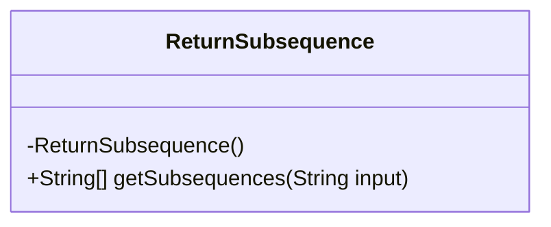
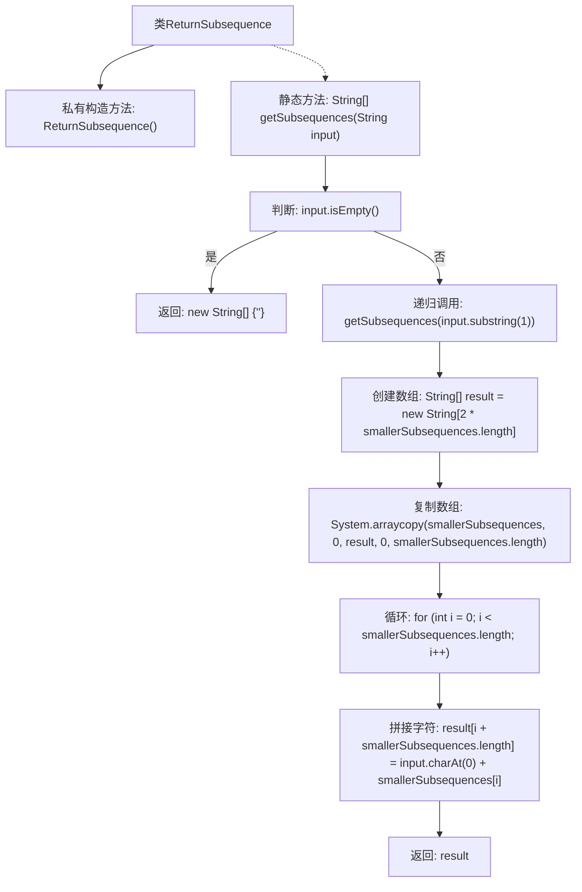

# 基础信息

|      |      |
|------|------|
| 名称 | ReturnSubsequence |
| 编码语言 | .java |
| 代码路径 | Java/src/main/java/com/thealgorithms/strings/ReturnSubsequence.java |
| 包名 | com.thealgorithms.strings |
| 依赖项 | [] |
| 概述说明 | 生成输入字符串的所有可能子序列。 |

# 说明

生成输入字符串的所有子序列，意味着从给定字符串中提取所有可能的字符组合，这些组合可以是连续的或不连续的，但必须保持原始字符串中的字符顺序。子序列的长度可以从1到字符串的总长度不等。例如，对于字符串“abc”，其子序列包括“a”、“b”、“c”、“ab”、“ac”、“bc”和“abc”。生成所有子序列的过程通常涉及递归或迭代的方法，确保每个可能的组合都被考虑和生成。这一操作在字符串处理、算法设计和数据分析等领域有广泛应用。

# 类列表 Class Summary

| 名称   | 类型  | 说明 |
|-------|------|-------------|
| ReturnSubsequence | class | 生成输入字符串的所有子序列。 |

## 类 ReturnSubsequence

|      |      |
|------|------|
| 访问范围 | public final |
| 类型 | class |
| 名称 | ReturnSubsequence |
| 说明 | 生成输入字符串的所有子序列。 |

### UML类图

这段代码定义了一个名为 `ReturnSubsequence` 的类，该类包含一个私有的构造函数和一个公有的静态方法 `getSubsequences`。`getSubsequences` 方法用于生成给定字符串的所有子序列。该方法通过递归的方式，首先生成除去第一个字符后的子字符串的所有子序列，然后将这些子序列与第一个字符进行组合，最终返回所有可能的子序列。该方法处理了输入字符串为空的情况，返回一个包含空字符串的数组。

### 内部方法调用关系图

这段代码的流程图展示了`ReturnSubsequence`类中`getSubsequences`方法的执行流程。该方法通过递归生成输入字符串的所有子序列。首先检查输入是否为空，若为空则返回包含空字符串的数组。否则，递归调用自身处理子字符串，并将结果复制到新数组中，最后将第一个字符与每个子序列拼接，最终返回所有子序列的数组。

### 字段列表 Field List

| 名称  | 类型  | 说明 |
|-------|-------|------|

### 方法列表 Method List

| 名称  | 类型  | 说明 |
|-------|-------|------|
| getSubsequences | String[] | 递归生成字符串所有子序列，返回包含空字符串的数组。 |

