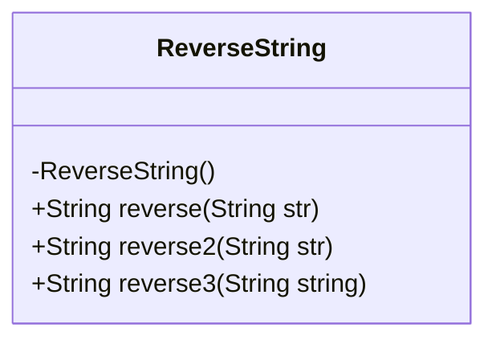
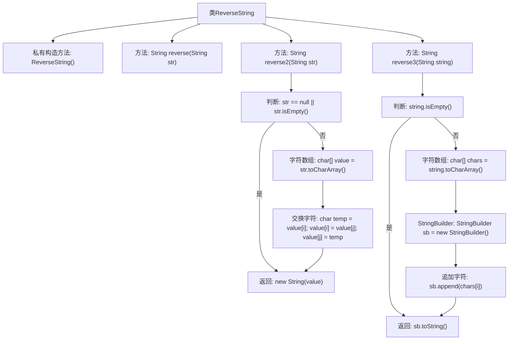

# 基础信息

|      |      |
|------|------|
| 名称 | ReverseString |
| 编码语言 | .java |
| 代码路径 | Java/src/main/java/com/thealgorithms/strings/ReverseString.java |
| 包名 | com.thealgorithms.strings |
| 依赖项 | [] |
| 概述说明 | ReverseString类提供三种字符串反转方法：StringBuilder、字符数组交换、反向遍历。 |

# 说明

ReverseString类提供了三种实现字符串反转功能的方法。第一种方法利用StringBuilder的内置反转功能，直接对字符串进行反转操作。第二种方法通过将字符串转换为字符数组，然后交换数组中的字符位置来实现反转。第三种方法则是通过反向遍历字符数组，逐个字符拼接成新的反转字符串。这三种方法各有特点，适用于不同的场景和需求。

# 类列表 Class Summary

| 名称   | 类型  | 说明 |
|-------|------|-------------|
| ReverseString | class | ReverseString类提供三种字符串反转方法：使用StringBuilder、字符数组交换、反向遍历字符数组。 |

## 类 ReverseString

|      |      |
|------|------|
| 访问范围 | public final |
| 类型 | class |
| 名称 | ReverseString |
| 说明 | ReverseString类提供三种字符串反转方法：使用StringBuilder、字符数组交换、反向遍历字符数组。 |

### UML类图

类图描述：`ReverseString` 类是一个工具类，用于反转字符串。它包含三个静态方法：`reverse`、`reverse2` 和 `reverse3`，分别通过不同的方式实现字符串反转。`reverse` 方法使用 `StringBuilder` 的 `reverse` 方法；`reverse2` 方法通过交换字符数组中的字符来实现反转；`reverse3` 方法则通过遍历字符数组并逐个追加到 `StringBuilder` 中来实现反转。所有方法都返回反转后的字符串。

### 内部方法调用关系图

这段代码定义了一个名为 `ReverseString` 的类，该类包含三个静态方法 `reverse`、`reverse2` 和 `reverse3`，用于反转输入的字符串。`reverse` 方法使用 `StringBuilder` 的 `reverse` 方法直接反转字符串；`reverse2` 方法通过交换字符数组中的字符来实现反转；`reverse3` 方法使用 `StringBuilder` 逐个字符追加的方式实现反转。每个方法都处理了空字符串或 `null` 的情况，确保程序的健壮性。

### 字段列表 Field List

| 名称  | 类型  | 说明 |
|-------|-------|------|

### 方法列表 Method List

| 名称  | 类型  | 说明 |
|-------|-------|------|
| reverse | String | 静态方法reverse反转输入字符串并返回结果。 |
| reverse2 | String | 反转字符串，交换字符位置实现。 |
| reverse3 | String | 静态方法reverse3反转输入字符串并返回结果。 |

