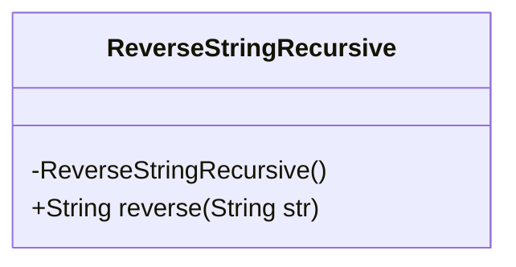
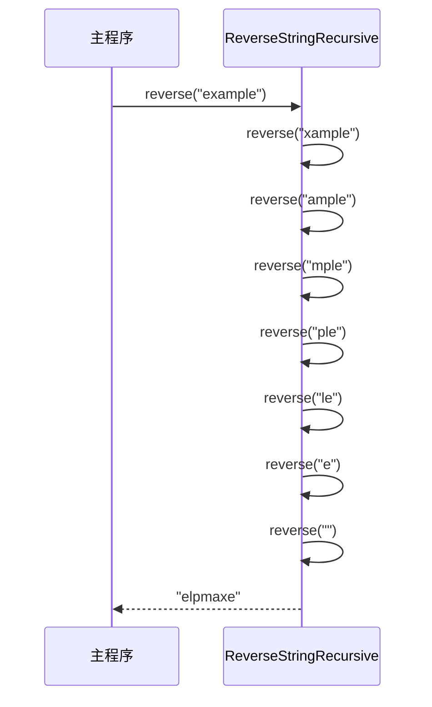
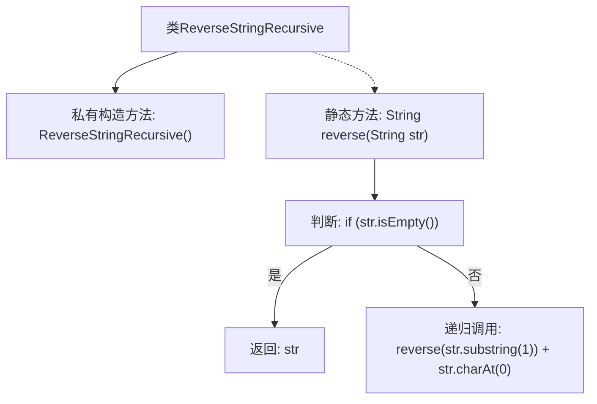

# 基础信息

|      |      |
|------|------|
| 名称 | ReverseStringRecursive |
| 编码语言 | .java |
| 代码路径 | Java/src/main/java/com/thealgorithms/strings/ReverseStringRecursive.java |
| 包名 | com.thealgorithms.strings |
| 依赖项 | [] |
| 概述说明 | Java类实现递归反转字符串，包含私有构造和静态反转方法。 |

# 说明

该Java类设计用于递归反转字符串，具有私有构造函数以防止实例化，确保所有操作通过静态方法进行。类中包含一个静态方法，专门用于实现字符串的反转功能。该方法通过递归调用自身，逐步将字符串的字符顺序颠倒，最终返回反转后的字符串。这种设计保证了方法的简洁性和高效性，适用于需要字符串反转的场景。

# 类列表 Class Summary

| 名称   | 类型  | 说明 |
|-------|------|-------------|
| ReverseStringRecursive | class | 递归反转字符串的Java类，包含私有构造和静态反转方法。 |


## 类 ReverseStringRecursive

|      |      |
|------|------|
| 访问范围 | public final |
| 类型 | class |
| 名称 | ReverseStringRecursive |
| 说明 | 递归反转字符串的Java类，包含私有构造和静态反转方法。 |


### UML类图



```mermaid
flowchart TD
    A[开始] --> B{str是否为空?}
    B -- 是 --> C[返回str]
    B -- 否 --> D[递归调用reverse(str.substring(1)) + str.charAt(0)]
    D --> E[返回结果]
    E --> F[结束]
```



**描述：**  
`ReverseStringRecursive` 类提供了一个静态方法 `reverse`，用于递归地反转字符串。该方法通过不断截取字符串的子串并拼接第一个字符来实现反转。流程图展示了方法的执行逻辑，时序图则展示了递归调用的过程。该类设计为不可实例化，确保了方法的纯粹性和工具类的特性。


### 内部方法调用关系图



这段代码定义了一个名为 `ReverseStringRecursive` 的类，其中包含一个私有的构造方法和一个静态的递归方法 `reverse`。`reverse` 方法用于反转传入的字符串。如果字符串为空，则直接返回该字符串；否则，递归调用 `reverse` 方法，将字符串的第一个字符移动到末尾，直到字符串为空为止。该方法通过递归实现了字符串的反转。

### 字段列表 Field List

| 名称  | 类型  | 说明 |
|-------|-------|------|

### 方法列表 Method List

| 名称  | 类型  | 说明 |
|-------|-------|------|
| reverse | String | 递归反转字符串，空字符串直接返回，否则递归反转子串并拼接首字符。 |


