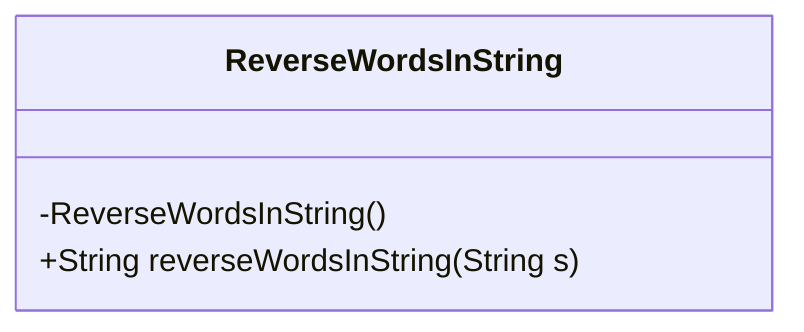
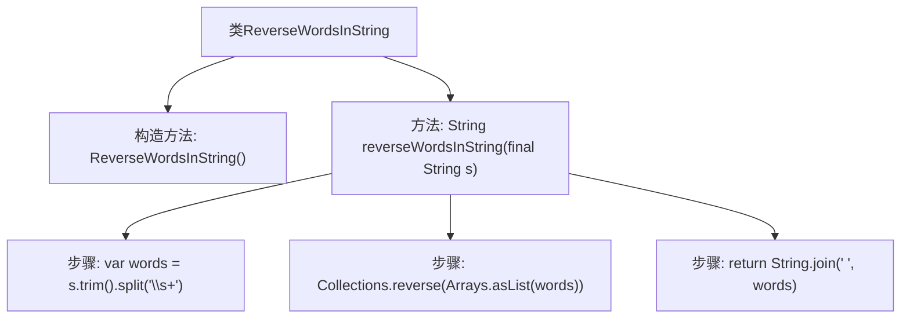

# 基础信息

|      |      |
|------|------|
| 名称 | ReverseWordsInString |
| 编码语言 | .java |
| 代码路径 | Java/src/main/java/com/thealgorithms/strings/ReverseWordsInString.java |
| 包名 | com.thealgorithms.strings |
| 依赖项 | ['java.util.Arrays', 'java.util.Collections'] |
| 概述说明 | 反转字符串中单词顺序并返回结果。 |

# 说明

该任务要求反转字符串中单词的顺序，并返回处理后的结果。具体来说，输入一个包含多个单词的字符串，需要将这些单词的顺序进行反转，使得原本第一个单词变为最后一个，最后一个单词变为第一个，依此类推。最终输出反转后的字符串。该任务不涉及具体代码实现，仅描述其功能和目标。

# 类列表 Class Summary

| 名称   | 类型  | 说明 |
|-------|------|-------------|
| ReverseWordsInString | class | 反转字符串中的单词顺序，返回结果。 |

## 类 ReverseWordsInString

|      |      |
|------|------|
| 访问范围 | public final |
| 类型 | class |
| 名称 | ReverseWordsInString |
| 说明 | 反转字符串中的单词顺序，返回结果。 |

### UML类图

这段代码定义了一个名为 `ReverseWordsInString` 的最终类，该类包含一个私有构造函数和一个公共静态方法 `reverseWordsInString`。该方法接收一个字符串作为输入，去除首尾空格后按空格分割成单词数组，然后反转数组中的单词顺序，最后将反转后的单词数组重新拼接成一个字符串并返回。这个类的主要功能是反转字符串中的单词顺序。

### 内部方法调用关系图

该流程图描述了`ReverseWordsInString`类的结构及其`reverseWordsInString`方法的执行流程。首先，调用`trim()`方法去除字符串首尾空格，然后使用`split("\\s+")`将字符串按空格分割成单词数组。接着，使用`Collections.reverse()`将数组中的单词顺序反转，最后通过`String.join(" ", words)`将反转后的单词数组重新拼接成字符串并返回。整个过程实现了字符串中单词顺序的反转。

### 字段列表 Field List

| 名称  | 类型  | 说明 |
|-------|-------|------|

### 方法列表 Method List

| 名称  | 类型  | 说明 |
|-------|-------|------|
| reverseWordsInString | String | 反转字符串中的单词顺序。 |

